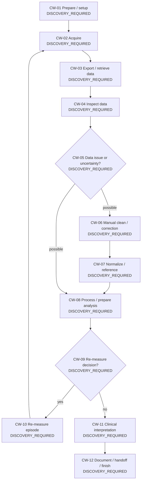

# MotionLab Current-State Workflow Map v0.1

**Artifact:** `clinical/workflows/motionlab-current-state.v0.1.md`  
**Day:** DAY02 — Real MotionLab Workflow Mapping & Time-Motion Study Design  
**Status:** `CANDIDATE_CURRENT_STATE_TO_VERIFY`  
**Clinical/site evidence:** **NOT SITE-VERIFIED**  
**Primary use:** Coding frame for DAY03 observation; not a final SOP and not a claim about exact Vinmec workflow.

## 1. Why this artifact exists

PRD/SRS establish the business problem: MotionLab clinicians spend substantial effort handling data, remeasurement occurs, and the product North Star is to reduce data-processing toil while preserving quality, physiology, traceability and human authority. The 90-day roadmap therefore requires DAY02 to model the candidate current-state workflow and design a time-motion instrument before DAY03 collects real workflow evidence.

This document intentionally separates:

1. **documented business/workflow statements** (`VERIFIED_DOCUMENTED`);
2. **candidate workflow states derived from the roadmap/problem framing** (`INFERRED` or `DISCOVERY_REQUIRED` for site truth);
3. **future site observation evidence** (`SITE_VERIFIED`, only after approved observation).

No candidate node below becomes `SITE_VERIFIED` merely because it appears in this diagram.

## 2. Source-of-truth rules inherited from DAY01

Priority order remains: SRS → PRD → observed CSV architecture → re-baselined roadmap → project skeleton → accepted legacy engineering assets → old implementation plan → explicit assumption. A lower-priority source never silently overrides a higher-priority source.

Important frozen semantics:

- physiological variation != artifact;
- pathology != noise;
- missing evidence != normal;
- unavailable metric != 0;
- MFCV unavailable != system failure;
- no autonomous diagnosis/treatment/finalization;
- no model training merely because CSV exists.

## 3. What is documented vs what still requires observation

| Statement | Evidence state | DAY02 handling |
|---|---|---|
| Data/noise handling is the highest-priority operational pain | VERIFIED_DOCUMENTED | Drives observation focus; does not quantify time. |
| Team estimate suggests a case can take around/at least 60 minutes | VERIFIED_DOCUMENTED as an estimate only | Tagged `TEAM_ESTIMATE_NOT_BASELINE`; never populated as measured baseline. |
| Remeasurement occurs | VERIFIED_DOCUMENTED qualitatively | Observation form captures event/count/reason without inventing a rate. |
| Exact hands-on doctor/KTV time by step | UNKNOWN | OQ-002 remains open; DAY03 measures it. |
| Exact case volume and case mix | UNKNOWN | OQ-001 remains open. |
| Exact current filter/normalization/window settings | UNKNOWN | OQ-004 remains open; DAY02 only provides a capture location. |
| Exact clinical decision supported by the final sEMG output | UNKNOWN | OQ-005 remains open. |
| Exact site privacy/de-identification workflow | DISCOVERY_REQUIRED | OQ-007 remains open; conservative no-direct-PHI/no-raw-signal boundary applies to this instrument. |

## 4. Candidate current-state flow

The diagram is a **coding scaffold** derived from the roadmap phrase `thu đo → inspect → clean → normalize → process → remeasure → interpret`. It must be edited after site evidence. A missing observed stage is not a failure; it is evidence that the scaffold needs revision.

## 5. Candidate workflow step dictionary

| ID | Candidate activity | Candidate actor(s) | Input to observe | Output to observe | Manual toil candidate? | Rework / remeasure relevance | Site evidence status |
|---|---|---|---|---|---|---|---|
| CW-01 | Prepare / setup | KTV / doctor / device | order/protocol/device context | ready-to-acquire state | possible | setup failures may trigger delay | DISCOVERY_REQUIRED |
| CW-02 | Acquire | KTV / doctor / device | patient/task/device setup | acquired record | acquisition, not post-acquisition KPI by default | may repeat | DISCOVERY_REQUIRED |
| CW-03 | Export / retrieve | KTV / software | acquired record | accessible data/export | yes if human active | export failure/retry | DISCOVERY_REQUIRED |
| CW-04 | Inspect data | doctor / KTV | data view/report | findings/next action | yes | may trigger rework | DISCOVERY_REQUIRED |
| CW-05 | Identify data issue / uncertainty | doctor / KTV | inspected data | issue/uncertainty statement | yes | may trigger reprocess or remeasure | DISCOVERY_REQUIRED |
| CW-06 | Manual clean / correct | doctor / KTV | issue + data | modified working representation | yes | core toil candidate | DISCOVERY_REQUIRED |
| CW-07 | Normalize / reference | doctor / KTV / software | working data + reference | normalized/eligible representation | yes if human active | reference may be unavailable | DISCOVERY_REQUIRED |
| CW-08 | Process / prepare analysis | doctor / KTV / software | working data | metrics/report-ready data | yes if human active | may repeat | DISCOVERY_REQUIRED |
| CW-09 | Re-measure decision | doctor / KTV | evidence + workflow context | remeasure yes/no | yes | branch point | DISCOVERY_REQUIRED |
| CW-10 | Re-measure | doctor / KTV / device | remeasure request | new acquisition | separate remeasurement burden | returns to acquisition | DISCOVERY_REQUIRED |
| CW-11 | Clinical interpretation | doctor | supportable evidence | professional interpretation | **separate from data-processing KPI** | may request more evidence | DISCOVERY_REQUIRED |
| CW-12 | Document / handoff / finish | doctor / KTV | approved result | workflow completion | capture separately | possible downstream revision | DISCOVERY_REQUIRED |

## 6. Actor model

DAY02 deliberately does not collapse all human work into one bucket.

| Actor | Why separate? | Observation rule |
|---|---|---|
| DOCTOR | PRD KPI explicitly defines manual processing time as time the doctor actually processes data after acquisition. | Capture post-acquisition data handling separately from interpretation. |
| KTV | North Star and workflow include KTV operational toil, but it is not identical to the PRD doctor-time KPI. | Capture separately so later optimization does not hide burden transfer. |
| SOFTWARE | Machine-active time is not human toil. | Capture intervals even when parallel with human work. |
| DEVICE | Acquisition/device-active states affect elapsed time but are not automatically manual processing. | Capture only when relevant to workflow delay or remeasurement. |
| OTHER | Needed for handoffs/dependencies. | Never infer identity; role only. |

## 7. Time classes used by the DAY02 instrument

1. `CLINICIAN_DATA_HANDS_ON` — doctor actively inspects/handles/processes data post-acquisition.
2. `TECHNICIAN_DATA_HANDS_ON` — KTV actively handles data/export/process/support.
3. `ACQUISITION_HANDS_ON` — human effort for setup/acquisition; kept separate from post-acquisition KPI.
4. `SYSTEM_ACTIVE` — software/device computation/export active without required continuous human work.
5. `WAITING_BLOCKED` — no useful progress because workflow waits for system/person/dependency.
6. `REMEASUREMENT` — work/time specifically caused by a repeat measurement episode.
7. `CLINICAL_INTERPRETATION` — clinician interprets evidence; not silently counted as data-processing toil.
8. `OTHER` / `UNKNOWN` — explicit catch-all; must be reviewed rather than guessed.

## 8. Concurrency rule

Events are stored as **intervals**, not as one scalar duration. Overlap is legal and expected. For example, software may export while a doctor reviews another record.

Therefore:

- do **not** compute case elapsed time by summing event durations;
- do **not** compute doctor toil by summing overlapping doctor events without interval-union handling;
- do **not** add system-active time to human hands-on time and call the result “manual time”.

DAY86 may later compute paired time-motion statistics, but DAY02 only defines the measurement contract.

## 9. Remeasurement representation

A remeasurement is not hidden inside acquisition time. It must be observable as:

- a decision/request event (`REMEASURE_DECISION`);
- a distinct episode identifier (`remeasurement_episode_id`);
- one or more `REMEASUREMENT` intervals;
- a reported reason kept as free-text evidence until DAY04 defines a validated taxonomy.

The observation form explicitly separates `reason_reported_by_operator` from `observer_note`. The observer must not convert a clinician statement into an artifact/pathology label without evidence.

## 10. KPI boundary

### Primary measurement design

`Manual processing time / case` is designed as the union of **doctor post-acquisition data-handling intervals**, consistent with the PRD wording “thời gian bác sĩ thực sự xử lý data sau thu đo.”

### Supporting operational measurements

- KTV data hands-on time;
- acquisition hands-on time;
- system-active time;
- blocked waiting time;
- remeasurement burden;
- clinical interpretation time;
- elapsed case time;
- full-manual-review flag;
- rework/remeasurement episode counts.

These supporting measures prevent optimization that merely shifts burden between roles or hides waiting/rework.

## 11. What DAY03 must verify

DAY03 observation should answer with evidence, not assumptions:

- Which candidate steps actually occur?
- Which actor performs each step?
- Which steps dominate doctor/KTV hands-on time?
- Where do waits occur?
- Does work run in parallel?
- When does rework/remeasurement occur?
- What reason does the operator state?
- Which actions are current software defaults vs manual interventions?
- Which outputs are used for downstream interpretation?

## 12. Explicit limitations

This v0.1 map does **not** establish:

- actual minutes/case;
- case volume/month;
- remeasurement rate;
- actual QC taxonomy;
- site filter/normalization settings;
- a clinical threshold;
- a valid privacy pathway for raw patient data;
- MFCV eligibility;
- pressure or Knee/ACL solution behavior.

## 13. Review checklist

- [ ] Every site-specific node is still `DISCOVERY_REQUIRED` unless evidence is attached.
- [ ] Doctor, KTV, software/device times are not conflated.
- [ ] Interpretation is not silently counted as post-acquisition data-processing toil.
- [ ] Remeasurement has a separate branch and episode identifier.
- [ ] Concurrency is representable.
- [ ] No direct PHI/raw signal is required to use the workflow timing instrument.
- [ ] `>=60 min/case` is not presented as measured baseline.
- [ ] `>=50%` is not presented as a committed threshold.

## 14. DAY02 close state

If the associated protocol, observation form, traceability and automated checks pass, this artifact supports `GO_FOR_DAY_03` **only as a measurement-design gate**. It does not make the workflow site-validated.
