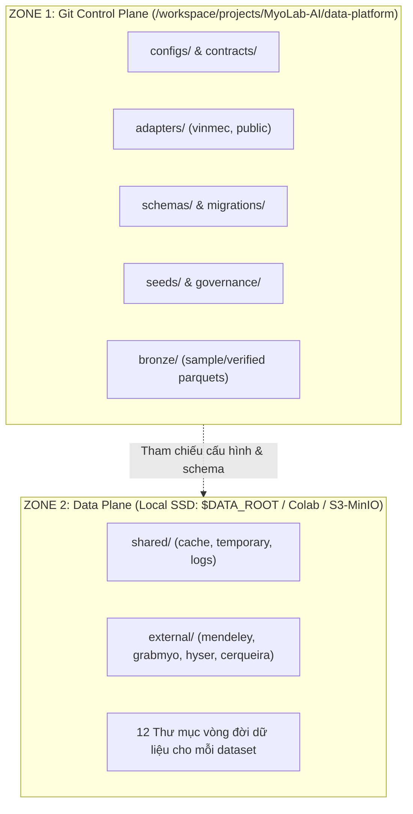
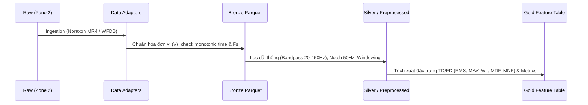

# Data Platform — MyoLab-AI

Hệ thống Data Platform của **MyoLab-AI** được xây dựng theo **Kiến trúc hai vùng lưu trữ (Two-Zone Storage Architecture)** kết hợp mô hình **Medallion Lakehouse** phục vụ nghiên cứu và phân tích dữ liệu điện cơ bề mặt (sEMG).

---

## 1. Kiến trúc Hai Vùng Lưu Trữ (Two-Zone Architecture)



### Nguyên tắc cốt lõi:
1. **ZONE 1 (Trong Git worktree)**: Chỉ lưu trữ code, data contracts, schemas, migrations, manifest templates, adapter logic, và các file bronze mẫu. **Tuyệt đối không commit raw waveform nặng, archive zip/mat/dat hay token/secret**.
2. **ZONE 2 (Ngoài Git worktree)**: Lưu trữ toàn bộ dữ liệu dung lượng lớn, cache, downloads, partitioned features và model checkpoints.

---

## 2. Cấu trúc Thư mục `data-platform/`

```text
data-platform/
├── adapters/                  # Data parsers & adapters (Noraxon MR4, WFDB, GRABMyo, Hyser)
│   ├── public/                # Adapters cho public benchmarks (grabmyo.py, hyser.py, wfdb16.py)
│   └── vinmec/                # Parsers cho MotionLab/Noraxon MR4 format
├── bronze/                    # Dữ liệu Bronze Parquet đã chuẩn hóa đơn vị (SI Volt)
│   └── Vinmec/EMG/
├── catalog/                   # Danh mục quản trị tài sản dữ liệu & inventory
├── configs/                   # Cấu hình storage, view registry, ontology, profiles
│   ├── day30/                 # common-ontology.yaml, dataset-profiles.yaml, dataset-view-registry.yaml
│   └── pre_day30_storage.local.yaml
├── contracts/                 # Data Contracts (JSON Schemas, CSV columns, YAML freezes)
│   ├── day30/, day31/, day33/, day37/
│   ├── canonical/
│   ├── noraxon/
│   └── vicon/
├── datasets/                  # Manifests & split index cho các dataset nghiên cứu
│   ├── external/              # grabmyo-v1.1.0, mendeley-4channel-hand-gesture-v2
│   ├── external-artifacts/    # Split manifests, feature columns, gate JSONs
│   ├── public-benchmark-selection-v1.0.yaml
│   └── public-sEMG-catalog.v0.1.yaml
├── events/                    # Event sourcing contracts & Clinical Event Store schemas
├── governance/                # Chính sách quản trị bằng chứng, anti-leakage, tiering
├── manifests/                 # Manifest templates cho Public & Research datasets
├── migrations/                # Database DDL migrations (Core tables, RBAC, longitudinal views)
├── object-storage/            # Cấu hình MinIO S3, lifecycle policies, storage layouts
├── privacy/                   # An toàn dữ liệu PHI/PII (de-identification, date shift, hash IDs)
├── schemas/                   # SQL schemas (feature_table.sql, longitudinal_view.sql, audit_log.sql)
├── seeds/                     # Database seeds (devices, protocols, roles, synthetic patients)
├── storage/                   # Retention & immutability policies
└── synthetic-data/            # Bộ tạo tín hiệu sEMG giả lập phục vụ unit/integration test
```

---

## 3. Quy trình Medallion Pipeline (Raw -> Bronze -> Silver -> Gold)



---

## 4. Quản lý Môi trường Data Plane (Zone 2)

Khởi tạo cấu trúc Zone 2 ngoài repo bằng lệnh:
```bash
bash scripts/dev/bootstrap_pre_day30_storage.sh --apply
```

Biến môi trường tiêu chuẩn:
```bash
export DATA_ROOT="/home/duyvd9/massive/myolab-ai-data"
export MYOLAB_DATA="/home/duyvd9/massive/myolab-ai-data"
```
