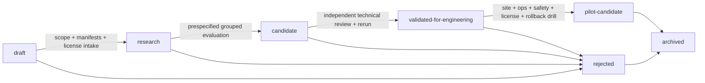

# Model Registry Specification — sEMG Clinical Intelligence

**Artifact:** `docs/09-mlops-devops/model-registry-spec.md`  
**schema_version:** `1.0`  
**status:** `PROVISIONAL_LOCKED_FOR_DAY26_BLUEPRINT`  
**trainingAllowed:** `false`  
**Scope:** Model, rule, metric, calibration and abstention artifacts for Tasks A/B/C.

---

## 1. Purpose

Define a controlled registry for analytical artifacts without overstating clinical evidence.
The registry must support:

- versioned lineage;
- promotion and rejection;
- model cards;
- compatibility checks;
- license/security gates;
- release composition;
- rollback and deprecation;
- immutable audit history;
- single-operator preparation with independent approval at higher states.

The term **model** in this document includes deterministic engines and policies where
appropriate. Task C is not forced into a classifier.

---

## 2. Registry object types

```text
classifier              # Task A base classifier
context_engine          # Task B context/supportability engine
metric_engine           # Task C deterministic quantitative metrics
rule_engine             # QC/fatigue/context rules
calibrator               # Score-to-calibrated-output mapping
threshold_policy         # Class/reject threshold policy
abstention_policy        # Mandatory/optional abstention logic
feature_extractor        # Versioned learned or deterministic feature transform
composite_pipeline       # Explicit composition of the above
```

Each type has a separate ID/version. A release references exact versions, preventing hidden
coupling among Task A, B and C.

---

## 3. Registry states

The exact machine values are:

```text
draft
research
candidate
validated-for-engineering
pilot-candidate
rejected
archived
```

### 3.1. Semantic definitions

| State | Meaning | Explicit non-meaning |
|---|---|---|
| `draft` | Contract exists; artifact may not exist; design not execution-approved | Not trained, not evaluated, not deployable |
| `research` | Artifact may be generated under approved research protocol | Not selected, not pilot-ready |
| `candidate` | Completed prespecified engineering evaluation and ready for independent review | Not clinically validated |
| `validated-for-engineering` | Reproducible and technically reviewed in declared engineering scope | Not authorized for patient-facing use |
| `pilot-candidate` | Passed site/ops/license/security/human-review gates for a specifically approved pilot plan | Not general clinical deployment approval |
| `rejected` | Failed a gate or superseded for a documented reason | Not deleted from audit history |
| `archived` | Retained for history and not selectable for new release | Not active |

The strings `clinical-validated`, `clinically-validated`, `clinical-grade` and equivalent
states are prohibited unless a separate approved governance framework explicitly introduces
them with supporting evidence.

---

## 4. Registry identity

### 4.1. ID patterns

```text
MOD-TASKA-<family>-<short-name>
CTX-TASKB-<short-name>
MET-TASKC-<short-name>
CAL-<task>-<short-name>
THR-<task>-<short-name>
ABS-<task>-<short-name>
PIPE-<task-or-crosscutting>-<short-name>
```

Version format:

```text
MAJOR.MINOR.PATCH
```

Rules:

- PATCH: non-semantic documentation/packaging correction with identical behavior and hashes
  of behavioral components.
- MINOR: backward-compatible behavior/config change requiring evaluation.
- MAJOR: incompatible schema, ontology, protocol or behavior change.

A changed model binary/coefficient set always creates a new version.

---

## 5. Registry record contract

Canonical schema:

```text
schemas/model-registry-record.schema.json
```

Minimum groups:

| Group | Required content |
|---|---|
| Governance | metadata fields, task, state, rationale, evidence, open questions |
| Lineage | parent experiment ID and manifest hash, code commit, dataset/split hashes |
| Component identity | artifact type, family, version, class/channel/protocol scope |
| Bundle | component paths/URIs, media types, SHA-256, sizes, trust classes |
| Evaluation | regime, metric contract, result refs, status `NOT_RUN` or actual future values |
| Calibration/abstention | component IDs/versions and score semantics |
| Compatibility | input/export/device/protocol/channel/class/runtime versions |
| License | per-source license records and aggregate gate decision |
| Security | serialization format, arbitrary-deserialization flag, scan/review status |
| Model card | path and SHA-256 |
| Promotion | criteria, reviewers, decisions, timestamps |
| Rollback | approved previous version/release |
| Deprecation | status, reason, replacement, effective date |
| Audit | append-only event references |

---

## 6. Promotion state machine



### 6.1. `draft → research`

**Input**

- Valid experiment manifest.
- Data/split/test-seal hashes.
- Environment contract lock.
- Intended-use statement.
- License intake.

**Required output**

```yaml
state: research
training_authorization: separate_future_decision
reviewer_decision: approved_for_research_only
```

**Blocking failures**

- missing license record;
- unclear task/target;
- no test seal;
- random-window benchmark plan;
- Task A/B/C collapse;
- clinical claim language.

### 6.2. `research → candidate`

Future execution gate only.

**Input**

- Outer out-of-fold result ledger.
- Full metric/calibration/coverage/failure report.
- Model card.
- Rerun report.
- Security/serialization review.

**Required output**

- candidate registry record;
- immutable model/engine bundle;
- compatibility matrix;
- rejected-alternative record.

**Blocking failures**

- subject/window leakage;
- test-set peeking;
- missing worst-subject/class reporting;
- raw score called probability without semantic gate;
- threshold selected on outer test;
- license gate fail;
- artifact hash mismatch.

### 6.3. `candidate → validated-for-engineering`

**Input**

- Independent reviewer checklist.
- Clean reference-environment reconstruction.
- Golden/negative/compatibility tests.
- Exact artifact and environment hashes.

**Required output**

```yaml
state: validated-for-engineering
scope: declared_engineering_context_only
```

**Blocking failures**

- no independent reviewer;
- rerun outside tolerance;
- unresolved critical incident;
- untrusted serialization default;
- no rollback target;
- incompatible runtime.

### 6.4. `validated-for-engineering → pilot-candidate`

**Input**

- Site-verified device/export/protocol mapping.
- Pilot protocol and inclusion/exclusion criteria.
- Human review workflow.
- Security/privacy review.
- Operational profile on target hardware.
- License/legal clearance.
- Rollback drill.

**Required output**

```yaml
state: pilot-candidate
pilot_scope_id: <approved-scope>
human_review_required: true
automatic_treatment_recommendation: false
```

**Blocking failures**

- site compatibility unknown;
- MFCV claimed without eligibility;
- no rollback drill;
- no clinical/site approver;
- NC/research-only/unclear license for intended pilot use;
- clinical latency threshold invented without evidence;
- abstention path absent.

---

## 7. Approvals and separation of duties

### 7.1. Single-operator phase

The single operator may:

- create records;
- run schema/hash/preflight checks;
- move `draft → research` after documented self-review;
- prepare candidate evidence.

The single operator may not solely approve:

- `research → candidate` when results exist;
- `candidate → validated-for-engineering`;
- `validated-for-engineering → pilot-candidate`;
- pilot release or rollback decisions affecting site workflow.

### 7.2. Approval matrix

| Decision | Required roles |
|---|---|
| Research authorization | Project lead / single operator, documented |
| Candidate acceptance | Independent ML/DSP/biostat reviewer |
| Engineering validation | Independent technical QA + ML/DSP reviewer |
| Pilot candidacy | Clinical lead + site owner + AI safety/QA + technical owner |
| Release | Release owner + required pilot approvers |
| Emergency rollback | Authorized release/site owner per SOP; clinical review when workflow impact exists |

Names may remain `NOT_VERIFIED` until site governance assigns them, but role requirements
cannot be removed.

---

## 8. Model card contract

Every `candidate` or higher record requires a versioned model card.

### 8.1. Mandatory sections

```text
1. Identity, version and registry state
2. Owner and reviewers
3. Intended use
4. Prohibited use
5. Task A/B/C boundary
6. Population and data sources
7. Data access/license/DUA status
8. Device, channel, electrode and protocol context
9. Label/target provenance
10. Data hierarchy and split regime
11. Preprocessing and feature contract
12. Model/engine family and parameters
13. Personalization/calibration regime
14. Score semantics
15. Threshold and abstention policy
16. Metrics and confidence intervals
17. Coverage/selective-risk report where applicable
18. Worst subject/class/subgroup and failure cases
19. Operational footprint and target runtime
20. Serialization/security format
21. Compatibility matrix
22. Known limitations and transferability
23. Human review requirements
24. Change history
25. Rollback target
```

### 8.2. Prohibited card language

Unless separately evidenced and approved:

- “clinical-grade”;
- “clinically validated”;
- “safe” as an absolute property;
- “diagnoses fatigue”;
- “automatically determines treatment”;
- “works on Vinmec stroke patients” from healthy public data;
- “probability” for raw/uncalibrated score.

---

## 9. Compatibility contract

### 9.1. Required dimensions

```text
input_schema_version
source_adapter_id/version
device_family and verified models
export_schema_version
physical_units
sampling_rate range/constraints
channel_count and channel_order
channel_mapping_version
electrode_geometry assumptions
protocol_id/version
muscle/anatomical scope
class_ontology_version
preprocessing_version
feature_version
model/engine version
calibrator version
threshold policy version
abstention policy version
runtime environment lock
CPU/GPU runtime profile
MFCV eligibility requirement
```

### 9.2. Compatibility outcomes

```text
compatible
compatible-with-warning
incompatible
not-verified
```

`not-verified` does not silently degrade to `compatible`.

### 9.3. Mandatory block/abstention reasons

- `UNSUPPORTED_DEVICE`
- `UNSUPPORTED_EXPORT_SCHEMA`
- `UNSUPPORTED_PROTOCOL_OR_ANATOMY`
- `CHANNEL_MAPPING_MISMATCH`
- `UNIT_OR_SAMPLING_UNKNOWN`
- `CLASS_ONTOLOGY_MISMATCH`
- `CALIBRATION_FAILURE_OR_EXPIRED`
- `MFCV_NOT_ELIGIBLE`
- `MODEL_BUNDLE_INCOMPATIBLE`

---

## 10. Serialization and security gate

### 10.1. Allowed classes

| Trust class | Formats | Registry eligibility |
|---|---|---|
| `canonical-typed` | JSON/YAML + `.npy/.npz` with `allow_pickle=False` | Preferred |
| `converted-runtime` | ONNX with equivalence report | Conditional |
| `trusted-python-snapshot` | joblib/pickle from controlled store | Research-only by default |
| `untrusted` | any artifact without provenance/hash or external pickle/joblib | Prohibited |

### 10.2. Security fields

- serialization format/version;
- arbitrary-deserialization risk flag;
- source path and trust class;
- SHA-256;
- optional signature/key ID;
- loader/runtime version;
- sandbox/privilege profile;
- vulnerability scan/reference;
- review decision.

### 10.3. Blockers

- `pickle/joblib` from untrusted source;
- cross-version sklearn load without explicit migration/revalidation;
- unsupported ONNX operator or failed equivalence;
- missing model-card/hash/environment lock;
- executable code hidden in artifact bundle.

---

## 11. License gate

### 11.1. Per-source record

```text
source_id
source_title
license_id/version
license_url_or_DUA_ref
access_class
training_allowed
research_use_allowed
commercial_use_allowed
redistribution_allowed
derivative_database_allowed
trained_artifact_distribution_allowed
attribution_required
share_alike_required
DUA_or_IRB_required
reviewer
review_date
expiry/recheck_date
notes
```

### 11.2. Aggregate decision

```text
pass-research
pass-internal-engineering
pass-pilot-noncommercial
pass-pilot-approved
block
not-verified
```

### 11.3. Fail-closed rules

- License absent/ambiguous → no redistribution or pilot-commercial promotion.
- CC BY-NC → no commercial use unless separate permission.
- Research-only/custom DUA → follow DUA; do not infer trained-artifact rights.
- Mixed corpus → most restrictive unresolved source controls.
- Attribution obligations travel into model card/release notice.
- License changes can deprecate a model even if performance is unchanged.

---

## 12. Registry-to-release relationship

A model/engine record is not a release. A release manifest composes exact versions of:

```text
application code
input adapter/schema
preprocessing
feature extractor
model/metric/context engines
calibrator
threshold/abstention policies
reason-code registry
report template
runtime/container/environment
```

Only a release manifest can be deployed. MLflow alias changes alone do not constitute an
approved release.

---

## 13. Rollback target

Every `validated-for-engineering` or `pilot-candidate` record must identify:

- last approved compatible registry version;
- last approved release ID;
- data/schema compatibility limits;
- migration/reversal needs;
- known reason not to roll back.

If no valid target exists, promotion is blocked.

---

## 14. Deprecation and archival

### 14.1. Deprecation triggers

- security vulnerability;
- license/DUA change;
- dependency end-of-support;
- discovered leakage/test contamination;
- incompatible site export/protocol;
- incorrect class/channel mapping;
- calibration/coverage failure in governed monitoring;
- replacement approved;
- governance decision.

### 14.2. Required actions

1. mark deprecated and disable new selection;
2. identify affected releases/sessions;
3. preserve artifact and evidence;
4. assign replacement/rollback path;
5. update model card and audit log;
6. notify required owners;
7. archive only after active release references are removed.

---

## 15. Audit log

Required event types:

```text
record_created
artifact_attached
hash_verified
state_transition_requested
state_transition_approved
state_transition_rejected
compatibility_changed
license_changed
security_reviewed
release_created
release_rolled_back
deprecated
archived
incident_linked
```

Every event records actor, timestamp, reason, previous/new state, evidence IDs and manifest
hash. Events are append-only.

---

## 16. Negative tests

| Test ID | Invalid behavior | Expected result |
|---|---|---|
| `REG-NEG-001` | State value `clinical-validated` | Schema/policy rejection |
| `REG-NEG-002` | Candidate without model card | Promotion blocked |
| `REG-NEG-003` | Candidate without parent experiment hash | Promotion blocked |
| `REG-NEG-004` | Pilot-candidate with `human_review_required=false` | Hard fail |
| `REG-NEG-005` | MFCV capability set true while eligibility `NOT_VERIFIED` | Compatibility fail |
| `REG-NEG-006` | Pickle artifact trust class `untrusted` | Security fail |
| `REG-NEG-007` | License aggregate state missing | Promotion blocked |
| `REG-NEG-008` | No rollback target for engineering/pilot state | Promotion blocked |
| `REG-NEG-009` | Task B context engine merged invisibly into Task A model version | Architecture/lineage fail |
| `REG-NEG-010` | Registry record overwritten instead of versioned | Audit fail |
| `REG-NEG-011` | Raw score labeled probability without calibration evidence | Semantic fail |
| `REG-NEG-012` | Same operator solely approves pilot-candidate | Approval fail |

---

## 17. Definition of Done

- [ ] Seven exact registry states are locked.
- [ ] No clinical-validation state exists.
- [ ] Registry supports classifier/context/metric/rule/calibration/policy artifacts.
- [ ] Parent experiment and all hashes are required.
- [ ] Model card contract is defined.
- [ ] Compatibility matrix is defined.
- [ ] License and security gates are required.
- [ ] Promotion criteria and approvers are defined.
- [ ] Rollback target is required at higher states.
- [ ] Deprecation and append-only audit are defined.
- [ ] Task A/B/C remain technically distinct.
- [ ] Human review is mandatory for pilot path.
- [ ] Day 26 examples create no model artifact.

---

## 18. Handoff

### Provisional decisions

- Exact state machine selected.
- Registry records are file-based governance objects mirrored to MLflow.
- Canonical typed serialization preferred.
- Pilot promotion requires site, license, security, rollback and human-review gates.

### Rejected alternatives

- Auto-promotion by metric.
- Clinical-validation wording.
- One opaque artifact for Tasks A/B/C.
- Untrusted pickle/joblib.
- Pilot state without rollback target.

### NOT_VERIFIED

- Named site approvers.
- Actual signing/KMS mechanism.
- Final runtime/device compatibility list.
- Per-dataset trained-artifact rights until legal review.

### Machine-readable output

`schemas/model-registry-record.schema.json`.

### Go status

**`GO_WITH_CONDITIONS`**.
