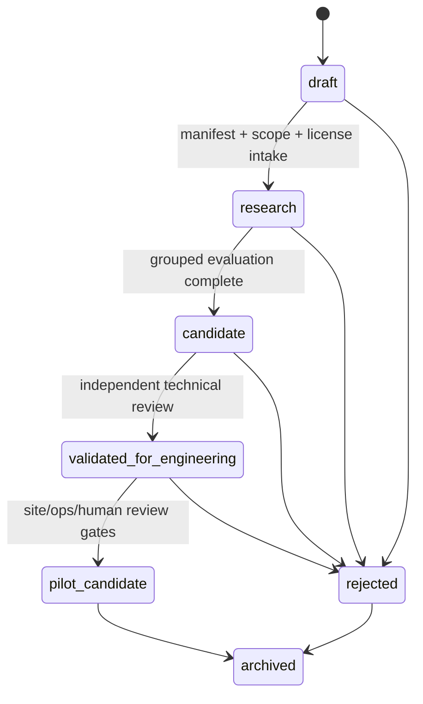

# Day 26 — Reproducibility, Model Governance và Deployment Constraints

**Artifact:** `docs/research/day26/09-reproducibility-and-governance.md`  
**schema_version:** `1.0`  
**status:** `PROVISIONAL_LOCKED_FOR_DAY26_BLUEPRINT`  
**trainingAllowed:** `false`  
**Ngày khóa:** `2026-07-27`  
**Phạm vi:** Task A — Gesture Recognition; Task B — Fatigue Context / Confidence Adjustment / Abstention; Task C — Quantitative Assessment.

> Đây là workstream blueprint-only. Không huấn luyện, không tuning, không tái lập benchmark,
> không tạo model artifact thật, không mở sealed test set và không đặt clinical threshold.

---

## 1. Kết luận điều hành

Day 26 khóa một kiến trúc quản trị có thể vận hành ngay cho dự án một người thực hiện,
trên máy local/on-premises, nhưng không tạo ngõ cụt khi chuyển sang pilot nhiều người.

### 1.1. Quyết định chính

| Câu hỏi | Quyết định Day 26 | Evidence status |
|---|---|---|
| MLflow, file-based hay hybrid? | **Hybrid**. File manifest có hash là governance SSOT; MLflow local là lớp tìm kiếm, UI và lineage tiện dụng. | `OFFICIAL_VERIFIED + INFERRED` |
| MLflow local dùng backend gì? | SQLite backend store + local artifact store, bind `127.0.0.1`; không dùng file backend làm registry dài hạn. | `OFFICIAL_VERIFIED` |
| Environment được khóa ra sao? | Exact core-version contract + dependency resolver lock bắt buộc trước Day 29; mọi run lưu lock hash, OS/CPU/BLAS/threading fingerprint. | `OFFICIAL_VERIFIED + PROJECT_LOCKED` |
| Random seed policy | Một `root_seed` sinh named child seeds bằng `SeedSequence`; mọi estimator/split/bootstrap phải nhận seed tường minh. | `OFFICIAL_VERIFIED` |
| Có cam kết deterministic tuyệt đối không? | **Không.** Khóa inputs/splits/configs/code/environment; kiểm tra rerun theo tolerance và same-reference-runtime trước. | `OFFICIAL_VERIFIED + INFERRED` |
| Serialization mặc định | Ưu tiên JSON/YAML + typed arrays/coefficient bundle cho pipeline classical đơn giản; ONNX là runtime derivative có kiểm thử; `pickle/joblib` chỉ trusted research và không phải pilot default. | `OFFICIAL_VERIFIED + INFERRED` |
| Model registry states | `draft → research → candidate → validated-for-engineering → pilot-candidate`; cùng `rejected`, `archived`. | `PROJECT_LOCKED` |
| Có trạng thái “clinical validated” không? | **Không.** Không được dùng nếu chưa có clinical evidence và phê duyệt tương ứng. | `PROJECT_LOCKED` |
| GPU có bắt buộc không? | **Không. CPU-first.** GPU chỉ được mở nếu profiling trên workload/site target chứng minh nhu cầu. | `INFERRED_FROM_MODEL_LADDER + PROJECT_LOCKED` |
| Latency threshold | Không tự đặt clinical cut-off. Chỉ khóa measurement boundary và để budget `NOT_VERIFIED` cho tới human-factor/site evidence. | `PROJECT_LOCKED` |
| License của trained artifact | Mỗi dataset/source phải có license record riêng; restriction mạnh nhất quyết định promotion. License không rõ hoặc NC/research-only chặn pilot/commercial path. | `OFFICIAL_VERIFIED + GOVERNANCE_DECISION` |
| Human review | Bắt buộc ở model promotion, release và rollback; single operator không được tự cấp clinical authority. | `PROJECT_LOCKED + OFFICIAL_VERIFIED` |

### 1.2. Kiến trúc tối thiểu được khóa

```text
Git-tracked specifications and schemas
        │
        ├── immutable/content-addressed experiment manifests  ← governance SSOT
        │       ├── dataset/split/config/environment hashes
        │       ├── evidence and license records
        │       └── review decisions
        │
        ├── local MLflow server                                 ← search/UI convenience
        │       ├── SQLite metadata backend
        │       └── local artifact store
        │
        ├── versioned model registry records
        │       ├── model card
        │       ├── compatibility contract
        │       └── promotion history
        │
        └── immutable release bundle
                ├── release manifest
                ├── component hashes
                ├── license gate
                └── rollback target
```

### 1.3. Go status

**`GO_WITH_CONDITIONS`** để đưa block này vào Day 26 Experiment Blueprint.

Điều kiện:

1. `trainingAllowed=false` giữ nguyên cho toàn bộ artifact Day 26.
2. Không tạo fake metrics, fake model binary hoặc fake site capability.
3. Trước Day 29 phải sinh resolved dependency lock bằng toolchain đã pin và commit hash của lock.
4. Sealed test manifest phải tồn tại và chưa mở.
5. License gate phải pass ở mức intended use của experiment.
6. Human reviewer độc lập phải xác nhận promotion từ `candidate` trở lên.

---

## 2. Scope locks và reconciliation với nguồn nội bộ

### 2.1. Không mở lại

- Không inventory lại dataset Day 25.
- Không audit tổng quát “Noraxon xuất được gì”.
- Không giả định output Noraxon tại site đã được xác minh.
- Không giả định MFCV eligible.
- Không gộp Task A, B và C thành một model chung.
- Không biến Task B thành hard fatigue classifier mặc định.
- Không dùng random-window split làm benchmark chính.
- Không fit scaler, learned normalization, feature selector, calibrator hoặc threshold ngoài training/inner-validation fold.
- Không suy hiệu năng từ public healthy data sang stroke/Vinmec.
- Không chọn model chỉ vì paper báo accuracy/F1 cao.

### 2.2. Reconciliation quan trọng

Một số tài liệu proposal/implementation cũ dùng ngôn ngữ mạnh như KNN đã đạt F1 cao,
MFCV đã có, hoặc realtime là ràng buộc cứng. Day 26 **không kế thừa các câu đó như
site-verified facts**. Chúng chỉ được xem là historical proposal context. Blueprint hiện tại
khóa classical model ladder rộng hơn, MFCV optional, latency budget chưa xác minh, và
selective prediction/human review là bắt buộc.

| Item | Day 26 resolution |
|---|---|
| KNN là model mặc định vì một paper có F1 cao | `REJECTED`; giữ KNN optional comparator, không phải core baseline mặc định. |
| MFCV luôn có trong artifact | `REJECTED`; chỉ tham chiếu `mfcv_eligibility` và block nếu chưa đủ điều kiện. |
| Realtime clinical threshold | `NOT_VERIFIED`; đo latency theo contract, không tự đặt ngưỡng. |
| “Probability” từ raw classifier score | `REJECTED`; chỉ dùng semantics probability sau fold-contained calibration và independent evaluation. |
| Online incremental learning | `NO_GO_FOR_MVP`; chỉ nghiên cứu sau adjudicated labels, rollback và audit trail. |

---

## 3. Phương pháp nghiên cứu

### 3.1. Source hierarchy

1. Official software documentation, standards, license texts và official release records.
2. Original peer-reviewed methodological papers.
3. Methodological/systematic reviews.
4. Internal artifacts cho project scope và terminology.
5. Blog/SEO/vendor marketing chỉ dùng discovery, không khóa quyết định.

### 3.2. Search themes

- `MLflow backend store artifact store model registry local SQLite`
- `scikit-learn model persistence pickle joblib ONNX security version compatibility`
- `Python NumPy SciPy scikit-learn current stable release`
- `uv lock reproducible environment --locked --frozen`
- `scikit-learn random_state reproducibility parallelism OpenMP BLAS`
- `NumPy SeedSequence spawn reproducible streams`
- `model cards model governance rollback audit trail`
- `dataset license trained model derivative commercial use CC BY CC BY-NC ODC-By`
- `NIST AI RMF governance measure manage human oversight`
- `TRIPOD+AI transparent reporting prediction model`

Full screening log: `evidence/09-search-screening-log.csv`.  
Full evidence matrix: `evidence/09-evidence-matrix.csv`.

### 3.3. Decision-grade rule

Một recommendation chỉ được khóa khi có:

- ít nhất một official/primary source;
- rõ giới hạn transfer sang project;
- không mâu thuẫn project locks;
- không phụ thuộc model result chưa chạy;
- không cần tự bịa site threshold.

---

## 4. Part A — Experiment Tracking

### 4.1. Yêu cầu bất biến của một experiment

Mọi experiment trong tương lai phải có một manifest độc lập, immutable sau khi review,
chứa tối thiểu:

```text
experiment_id
hypothesis
code_commit
code_dirty_state
dataset_id / version / hash
split_manifest_id / hash / test_seal_hash
preprocessing_config_id / hash
feature_config_id / hash
model_config_id / hash
calibration_config_id / hash
threshold_policy_id / hash
abstention_policy_id / hash
random_seeds
environment_lock_id / hash
OS / CPU / BLAS / threading fingerprint
metrics contract and result references
artifact references
evidence references
license gate
status
reviewer decision
```

Task A/B/C dùng manifest chung về governance nhưng **không dùng chung target, metric set,
threshold policy hoặc promotion claim**.

### 4.2. So sánh ba phương án

Scores dưới đây là engineering appraisal `1–5`, không phải benchmark khoa học.

| Tiêu chí | Trọng số | MLflow-only | File-based-only | Hybrid |
|---|---:|---:|---:|---:|
| Single-operator usability | 5 | 4 | 5 | 5 |
| Local/on-prem suitability | 5 | 4 | 5 | 5 |
| Auditability và content integrity | 5 | 3 | 5 | 5 |
| Setup complexity | 4 | 2 | 5 | 3 |
| Artifact-size handling | 3 | 4 | 3 | 4 |
| Rollback clarity | 5 | 4 | 4 | 5 |
| Future multi-user expansion | 4 | 5 | 2 | 5 |
| Human-readable diff/review | 4 | 2 | 5 | 5 |
| Query/filter/UI | 3 | 5 | 2 | 5 |
| **Decision** |  | Conditional | Useful but insufficient alone | **Selected** |

#### MLflow-only

Ưu điểm:

- run search, comparison, tags, lineage và artifact UI tốt;
- dễ chuyển từ local sang server/database;
- Model Registry hỗ trợ versions, aliases và tags.

Rủi ro:

- metadata store không tự tạo một governance decision record đầy đủ;
- người vận hành có thể sửa tag/alias mà không có pull-request review;
- artifact store và metadata store là hai lớp, cần backup/restore nhất quán;
- local file backend không phải lựa chọn tốt cho future registry/multi-user.

#### File-based-only

Ưu điểm:

- transparent, diff được, dễ ký duyệt và hash;
- không cần service;
- phù hợp single operator, offline, long-term archive.

Rủi ro:

- khó query khi run tăng;
- dễ copy file thủ công, thiếu index;
- artifact lineage và visual comparison kém;
- multi-user concurrency/locking phải tự xây.

#### Hybrid — quyết định được khóa

- **File manifests** là authoritative governance SSOT.
- **MLflow** mirror manifest fields để search/UI; không được là nguồn duy nhất.
- Promotion/release chỉ hợp lệ khi registry record và manifest hash khớp.
- MLflow run bị xóa không được làm mất release evidence; release bundle vẫn độc lập.

### 4.3. Local MLflow topology

```text
/data/experiments/mlflow/mlflow.db
/data/experiments/mlflow/artifacts/
/data/experiments/runs/<experiment_id>/
/data/experiments/registry/experiments/
/data/experiments/registry/models/<model_id>/<version>/
/data/models/exported/<model_id>/<version>/
/data/backups/mlflow/
```

Recommended local command is generated in `scripts/start_mlflow_local.sh`:

```bash
mlflow server \
  --host 127.0.0.1 \
  --port 5000 \
  --backend-store-uri sqlite:////data/experiments/mlflow/mlflow.db \
  --default-artifact-root file:///data/experiments/mlflow/artifacts
```

Controls:

- bind loopback only by default;
- never expose unauthenticated server to hospital network;
- backup DB and artifact store in one coordinated snapshot;
- no raw PHI in run names, tags, file names or artifact paths;
- large raw signals remain in controlled data storage; MLflow stores references/hashes.

### 4.4. Future multi-user migration

Trigger conditions:

- more than one concurrent operator;
- pilot site access;
- need for RBAC, TLS, audit integration or centralized backup;
- SQLite write contention or operational fragility.

Target:

```text
PostgreSQL backend store
+ controlled object storage (on-prem S3/MinIO or approved equivalent)
+ TLS/reverse proxy
+ authentication/RBAC
+ backup/restore drill
+ immutable release archive
```

Migration is not permitted until a verified backup, dry-run migration, row/artifact count
reconciliation and rollback plan exist.

### 4.5. Experiment ID and lifecycle

Pattern:

```text
EXP-YYYYMMDD-TASKA-<short-purpose>-NNN
EXP-YYYYMMDD-TASKB-<short-purpose>-NNN
EXP-YYYYMMDD-TASKC-<short-purpose>-NNN
```

Lifecycle:

```text
planned → running → completed → reviewed
                     ├→ rejected
                     └→ superseded
```

Day 26 examples remain `planned` and `NOT_RUN`.

---

## 5. Part B — Reproducible Environment

### 5.1. Provisional exact core lock

| Component | Locked version | Status | Rationale |
|---|---:|---|---|
| Python | `3.13.14` | `PROVISIONAL_ENGINEERING_LOCK` | Current stable patch line at research date; pin exact patch for rerun. |
| NumPy | `2.5.1` | `PROVISIONAL_ENGINEERING_LOCK` | Exact array/numerical semantics. |
| SciPy | `1.18.0` | `PROVISIONAL_ENGINEERING_LOCK` | Exact DSP/statistical implementation. |
| scikit-learn | `1.9.0` | `PROVISIONAL_ENGINEERING_LOCK` | Exact estimator/pipeline/model-persistence behavior. |
| MLflow | `3.14.0` | `PROVISIONAL_ENGINEERING_LOCK` | Tracking/registry API behavior. |
| uv | `0.11.32` | `PROVISIONAL_TOOL_LOCK` | Resolver/lock behavior must be recorded. |

This is an engineering reference lock, not a clinical claim. Exact files:

- `configs/environment-lock.research.yaml`
- `environment/requirements-core.lock.txt`
- `environment/pyproject.toml`

A fully resolved `uv.lock` must be generated and committed before Day 29. Training must
fail closed if the resolved lock is missing, stale or inconsistent with the contract lock.

### 5.2. Environment fingerprint

Each run must capture:

```text
python_version
implementation
platform / OS / kernel
architecture
libc
CPU model
CPU flags
physical/logical cores
RAM
NumPy/SciPy/scikit-learn/MLflow versions
BLAS vendor and version
OpenMP runtime
threadpoolctl report
OMP_NUM_THREADS
MKL_NUM_THREADS
OPENBLAS_NUM_THREADS
BLIS_NUM_THREADS
VECLIB_MAXIMUM_THREADS
NUMEXPR_NUM_THREADS
joblib backend
n_jobs
locale
timezone
Git commit and dirty state
container image digest, if used
lock file SHA-256
```

`capture_environment.py` writes this as JSON without collecting PHI.

### 5.3. Dependency-lock policy

Reference commands:

```bash
uv lock --check
uv sync --frozen
uv run --locked <command>
```

Rules:

1. No unpinned direct dependency in training environment.
2. Lock update requires separate PR/decision-ledger entry.
3. Lock update cannot be bundled silently with model search-space changes.
4. A run stores both lock path and SHA-256.
5. Loading a persisted sklearn object under a different sklearn version is blocked.
6. OS/container digest is part of the release compatibility contract.

### 5.4. Random-seed policy

One root seed is recorded per experiment. Named child seeds are spawned, not hand-picked
ad hoc:

```text
root_seed
├── split_seed
├── inner_cv_seed
├── estimator_seed
├── feature_selection_seed
├── calibration_seed
├── threshold_seed
├── bootstrap_seed
└── synthetic_fixture_seed
```

Recommended implementation:

```python
from numpy.random import SeedSequence

root = SeedSequence(root_seed)
children = root.spawn(8)
```

Requirements:

- every stochastic estimator receives explicit integer `random_state`;
- `None` is prohibited for decision-grade runs;
- seed list is part of the manifest;
- changing a seed creates a new experiment, not an overwrite;
- report distribution across predeclared seeds when algorithm variance is material.

### 5.5. BLAS, threading and parallelism

Numerical results can change with thread scheduling and backend libraries. The reference
reproducibility mode is therefore:

```text
CPU-only
n_jobs = 1
OMP_NUM_THREADS = 1
MKL_NUM_THREADS = 1
OPENBLAS_NUM_THREADS = 1
BLIS_NUM_THREADS = 1
VECLIB_MAXIMUM_THREADS = 1
NUMEXPR_NUM_THREADS = 1
```

A performance mode may use more threads, but it becomes a separate runtime profile and
must have its own environment fingerprint and rerun comparison.

### 5.6. Deterministic limitations

Not guaranteed:

- byte-identical floating-point arrays across different CPU instruction sets;
- exact equality across BLAS/OpenMP vendors;
- exact equality across OS/libc or sklearn versions;
- deterministic timing under shared system load;
- stable serialized pickle/joblib bytes across versions.

Guaranteed by contract:

- same raw registry and dataset manifest hashes;
- same split manifest and group keys;
- same class/channel order;
- same preprocessing/feature/model/calibration/threshold/abstention configs;
- same code commit and environment lock;
- no test-set selection;
- results compared against predeclared tolerance.

### 5.7. Rerun tolerance

Provisional engineering tolerance for the **same reference runtime**:

| Output | Rule |
|---|---|
| IDs, splits, class/channel mapping, selected feature names | Exact equality |
| Integer predictions and abstention reason codes | Exact equality |
| Config/manifest hashes | Exact equality |
| Float arrays | `rtol=1e-7`, `atol=1e-9` |
| Scalar metrics | absolute delta `≤ 1e-8` |
| Latency/memory | Distributional comparison only; no exact equality |

These values are engineering hypotheses and may be tightened after deterministic golden
fixtures exist. They are not clinical acceptance thresholds.

---

## 6. Part C — Serialized Pipeline

### 6.1. Logical bundle contract

A releaseable analytical bundle must contain or reference consistently:

```text
input_schema
channel_mapping
class_mapping
protocol_compatibility
preprocessing_config
feature_extractor_config
scaler
feature_selector
base_model_or_metric_engine
calibrator
class_decision_thresholds
abstention_policy
reason_code_registry
version_metadata
environment_lock
model_card
license_record
hash_ledger
```

For Task C, `base_model_or_metric_engine` may be a deterministic metric engine rather than
a classifier. For Task B, the bundle must keep gesture predictor and context/abstention engine
as separate versioned components.

### 6.2. Format comparison

| Format | Strength | Main risk | Day 26 decision |
|---|---|---|---|
| `pickle` | Full Python object graph, easy research round-trip | Arbitrary code execution; environment/version coupling; opaque review | `RESEARCH_ONLY_TRUSTED` |
| `joblib` | Efficient NumPy arrays, compression/memory mapping | Same arbitrary deserialization class as pickle; version coupling | `RESEARCH_ONLY_TRUSTED` |
| ONNX | Runtime without Python object; portable inference for supported operators | Conversion mismatch; unsupported custom transforms/calibrators; runtime still needs sandboxing | `CONDITIONAL_RUNTIME_DERIVATIVE` |
| Custom JSON/YAML + coefficients/typed arrays | Human-readable metadata, strict schema, easy diff/hash, minimal attack surface | Requires explicit exporter/loader; not suitable for every estimator | **Preferred for simple classical bundles** |

### 6.3. Preferred serialization ladder

1. **Canonical governance bundle**
   - JSON/YAML metadata under strict schema.
   - Numeric arrays in `.npy`/`.npz` with `allow_pickle=False`, or a documented binary tensor format.
   - Coefficients, class means/covariances, scaler stats, thresholds and label order explicitly named.
2. **ONNX runtime derivative**
   - generated only after conversion compatibility and equivalence tests;
   - source canonical bundle remains authoritative;
   - records converter and runtime versions.
3. **Trusted joblib/pickle research snapshot**
   - optional convenience only;
   - never loaded from an untrusted source;
   - exact SHA-256 and environment lock required;
   - excluded from default pilot release.

### 6.4. Arbitrary deserialization warning

`pickle` and `joblib` can execute attacker-controlled code during load. Therefore:

- never load from email, shared drive, external repository or user upload;
- loading is allowed only from controlled artifact storage after hash verification;
- loader process must have minimal filesystem/network privileges;
- no PHI access is granted to the loader by default;
- signature verification is required when release signing is introduced;
- any hash mismatch is a hard fail and incident event;
- model file extension is not evidence of trust.

### 6.5. ONNX controls

ONNX is not automatically equivalent to the sklearn source pipeline. Promotion requires:

```text
supported operator audit
fixed opset
converter version pin
ONNX Runtime version pin
input/output schema match
class order match
numeric equivalence on golden fixtures
abstention/calibration parity
latency and memory measurement
sandboxed runtime
```

If calibrator, custom DSP transform, feature selector or policy logic cannot be represented
faithfully, they remain outside ONNX as separately versioned components, or ONNX is rejected.

### 6.6. Compatibility identity

A bundle compatibility key is:

```text
input_schema_version
+ device_family
+ export_schema_version
+ protocol_id/version
+ channel_mapping_version
+ class_ontology_version
+ preprocessing_version
+ feature_version
+ model_version
+ calibrator_version
+ threshold_policy_version
+ abstention_policy_version
```

Any incompatible field yields `UNSUPPORTED_DEVICE_OR_CONFIGURATION` or another explicit
abstention/block state; the system must not silently reorder or impute unknown channels.

---

## 7. Part D — Model Registry

### 7.1. Registry objects

Registry supports more than classifiers:

```text
classifier
context_engine
metric_engine
rule_engine
calibrator
abstention_policy
composite_pipeline
```

Each object receives independent ID/version and can be referenced by a composite release.
This prevents Task A, B and C from being collapsed into one opaque artifact.

### 7.2. State machine



Machine values use exact strings:

```text
draft
research
candidate
validated-for-engineering
pilot-candidate
rejected
archived
```

### 7.3. Promotion criteria

#### `draft → research`

- task and intended use fixed;
- experiment manifest valid;
- dataset/split/config/environment hashes present;
- class/channel/protocol versions present;
- sealed-test record present and unopened;
- license intake complete enough for research use;
- no training for Day 26 artifacts.

#### `research → candidate`

Future-only gate after training is permitted:

- grouped outer evaluation completed exactly once;
- no leakage incident;
- full metric bundle reported;
- calibration and coverage semantics reported where applicable;
- worst-subject/class/failure cases present;
- rerun passes;
- model card complete;
- serialization/security review complete;
- license gate passes intended candidate use.

#### `candidate → validated-for-engineering`

- independent technical reviewer approval;
- clean-environment rerun from immutable inputs;
- compatibility and negative tests pass;
- no critical open incident;
- release bundle can be reconstructed from manifest;
- rollback target exists;
- wording remains engineering-only.

#### `validated-for-engineering → pilot-candidate`

- site device/export/protocol compatibility verified;
- human review workflow defined;
- offline/silent-mode prospective evaluation plan approved;
- security/privacy/license review passed;
- deployment and rollback drill passed;
- operational budget measured on target hardware;
- clinical evidence wording reviewed by authorized clinical governance.

### 7.4. Approver model for single operator

| Transition | Preparer | Mandatory approver |
|---|---|---|
| draft → research | Single operator | Self-review allowed, decision logged |
| research → candidate | Single operator | Independent technical reviewer |
| candidate → validated-for-engineering | Single operator | Independent ML/DSP/QA reviewer |
| validated-for-engineering → pilot-candidate | Project lead | Clinical lead + AI safety/QA + site owner |
| rollback in pilot | Operator/site engineer | Release owner + clinical/site authority as defined by SOP |

A single operator may prepare evidence but may not self-authorize a clinical/pilot claim.

### 7.5. Model card requirements

Minimum sections:

1. Model/engine identity and registry state.
2. Intended use and prohibited use.
3. Task A/B/C scope.
4. Population and data sources.
5. Device/channel/electrode/protocol context.
6. Label provenance.
7. Split/validation regime.
8. Preprocessing, features and model family.
9. Calibration, threshold and abstention semantics.
10. Performance bundle and uncertainty.
11. Worst-subgroup/failure analysis.
12. Operational footprint.
13. License and redistribution constraints.
14. Security/serialization format.
15. Limitations and transferability.
16. Human review requirements.
17. Compatibility matrix.
18. Change history and rollback target.

### 7.6. Compatibility checks

Release blocker if any is missing or mismatched:

- input schema;
- channel order and names;
- physical units;
- sampling rate compatibility;
- protocol version;
- class ontology;
- preprocessing and feature versions;
- calibrator/threshold/abstention policy;
- runtime environment;
- device/export support state;
- MFCV eligibility where MFCV is referenced.

### 7.7. Audit log

Audit entries are append-only and include:

```text
timestamp
actor
object_type / object_id / version
action
previous_state
new_state
reason
evidence_refs
manifest_hash
reviewer_decision
```

No destructive overwrite of a released record. Correction creates a new version and links
`supersedes`/`superseded_by`.

### 7.8. Deprecation

Deprecation triggers:

- dependency/runtime end-of-support;
- license/DUA change;
- discovered leakage or test contamination;
- compatibility failure with site export/protocol;
- security vulnerability in loader/runtime;
- material calibration/coverage degradation;
- replacement release approved.

Deprecated artifacts remain retrievable for audit but cannot be selected for new sessions.

---

## 8. Rollback Governance

### 8.1. Rollback triggers

- wrong model/config selected;
- hash/signature mismatch;
- unsupported device accepted;
- abstention bypass;
- material increase in unsafe prediction events;
- runtime crash/resource exhaustion;
- license restriction discovered;
- release compatibility mismatch;
- audit/logging failure;
- clinical/site authority request.

### 8.2. Rollback sequence

```text
1. Freeze new processing for affected release.
2. Preserve logs, manifests and input references.
3. Mark release as suspended; do not delete evidence.
4. Select pre-approved rollback target from release manifest.
5. Verify target hashes and compatibility.
6. Redeploy or switch alias/config atomically.
7. Run smoke + negative + compatibility tests.
8. Confirm human-review queue and pending sessions.
9. Record rollback outcome and unresolved impact.
10. Open corrective-action review before re-promotion.
```

### 8.3. Rollback is not retraining

Rollback restores a previously approved immutable release. It must not trigger hidden online
learning, threshold retuning or data-driven patching. Any changed component creates a new
release candidate and passes normal review.

---

## 9. Part E — Deployment Constraints

### 9.1. CPU-first decision

The Day 26 minimum baseline ladder is dominated by LDA, Logistic Regression, Linear SVM
and a bounded Random Forest comparator. These models do not justify a mandatory GPU
before profiling. Therefore:

```yaml
compute_policy:
  default: cpu_first
  gpu_required: false
  gpu_status: NOT_JUSTIFIED
```

### 9.2. GPU eligibility gate

GPU may be evaluated only if all conditions hold:

1. CPU reference implementation fails a site-confirmed latency/throughput budget.
2. Profiling identifies compute, not I/O/window wait, as the bottleneck.
3. Candidate GPU path improves p95 end-to-end performance including startup and transfer.
4. Memory, driver, security, reproducibility and maintenance burden are acceptable.
5. CPU fallback remains available.
6. GPU software/model licenses are cleared.
7. Change is reviewed as a new runtime profile/release.

### 9.3. Latency budget

Day 26 locks **measurement boundaries**, not a clinical threshold:

```text
t_window_start
t_window_close
t_decision_ready
t_user_visible
```

Required metrics:

- p50/p95 pipeline compute latency;
- p50/p95 end-to-end latency;
- signal-to-feedback latency;
- feature extraction time;
- model inference time;
- calibration mapping time;
- abstention decision time;
- throughput;
- dropped-window ratio;
- cold-start and warmed measurements.

Fields such as `max_p95_end_to_end_latency_ms` remain `null`/`NOT_VERIFIED` until target
workflow and human-factor evidence exist.

### 9.4. Memory and artifact budgets

No arbitrary absolute limit is locked. Every candidate must report:

```text
peak_rss_mb
steady_state_rss_mb
artifact_size_mb
startup_time_ms
working_set_by_component
number_of_threads
queue/backpressure behavior
```

A model is rejected if it causes resource exhaustion or destabilizes the on-prem host, even if
classification metrics appear favorable.

### 9.5. Offline batch and near-real-time

| Mode | Day 26 status | Minimum requirement |
|---|---|---|
| Offline batch | **Mandatory first path** | deterministic session import, full provenance, report only after human review |
| Near-real-time engineering demo | Conditional | measured timing, no clinical threshold claim, abstention path, CPU fallback |
| Clinical real-time operation | `NOT_VERIFIED` | site/human-factor/prospective evidence and governance approval |

### 9.6. Unsupported-device/configuration state

System must block or abstain when any mandatory contract is unknown:

```text
UNSUPPORTED_DEVICE
UNSUPPORTED_EXPORT_SCHEMA
UNSUPPORTED_PROTOCOL
CHANNEL_MAPPING_MISMATCH
CLASS_ONTOLOGY_MISMATCH
UNIT_OR_SAMPLING_UNKNOWN
MFCV_NOT_ELIGIBLE
CALIBRATION_EXPIRED_OR_FAILED
MODEL_BUNDLE_INCOMPATIBLE
```

It must not silently coerce, reorder, resample or infer a vendor field unless an explicit,
versioned adapter policy permits it.

### 9.7. License restrictions on trained artifacts

A trained artifact is not automatically free to store, redistribute or commercialize because
source data were downloadable. Required license fields:

```text
source_id
license_id / version
access_class
training_allowed
research_use_allowed
commercial_use_allowed
redistribution_allowed
derivative_database_allowed
trained_artifact_distribution_allowed
attribution_required
share_alike_required
DUA_or_IRB_required
expiry_or_review_date
legal_reviewer
```

Policy:

- **CC BY 4.0:** attribution and indication of changes remain required.
- **CC BY-NC 4.0:** blocks commercial/pilot-commercial promotion unless separately cleared.
- **ODC-By 1.0:** database attribution/notice obligations must be assessed for derivative database use.
- **Custom DUA/research-only:** terms govern; public visibility does not equal permissive reuse.
- **License not found/ambiguous:** fail closed for redistribution/pilot-commercial use.
- Most restrictive source in a combined training corpus determines release eligibility until legal review says otherwise.

---

## 10. Security and threat model

| Threat | Control | Failure handling |
|---|---|---|
| Malicious pickle/joblib | Prohibit untrusted load; canonical typed bundle; hash/signature verification | Security incident + block release |
| Artifact tampering | SHA-256 ledger, immutable storage, release manifest | Reject load/deploy |
| Dependency drift | Exact lock, lock hash, frozen sync | Run blocked |
| Test-set contamination | test seal, access log, one-time evaluation contract | `CRITICAL_FLAW`; invalidate result |
| Manifest/MLflow divergence | reconcile IDs/hashes before promotion | Promotion blocked |
| PHI in tracking metadata | whitelist fields, pseudonymous IDs, path scanner | Remove exposure, incident review |
| Unsupported device accepted | compatibility check before inference | abstain/block |
| Hidden threshold change | threshold config hash and audit log | invalidate release |
| Rollback target corrupted | preflight hash + restore drill | no deployment; incident escalation |
| Single-operator self-approval | independent approver gates | promotion blocked |

---

## 11. Acceptance-criteria crosswalk

| Acceptance criterion | Artifact/control | Result |
|---|---|---|
| Dataset/split/config hashes | experiment manifest schema + examples | **PASS** |
| Environment lock | exact contract lock + requirements lock + lock hash | **PASS_WITH_CONDITION:** resolved `uv.lock` required pre-Day29 |
| Secure serialization warning | research report + training policy + serialization config | **PASS** |
| Promotion and rollback | registry state machine + release/rollback schemas | **PASS** |
| Model-card requirements | registry spec | **PASS** |
| License gate | experiment, registry and release schemas | **PASS** |
| No unjustified GPU | CPU-first policy + GPU gate | **PASS** |
| Single-operator now, future pilot ready | hybrid tracking + staged approvers + migration path | **PASS** |
| No model artifact created | examples remain `NOT_RUN`/blueprint only | **PASS** |
| Human review and abstention | registry/release requirements | **PASS** |

---

## 12. Provisional decisions

1. Hybrid tracking is selected.
2. File manifests with SHA-256 are authoritative.
3. Local MLflow uses SQLite + local artifacts, loopback only.
4. Exact reference environment versions are provisionally locked.
5. Resolved dependency lock is a hard gate before Day 29.
6. CPU single-thread reference mode is the reproducibility baseline.
7. Named seed streams are mandatory.
8. JSON/YAML + typed numeric arrays are preferred canonical serialization for simple classical pipelines.
9. ONNX is a tested derivative, not automatic source of truth.
10. Pickle/joblib remain trusted-research-only.
11. Seven registry states are locked; no “clinical validated”.
12. Promotion and rollback require immutable manifests and human review.
13. Offline batch is mandatory first deployment mode.
14. Latency/memory clinical budgets remain `NOT_VERIFIED`.
15. License gate is mandatory before training, registration and release.

---

## 13. Rejected alternatives

| Alternative | Reason |
|---|---|
| MLflow as sole SSOT | Mutable metadata/tags are insufficient for reviewable governance and long-term archive. |
| File registry with no index/UI forever | Becomes fragile for run discovery and future multi-user work. |
| Git-commit large model/raw data | Poor storage/governance; raw clinical data must not enter repo. |
| Pickle/joblib as pilot default | Arbitrary deserialization and version coupling. |
| ONNX for every pipeline by policy | Unsupported custom transforms/calibrators can create semantic mismatch. |
| GPU by default | Not justified for current classical baseline ladder. |
| Hardcoded “realtime” latency threshold | No site/human-factor evidence. |
| One global registry object for Tasks A/B/C | Hides distinct targets, calibration and safety semantics. |
| Auto-promotion based on metric | Ignores leakage, calibration, coverage, license, compatibility and human review. |
| Online learning from unreviewed feedback | No-Go under current governance. |
| License inferred from “downloadable” | Legally and operationally unsound. |

---

## 14. NOT_VERIFIED items

| Item | Dependency |
|---|---|
| Exact site OS/CPU/RAM/BLAS target | Site inventory |
| Exact allowed local storage path and backup policy | IT/site governance |
| Actual Noraxon export schema/version | Site verification |
| MFCV eligibility at site | Electrode geometry + raw export + protocol verification |
| Site-accepted calibration/onboarding duration | Workflow/human-factor study |
| Clinical latency threshold | Human-factor/site evidence |
| Maximum memory/artifact budget | Target hardware profiling |
| Whether every candidate pipeline converts faithfully to ONNX | Future conversion spike |
| Trained-artifact rights for every dataset/DUA | Dataset-by-dataset legal review |
| Final pilot approver names and role assignments | Site governance |
| Signing/KMS infrastructure for release artifacts | Security/IT decision |
| Multi-user authentication/RBAC design | Future pilot architecture |

---

## 15. Dependencies for the Day 26 master Experiment Blueprint

Downstream blueprint must import:

- `experiment_id` and manifest schema;
- hash policy;
- test-seal policy;
- environment lock and reference runtime profile;
- seed registry;
- artifact bundle contract;
- registry states and promotion gates;
- model-card requirements;
- license gate;
- CPU-first deployment profile;
- unsupported-device reason codes;
- release and rollback contracts.

No Day 29 training command is permitted unless the preflight validator confirms all required
fields and the resolved environment lock.

---

## 16. Machine-readable decision fragment

```yaml
schema_version: "1.0"
status: "PROVISIONAL_LOCKED_FOR_DAY26_BLUEPRINT"
rationale: >
  Reproducibility and governance must be locked before any baseline training.
  The design must work for a single operator on local/on-prem infrastructure and
  preserve an upgrade path to a governed multi-user pilot.
evidence_ids:
  - D26-INT-PROTOCOL
  - D26-INT-VALIDATION
  - D26-INT-METRICS
  - EXT-MLFLOW-TRACKING
  - EXT-SKLEARN-PERSISTENCE
  - EXT-UV-LOCK
  - EXT-NUMPY-SEEDSEQUENCE
  - EXT-NIST-AIRMF
open_questions:
  - "What is the final site runtime hardware profile?"
  - "Which data licenses permit trained-artifact distribution for the intended use?"
  - "What human-factor evidence will define a latency budget?"
trainingAllowed: false
experiment_tracking:
  decision: hybrid
  governance_ssot: content_addressed_file_manifests
  convenience_layer: local_mlflow
  mlflow_backend: sqlite
  mlflow_artifact_store: local_filesystem
serialization:
  canonical: json_yaml_plus_typed_arrays
  onnx: conditional_runtime_derivative
  pickle_joblib: trusted_research_only
registry_states:
  - draft
  - research
  - candidate
  - validated-for-engineering
  - pilot-candidate
  - rejected
  - archived
deployment:
  default_compute: cpu
  gpu_required: false
  offline_batch_required: true
  near_real_time: conditional
  clinical_latency_threshold: NOT_VERIFIED
human_review_required: true
```

---

## 17. Handoff bắt buộc

### 17.1. Provisional decisions

Đã liệt kê tại Section 12.

### 17.2. Rejected alternatives

Đã liệt kê tại Section 13.

### 17.3. NOT_VERIFIED items

Đã liệt kê tại Section 14.

### 17.4. Evidence matrix rows

Machine-readable rows: `evidence/09-evidence-matrix.csv`.

### 17.5. Open questions

Machine-readable ledger: `evidence/09-decision-ledger.yaml`.

### 17.6. Dependencies

Đã liệt kê tại Section 15.

### 17.7. YAML/schema handoff

- `schemas/experiment-manifest.schema.json`
- `schemas/model-registry-record.schema.json`
- `schemas/release-manifest.schema.json`
- `schemas/rollback-record.schema.json`
- `configs/*.yaml`

### 17.8. Final status

**`GO_WITH_CONDITIONS`**.

---

## 18. Key external references

- MLflow Tracking Server and backend/artifact store documentation: `https://mlflow.org/docs/latest/self-hosting/architecture/`.
- MLflow Model Registry documentation: `https://mlflow.org/docs/latest/ml/model-registry/`.
- scikit-learn model persistence: `https://scikit-learn.org/stable/model_persistence.html`.
- scikit-learn controlling randomness: `https://scikit-learn.org/stable/common_pitfalls.html#controlling-randomness`.
- scikit-learn parallelism: `https://scikit-learn.org/stable/computing/parallelism.html`.
- NumPy `SeedSequence`: `https://numpy.org/doc/stable/reference/random/parallel.html`.
- uv lock and sync concepts: `https://docs.astral.sh/uv/concepts/projects/sync/`.
- NIST AI RMF Playbook: `https://airc.nist.gov/AI_RMF_Knowledge_Base/Playbook`.
- TRIPOD+AI statement: `https://doi.org/10.1136/bmj-2023-078378`.
- Model Cards for Model Reporting: `https://doi.org/10.1145/3287560.3287596`.
- Creative Commons license texts: `https://creativecommons.org/licenses/by/4.0/`, `https://creativecommons.org/licenses/by-nc/4.0/`.
- Open Data Commons Attribution License: `https://opendatacommons.org/licenses/by/1-0/`.
