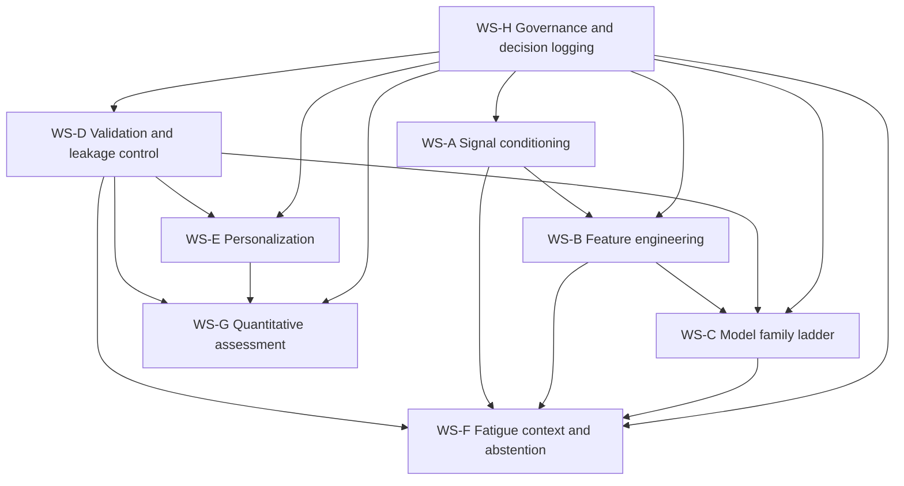

# Day 26 Research Protocol và Governance Framework cho sEMG Clinical Intelligence

## Khung khóa phạm vi và nguyên tắc bất biến

Bản này là **protocol-level artifact** cho Day 26, không phải báo cáo kết luận của tám workstream, không phải benchmark, và không phải kế hoạch huấn luyện. Về phương pháp, protocol này lấy ba trục làm xương sống: chuẩn báo cáo và appraisal cho prediction model dùng AI hoặc regression từ TRIPOD+AI và PROBAST+AI; chuẩn thiết kế, ghi nhận và báo cáo EMG từ CEDE-Check và SENIAM; cùng với nguyên tắc validation, calibration, abstention và human oversight từ loạt bài BMJ về clinical prediction model, tài liệu uncertainty trong medical ML, và khung governance như NIST AI RMF, WHO guidance, FDA/IMDRF GMLP. citeturn0search0turn0search1turn11view2turn12view1turn1search0turn1search12turn10search2turn10search4turn15search1turn7search1turn7search8turn6search0

**Lưu ý vận hành:** trong workspace hiện tại, các file nội bộ được nêu tên trong `internal source pack` không truy hồi được bằng file-search; vì vậy, những phần cần đối chiếu chính xác với “Pasted markdown(1).md” và artifact tree gốc được gắn **NOT_VERIFIED** nếu không thể suy ra trực tiếp từ context đã dán trong prompt. Do đó, bảng workstream dưới đây là **decomposition vận hành để khóa phương pháp luận**, còn **mức khớp một-một với tiêu đề tám workstream trong file nội bộ là NOT_VERIFIED**.

### Bảng khóa phạm vi

| Nhóm | Nội dung khóa |
|---|---|
| In-scope | Research protocol cho **Model, Feature, Validation, Personalization, Fatigue-Compensation**; governance framework; search strategy; appraisal template; evidence schema; decision ledger; dependency graph; stop conditions; checklist dùng chung cho 8 workstream |
| Out-of-scope | Training, fine-tuning, test-set evaluation, benchmark reproduction, hyperparameter tuning, model selection bằng performance đơn lẻ, deployment claim, treatment recommendation tự động |
| Previous decisions không mở lại | `trainingAllowed=false`; không mở lại dataset inventory Day 25; không mở lại audit tổng quát “Noraxon xuất được gì”; Task A/B/C là ba thực thể kỹ thuật riêng; Task B ưu tiên context, confidence adjustment, abstention; public healthy data chỉ làm engineering baseline; classical baseline phải đi trước deep learning; random-window split không là benchmark chính; mọi preprocessing/feature selection/calibration/threshold selection phải fit trong fold train/inner-val |
| Forbidden assumptions | Không giả định output Noraxon đã site-verified; không giả định MFCV eligible; không giả định public healthy performance suy rộng sang stroke/Vinmec; không giả định paper có accuracy cao thì phù hợp; không giả định split không nêu rõ là “ổn”; không giả định calibration/threshold có thể fit toàn bộ dataset |
| Dependency chỉ giải bằng site verification | Noraxon export fields thực tế tại site; nhãn lâm sàng cuối cùng cho Task C; quy trình dán điện cực, repositioning và operator consistency; protocol fatigue thực địa; session schedule; muscle set cuối cùng; eligibility của MFCV; data governance và permit nội bộ của site |

### YAML khóa protocol

```yaml
schema_version: "1.0"
artifact: "docs/research/day26/00-research-protocol.md"
status: "PROVISIONAL_LOCKED_FOR_DAY26"
trainingAllowed: false
rationale: >
  Day 26 chỉ khóa phương pháp luận nghiên cứu và governance.
  Không thực hiện training, benchmark reproduction, hoặc test-set use.
evidence_ids:
  - EXT-TRIPOD-AI-2024
  - EXT-PROBAST-AI-2025
  - EXT-CEDE-CHECK-2024
  - EXT-SENIAM-2000
  - EXT-BMJ-CPM-EVAL-2024
  - EXT-UQ-MEDAI-2021
  - EXT-GMLP-2025
  - EXT-NIST-AIRMF-2023
open_questions:
  - "Exact title mapping of 8 internal workstreams to this operational decomposition"
  - "Noraxon site export fields and timestamp/event-marker availability"
  - "Vinmec site label provenance and session protocol"
```

### Quyết định phạm vi

| Mục | Quyết định | Trạng thái |
|---|---|---|
| Dataset inventory | Không mở lại | LOCKED |
| Noraxon export audit tổng quát | Không mở lại | LOCKED |
| Search start-point | Database inception → hiện tại | LOCKED |
| Workstream conclusion chi tiết | Chưa thực hiện ở Day 26 protocol | LOCKED |
| Human review | Bắt buộc | LOCKED |
| Abstention pathway | Bắt buộc cho Task B và mọi output chưa đủ tin cậy | LOCKED |
| Site verification gate | Bắt buộc cho dependency phần cứng, protocol và label lâm sàng | LOCKED |

Các khóa trên phù hợp với chuẩn prediction-model reporting/appraisal hiện hành và best practice EMG: phải phân tách rõ giai đoạn phát triển so với external evaluation; phải mô tả kỹ task, điện cực, acquisition và preprocessing; và phải xem leakage hoặc identity confounding là flaw nghiêm trọng chứ không được “bù” bằng điểm cao ở hạng mục khác. citeturn10search2turn10search4turn11view2turn12view1turn3search10turn8search5turn9search0turn9search14

## Chuyển tám workstream thành research questions và dependency graph

Vì danh sách tám workstream trong file nội bộ chưa truy hồi được ở session này, tôi khóa một **operational eight-workstream map** đủ dùng cho Day 26. Map này bám theo phạm vi mà người dùng yêu cầu: **Model, Feature, Validation, Personalization, Fatigue-Compensation**, đồng thời giữ Task A/B/C là ba lane riêng trong các quyết định downstream. Mức khớp tiêu đề với tài liệu nội bộ: **NOT_VERIFIED**.

### Bảng research questions cho tám workstream

| Workstream | Primary research question | Secondary questions | Decision cần khóa | Evidence cần có | Output artifact | Upstream / downstream | Stop condition |
|---|---|---|---|---|---|---|---|
| WS-A Signal conditioning and segmentation | Pipeline tiền xử lý và segmentation nào có thể mô tả, tái lập và tương thích tốt nhất với sEMG từ Noraxon mà không đưa leakage? | Bandpass/notch; rectification hay không; window length; overlap; synchronization; artifact handling | Chuẩn preprocessing family và allowable window grid cho Day 26 | EMG tutorial/best-practice, CEDE/SENIAM, peer-reviewed method papers | `preprocessing-policy.yaml` | Upstream cho WS-B, C, D, F, G | Có danh mục allowed/preferred/forbidden và mọi bước học từ dữ liệu được đặt nội-fol d |
| WS-B Feature engineering | Bộ feature classical nào ổn định theo subject/session/fatigue hơn cho Task A/B/C? | Time, frequency, entropy, AR, time-frequency; feature scaling; feature stability; cost/latency | Feature candidate families và feature-governance rule | Primary papers + reviews về sEMG feature behavior, fatigue shifts, robustness | `feature-candidate-matrix.csv` | Phụ thuộc WS-A; downstream WS-C, D, F, G | Có shortlist feature families + rejection rules cho incomparable papers |
| WS-C Model family ladder | Ladder classical→advanced nào hợp lý cho từng Task mà không chọn model bằng một metric đơn lẻ? | LDA/SVM/RF/kNN/logistic/GBM; DL candidates chỉ sau classical; interpretability; compute budget | Model family shortlist theo Task A/B/C | Comparative methodological papers + reviews + governance guidance | `model-ladder.md` | Phụ thuộc WS-B, WS-D; downstream WS-F, G | Có baseline ladder cho cả 3 task và DL chỉ ở trạng thái secondary candidate |
| WS-D Validation and leakage control | Validation regime nào phản ánh transfer thật nhất giữa subject/session/day/site cho dự án này? | Subject-wise, session-wise, LOSO, grouped nested CV, internal-external style split, temporal split, site split | Primary benchmark split unit và anti-leakage SOP | BMJ evaluation series, leakage papers, subject-wise CV guidance, identity-confounding papers | `validation-policy.md` | Upstream gần như cho mọi workstream | Có primary benchmark + secondary stress tests + red flags |
| WS-E Personalization and adaptation | Personalization nào được phép nghiên cứu mà không phá vỡ hygiene đánh giá? | User-specific fine-tune? few-shot adaptation? calibration-only? per-subject normalization? MFCV eligibility? | Taxonomy personalization và eligibility gates | Inter-session/inter-subject EMG studies, adaptation papers, governance guidance | `personalization-eligibility.md` | Phụ thuộc WS-D; downstream blueprint for Task A/C | Có decision tree: none / calibration-only / lightweight adaptation / NOT_ELIGIBLE |
| WS-F Fatigue context, confidence adjustment, abstention | Fatigue được mô hình hóa như context/confidence adjustment/abstention thế nào thay vì classifier cứng mặc định? | Fatigue features vs nuisance shift; abstention trigger; selective coverage; uncertainty score; escalation | Task B operating concept và evaluation bundle | Fatigue reviews, selective prediction and medical UQ papers, calibration literature | `fatigue-context-policy.md` | Phụ thuộc WS-A/B/D; downstream human review workflow | Có rõ fatigue-as-context rule, abstention triggers và “không classifier cứng mặc định” |
| WS-G Quantitative assessment framework | Task C nên mô hình hóa đầu ra nào, ở mức nào, và bằng metric nào để không vượt chứng cứ? | Continuous score vs ordinal grade; label provenance; reliability target; minimal clinically relevant interpretation | Target-type shortlist và reporting metrics | CPM evaluation papers, site label governance, EMG clinical method papers | `taskC-target-framework.md` | Phụ thuộc WS-D/E; downstream site verification | Có target taxonomy + không có claim vượt label provenance |
| WS-H Governance, reproducibility and decision logging | Làm sao để tất cả workstream dùng cùng một evidence schema, appraisal template và decision threshold? | Versioning, ownership, evidence status, change control, red-team review | Unified governance package Day 26 | TRIPOD+AI, PROBAST+AI, NIST AI RMF, WHO, FDA/IMDRF GMLP | `governance-framework.md` | Cross-cutting; downstream mọi workstream | Có common schema, ledger, approval gates, and no-unreviewed merge rule |

### Dependency graph



### Protocol stop rules dùng chung

| Kiểu tình huống | Stop rule |
|---|---|
| Thiếu mô tả split unit | Không dùng performance claim cho decision-grade comparison |
| Có subject leakage / repeated-window leakage / feature selection ngoài fold | Gắn **CRITICAL FLAW**, paper không được dùng để chọn benchmark chính |
| Chỉ báo accuracy hoặc F1, không có thông tin calibration hoặc risk-score agreement khi task yêu cầu confidence/abstention | Chỉ dùng cho engineering hypothesis, không dùng khóa decision cho Task B/C |
| Population, muscle set, electrode geometry, task, session structure quá khác | Không so sánh trực tiếp metric; chỉ trích xuất idea/phương pháp |
| Preprint nhưng đã có paper peer-reviewed mạnh hơn | Loại khỏi decision-grade set |
| Không rõ label provenance hoặc clinical reference standard | Không dùng để suy diễn lâm sàng cho Task C |

Lý do của dependency order này là: EMG methodology đòi hỏi mô tả rõ task, điện cực, acquisition và preprocessing trước khi bàn feature/model; prediction-model methodology yêu cầu split strategy và leakage control được khóa trước khi bàn personalization hay abstention; và medical-AI governance yêu cầu human oversight, decision logging, và role clarity xuyên suốt vòng đời nghiên cứu. citeturn12view1turn10search2turn10search4turn3search10turn8search5turn9search0turn9search14turn15search1turn7search1turn6search0

## Search protocol, source hierarchy và screening rules

### Source hierarchy

| Level | Nguồn | Vai trò |
|---|---|---|
| H1 | Official standards / official documentation / official repositories | Khóa terminology, governance, reporting, device-method constraints |
| H2 | Original peer-reviewed papers | Bằng chứng chính cho methodology, feature behavior, variability, fatigue, personalization |
| H3 | Systematic / methodological reviews | Tổng hợp khoảng trống, terminology map, seed references |
| H4 | Preprints | Chỉ dùng khi chưa có nguồn mạnh hơn; phải gắn PREPRINT và không một mình khóa quyết định irreversible |
| H5 | Blogs / vendor marketing / SEO pages | Discovery only, không dùng làm bằng chứng quyết định |

Nguồn ưu tiên cho đợt này gồm CEDE, SENIAM, BMJ/EQUATOR, PubMed, IEEE Xplore, Scopus/Web of Science, WHO, FDA, IMDRF, NIST, và repository/license chính thức khi workstream cần kiểm tra access hoặc reuse rights. CEDE-Check và SENIAM là trọng tâm cho EMG reporting; TRIPOD+AI và PROBAST+AI là trọng tâm cho reporting và risk-of-bias của prediction model; BMJ 2024 series là trọng tâm cho internal, internal-external và external evaluation; còn NIST/WHO/FDA-IMDRF hỗ trợ governance, oversight và lifecycle control. citeturn11view2turn12view1turn1search0turn1search12turn0search0turn0search1turn10search2turn10search4turn10search1turn7search1turn7search8turn6search0

### Search concepts và synonyms

| Concept block | Query synonyms cốt lõi |
|---|---|
| sEMG modality | `"surface electromyography" OR sEMG OR EMG OR myoelectric` |
| Gesture / motor decoding | `gesture recognition OR hand gesture OR motion intention OR pattern recognition OR decoding` |
| Fatigue | `fatigue OR muscle fatigue OR exertion OR nonstationarity OR session drift` |
| Personalization | `personalization OR subject-specific OR adaptation OR transfer learning OR few-shot OR calibration-only OR user adaptation` |
| Validation | `subject-wise OR leave-one-subject-out OR grouped cross-validation OR internal-external validation OR session-wise OR temporal validation` |
| Leakage | `data leakage OR identity confounding OR feature selection leakage OR repeated measures leakage OR random window split` |
| Calibration / abstention | `calibration OR uncertainty OR confidence adjustment OR selective prediction OR abstention OR deferral` |
| Clinical transfer | `rehabilitation OR stroke OR upper limb OR clinical prediction model OR generalisability` |

### Exact search protocol seed set

Bảng dưới đây là **seed log** cho đợt xây protocol. Đây chưa phải full screening log cho từng workstream, nhưng đủ để khóa logic tìm kiếm và tiêu chí sàng lọc dùng chung.

| Database / site | Exact query | Ngày tìm kiếm | Records rà soát trong seed stage | Inclusion reason | Exclusion reason | Final decision |
|---|---|---:|---:|---|---|---|
| BMJ / EQUATOR | `TRIPOD+AI official guideline BMJ prediction model artificial intelligence` | 2026-07-27 | top surfaced official hits | Reporting guideline chính thức cho AI prediction model | Non-official repost | INCLUDE |
| BMJ / PubMed | `PROBAST-AI official risk of bias tool artificial intelligence` | 2026-07-27 | top surfaced official hits | Appraisal / risk-of-bias tool chính thức | Commentary không phải tool paper | INCLUDE |
| PubMed / CEDE / SENIAM | `surface EMG recommendations electrode placement SENIAM official pdf` | 2026-07-27 | top surfaced official hits | EMG electrode/reporting method | Non-official mirror nếu không có thông tin gốc rõ | INCLUDE nếu official/primary |
| PubMed / JEK | `Consensus for experimental design in electromyography CEDE checklist reporting critically appraising` | 2026-07-27 | top surfaced primary hits | Checklist chuẩn cho EMG study | Secondary mention only | INCLUDE |
| PubMed / PMC | `surface EMG machine learning subject-wise split cross validation` | 2026-07-27 | top surfaced methodological hits | Validation regime / split hygiene | Paper chỉ có performance mà không rõ split | CONDITIONAL |
| PMC / PubMed | `identity confounding repeated measures machine learning clinical` | 2026-07-27 | top surfaced methodological hits | Leakage risk do repeated measures | Không liên quan prediction evaluation | INCLUDE |
| PMC / PubMed | `nested cross-validation feature selection leakage biomedical machine learning` | 2026-07-27 | top surfaced methodological hits | Chốt rule “fit inside fold” | Opinion / blog | INCLUDE |
| BMJ / PubMed | `evaluation of clinical prediction models part 1 2 3 BMJ 2024` | 2026-07-27 | top surfaced BMJ series | Internal/internal-external/external evaluation; calibration | Non-peer-reviewed summaries | INCLUDE |
| PMC / JAMIA | `communicating uncertainty in medical machine learning abstention` | 2026-07-27 | top surfaced hits | Task B confidence / abstention rationale | Generic AI uncertainty outside medical context nếu mạnh hơn medical source đã có | INCLUDE |
| PubMed / PMC | `surface electromyography fatigue feature shifts classification review` | 2026-07-27 | top surfaced hits | Fatigue as context / non-stationarity | Exercise-only papers không khớp protocol nếu không chuyển giao được | CONDITIONAL |
| PubMed | `surface EMG-based inter-session gesture recognition` | 2026-07-27 | top surfaced hits | Session variability / adaptation relevance | Intra-session only | INCLUDE |
| PubMed / Sensors | `electrode shift limb position variation myoelectric pattern recognition` | 2026-07-27 | top surfaced hits | Personalization / robustness relevance | Không báo protocol hoặc channel details | CONDITIONAL |

### Inclusion và exclusion criteria

| Nhóm | Inclusion criteria | Exclusion criteria |
|---|---|---|
| Population relevance | Healthy hoặc clinical nếu giúp trả lời question methodology; clinical papers ưu tiên khi bàn transfer/gov | Population quá xa câu hỏi và không có methodological value |
| Protocol relevance | Có mô tả task, muscle/anatomical region, acquisition, sessions | Không mô tả đủ để hiểu protocol |
| Validation relevance | Có split unit rõ, hoặc cho phép suy ra chắc chắn | Không nêu split strategy và không suy ra được |
| Feature/model relevance | Có feature/model details và evaluation regime | Chỉ nêu “AI model” chung chung |
| Governance relevance | Official hoặc peer-reviewed guidance về reporting/appraisal/oversight | Marketing, SEO, brochure |
| Access / license clarity | Có DOI/official URL và full-text hoặc abstract đủ appraisal | Không truy hồi được, hoặc source mirror không rõ provenance |
| Comparative utility | Có thể map được sang Task A/B/C | Chỉ là benchmark không so sánh được vì ontology quá khác và không có ý nghĩa phương pháp |

### Rules xử lý paper khó

| Tình huống | Rule |
|---|---|
| Preprint | Giữ ở trạng thái `NOT_VERIFIED` hoặc `INFERRED` nếu chưa có nguồn mạnh hơn; không dùng một mình để khóa quyết định irreversible |
| Không báo split strategy | Không dùng performance claim; chỉ dùng để lấy feature idea hoặc protocol idea nếu phần đó mô tả rõ |
| Chỉ báo accuracy | Không dùng khóa decision cho Task B/C; có thể dùng ở mức engineering hypothesis cho Task A nếu split, population và ontology đủ tương thích |
| Random-window split | Không là benchmark chính; nếu paper chỉ có random-window split thì xếp “supporting only” |
| Calibration/threshold fit ngoài fold | Gắn `CRITICAL FLAW` |
| Feature selection toàn bộ dataset trước CV | Gắn `CRITICAL FLAW` |
| Repeated measures của cùng subject xuất hiện ở train và eval mà không group-aware | Gắn `CRITICAL FLAW` |
| Paper rất khác population/session/electrode/channel | Không so sánh trực tiếp metrics; chỉ trích phương pháp hoặc failure mode |

Các rule này bám sát bằng chứng rằng identity confounding từ repeated measures có thể làm mô hình học dấu hiệu của subject thay vì tín hiệu mục tiêu; subject-wise validation giữ trọn dữ liệu của một người trong cùng split; inner nesting giúp chặn leakage do feature selection; và calibration/external evaluation phải được báo riêng, không thể bị thay thế bởi một con số accuracy đơn lẻ. citeturn8search5turn3search10turn9search0turn9search14turn10search2turn10search4turn3search24

## Appraisal framework, leakage governance và checklist dùng chung

### Rubric appraisal

Rubric dưới đây dùng cho `00-paper-appraisal-template.csv`. Điểm chỉ để **sắp thứ tự ưu tiên đọc**, không bao giờ dùng để “xóa” critical flaw. Một paper có leakage nghiêm trọng vẫn là blocker dù tổng điểm cao.

| Domain | Scale | Ý nghĩa |
|---|---:|---|
| Population relevance | 0–2 | 0 = xa; 1 = có giá trị phương pháp; 2 = gần target population/task |
| Protocol relevance | 0–2 | 0 = mô tả kém; 1 = tạm dùng; 2 = đủ để tái lập logic |
| Channel/electrode relevance | 0–2 | 0 = rất khác; 1 = chấp nhận có điều kiện; 2 = gần với ứng dụng dự kiến |
| Session relevance | 0–2 | 0 = intra-session only; 1 = có multi-session hạn chế; 2 = session/day variability phù hợp |
| Split quality | 0–3 | 0 = random windows/không rõ; 1 = train-test đơn giản; 2 = subject/session-wise; 3 = grouped nested / internal-external / external |
| Leakage risk | 0–3 | 0 = critical suspicion; 1 = chưa rõ; 2 = tương đối sạch; 3 = mô tả sạch, fold-contained transformations |
| Model-selection hygiene | 0–2 | 0 = không rõ; 1 = partial; 2 = inner tuning / no test peeking |
| Personalization relevance | 0–2 | 0 = không liên quan; 1 = gợi ý; 2 = trực tiếp |
| Fatigue relevance | 0–2 | 0 = không liên quan; 1 = gián tiếp; 2 = trực tiếp |
| Clinical transferability | 0–2 | 0 = thấp; 1 = giới hạn; 2 = có mô tả cẩn trọng |
| Reproducibility | 0–2 | 0 = khó tái lập; 1 = trung bình; 2 = tốt |
| License/access clarity | 0–1 | 0 = không rõ; 1 = rõ |

### Critical flaw flags

| Flag | Điều kiện kích hoạt | Hệ quả |
|---|---|---|
| `CF-SUBJECT-LEAKAGE` | Cùng subject xuất hiện ở train và evaluation của benchmark chính | Không dùng để khóa model/split decision |
| `CF-WINDOW-LEAKAGE` | Random-window split hoặc phân đoạn chồng lấn giữa train/eval làm benchmark chính | Supporting-only |
| `CF-PREPROC-LEAKAGE` | Scaler/normalizer/denoiser học từ toàn bộ dataset trước split | Exclude from decision-grade evidence |
| `CF-FS-LEAKAGE` | Feature selection trước CV / ngoài inner fold | Exclude from comparative performance use |
| `CF-THRESHOLD-LEAKAGE` | Threshold / calibration fit trên evaluation fold hoặc test | Exclude from Task B/C decision use |
| `CF-LABEL-UNCLEAR` | Không rõ label provenance/reference standard | Không dùng cho clinical transfer claim |
| `CF-SPLIT-NR` | Split strategy không report và không suy ra được | No performance comparison |
| `CF-INCOMPARABLE` | Population/protocol/electrode/ontology quá khác | Chỉ dùng cho method idea, không so metric |

### Checklist dùng chung cho mọi workstream

| Hạng mục | Câu hỏi bắt buộc |
|---|---|
| Signal / acquisition | Task, posture, instructions, muscle set, electrode type/placement, sampling, filters, wireless transmission, synchronization đã được mô tả chưa? |
| Split | Split unit là sample/window/trial/subject/session/day/site? Có overlap leakage không? |
| Pipeline fitting | Bất kỳ bước nào học từ dữ liệu có nằm gọn trong training/inner-validation fold không? |
| Selection hygiene | Model/feature/threshold được chọn từ inner loop hay đã nhìn evaluation set? |
| Metrics | Có tách rõ discrimination, calibration của risk score, coverage-abstention, và utility theo task không? |
| Comparability | Paper có bị khác quá nhiều về population, ontology, channel/electrode, session count không? |
| Transfer | Tác giả có overclaim từ healthy sang clinical không? |
| Governance | Có human review, abstention path, logging, versioning, access/license rõ không? |

Rubric và checklist này được hỗ trợ mạnh bởi CEDE-Check về nội dung cần report trong EMG study; bởi TRIPOD+AI và PROBAST+AI về báo cáo và risk-of-bias cho prediction model; bởi BMJ 2024 series về tách bạch development, internal-external và external evaluation, cũng như calibration; và bởi literature về uncertainty/abstention trong medical ML. citeturn12view1turn11view2turn0search0turn0search1turn10search2turn10search4turn10search1turn15search1turn1search15

### Governance controls bắt buộc

| Control | Rule |
|---|---|
| Role clarity | Mỗi quyết định phải có owner chuyên môn và reviewer độc lập |
| Change control | Mọi thay đổi split rule, target definition, feature policy, threshold policy phải vào decision ledger |
| Human oversight | Mọi artifact ra Day 26 blueprint đều cần human review trước khi “lock” |
| Abstention gate | Nếu evidence không đủ, artifact phải ghi `NOT_VERIFIED` thay vì lấp giả định |
| Evidence status | Mọi claim quyết định-grade phải gắn `OFFICIAL_VERIFIED`, `PEER_REVIEWED_VERIFIED`, `REPOSITORY_VERIFIED`, `SITE_VERIFIED`, `INFERRED`, `NOT_VERIFIED`, hoặc `CONFLICTING` |
| Reproducibility | Mọi config phải có `schema_version`, `status`, `rationale`, `evidence_ids`, `open_questions` |
| No hidden optimization | Không dùng test-set để chọn preprocessing, feature, model, calibration, threshold |
| Escalation | Nếu workstream đụng dependency site-only, chuyển sang “site verification required” và dừng kết luận |

Các control này nhất quán với AI RMF của NIST về governance, role clarity và oversight; với WHO guidance về governance của AI trong y tế; và với FDA/IMDRF GMLP về lifecycle controls cho AI/ML medical-device–like systems. citeturn7search1turn7search5turn7search8turn6search0turn7search2turn7search3

## Working artifacts cho `docs/research/day26/`

### Artifact `00-research-protocol.md`

```markdown
# Day 26 Research Protocol for sEMG Clinical Intelligence

schema_version: 1.0
status: PROVISIONAL_LOCKED_FOR_DAY26
trainingAllowed: false

## Purpose
Lock methodology for research on model, feature, validation, personalization,
and fatigue-compensation without training or benchmark reproduction.

## Scope locks
- Keep Task A, B, C technically separate.
- Do not reopen dataset inventory.
- Do not reopen generic Noraxon export audit.
- Require human review and abstention.
- Require fold-contained fitting for any learned transformation.

## Workstreams
- WS-A Signal conditioning and segmentation
- WS-B Feature engineering
- WS-C Model family ladder
- WS-D Validation and leakage control
- WS-E Personalization and adaptation
- WS-F Fatigue context, confidence adjustment, abstention
- WS-G Quantitative assessment framework
- WS-H Governance, reproducibility, decision logging

## Evidence taxonomy
- OFFICIAL_VERIFIED
- PEER_REVIEWED_VERIFIED
- REPOSITORY_VERIFIED
- SITE_VERIFIED
- INFERRED
- NOT_VERIFIED
- CONFLICTING

## Mandatory stop rules
- Subject leakage => CRITICAL FLAW
- Random-window split as primary benchmark => REJECT
- Feature selection outside inner fold => REJECT
- Calibration / threshold fit outside inner fold => REJECT
- Missing split strategy => no performance comparison
```

### Artifact `00-search-strategy.md`

```markdown
# Day 26 Search Strategy

schema_version: 1.0
status: READY_FOR_WORKSTREAM_EXECUTION

## Source hierarchy
1. Official standards, official documentation, official repository/license
2. Original peer-reviewed papers
3. Systematic and methodological reviews
4. Preprints marked explicitly
5. Discovery-only web content

## Core databases
- PubMed
- IEEE Xplore
- Scopus
- Web of Science
- Google Scholar for citation chasing only
- BMJ / EQUATOR / CEDE / SENIAM / WHO / FDA / NIST / IMDRF official sites

## Query blocks
A = "surface electromyography" OR sEMG OR EMG OR myoelectric
B = gesture recognition OR motion intention OR pattern recognition OR decoding
C = fatigue OR muscle fatigue OR nonstationarity OR exertion
D = personalization OR adaptation OR transfer learning OR few-shot OR subject-specific
E = subject-wise OR leave-one-subject-out OR grouped cross-validation OR session-wise OR temporal validation
F = data leakage OR identity confounding OR feature selection leakage
G = calibration OR uncertainty OR confidence adjustment OR selective prediction OR abstention

## Operational rules
- Search from database inception to current date.
- Backward/forward citation chasing mandatory for decision-grade papers.
- Preprint only if no stronger source exists.
- No split strategy reported => performance not decision-grade.
- Accuracy-only papers => engineering-hypothesis only unless question is purely algorithmic and split is rigorous.
```

### Artifact `00-evidence-schema.csv`

```csv
evidence_id,workstream,research_question,claim,decision_implication,source_title,source_type,authors,year,doi_or_official_url,population,n_subjects,clinical_or_healthy,muscle_or_anatomical_region,task_or_protocol,device,channel_count,electrode_geometry,n_sessions_or_days,window_length,overlap,feature_set,model,split_unit,validation_regime,metric,main_finding,limitations,project_transferability,evidence_status,reviewer_note
```

### Artifact `00-paper-appraisal-template.csv`

```csv
paper_id,workstream,source_title,year,doi_or_url,source_type,population_relevance_score,protocol_relevance_score,channel_electrode_relevance_score,session_relevance_score,split_quality_score,leakage_risk_score,model_selection_hygiene_score,personalization_relevance_score,fatigue_relevance_score,clinical_transferability_score,reproducibility_score,license_access_clarity_score,critical_flag_subject_leakage,critical_flag_window_leakage,critical_flag_preproc_leakage,critical_flag_feature_selection_leakage,critical_flag_threshold_leakage,critical_flag_label_unclear,critical_flag_split_not_reported,critical_flag_incomparable,decision_use,overall_priority,reviewer_note
```

### Artifact `00-decision-ledger.md`

```markdown
# Day 26 Decision Ledger

| decision_id | question | options | current_status | evidence_threshold | owner | dependency | deadline | reversible_or_irreversible | final_rationale |
|---|---|---|---|---|---|---|---|---|---|
| D26-001 | Primary split unit for benchmark | subject-wise / session-wise / random-window | OPEN | >=2 independent methodological sources, no critical flaw | Biostat Lead | WS-D | Day26 freeze | irreversible-for-Day26 | TBD |
| D26-002 | Allow random-window split anywhere? | primary / secondary diagnostic only / ban | PROVISIONAL=secondary-diagnostic-only | same as above | Biostat Lead | WS-D | Day26 freeze | reversible | Leakage risk |
| D26-003 | Classical baseline precedence | yes / no | LOCKED=yes | project-locked | ML Lead | none | immediate | irreversible | Project decision |
| D26-004 | Task B operating concept | hard classifier / context-adjustment+abstention / mixed | LOCKED=context-adjustment+abstention-first | project-locked + UQ literature | Safety Lead | WS-F | immediate | irreversible | Project decision |
| D26-005 | Personalization eligibility gating | none / calibration-only / adaptation / MFCV | OPEN | inter-session evidence + site feasibility | ML Lead | WS-E | Day26 freeze | reversible | TBD |
| D26-006 | Feature selection policy | global / fold-contained | LOCKED=fold-contained | leakage literature | DSP Lead | WS-D | immediate | irreversible | Leakage control |
| D26-007 | Calibration fitting policy | full-data / inner-fold only | LOCKED=inner-fold-only | CPM evaluation + leakage logic | Biostat Lead | WS-D | immediate | irreversible | Hygiene |
| D26-008 | Site verification dependencies | soft / mandatory | LOCKED=mandatory for listed items | governance | Program Lead | all | immediate | irreversible | No assumption filling |
```

Các artifact này phản ánh trực tiếp logic từ EMG reporting consensus, prediction-model guidance, leakage literature, calibration guidance và uncertainty/abstention literature. citeturn11view2turn12view1turn0search0turn0search1turn10search2turn10search4turn9search0turn9search14turn15search1

## Decision ledger khởi tạo, handoff và trạng thái đưa vào Day 26 Blueprint

### Initial decision ledger

| decision_id | question | options | current status | evidence threshold | owner | dependency | deadline | reversible_or_irreversible | final rationale |
|---|---|---|---|---|---|---|---|---|---|
| D26-VAL-PRIMARY | Benchmark chính dùng split gì? | subject-wise / session-wise / grouped nested / random-window | **PROVISIONAL:** subject-wise hoặc session-wise grouped nested; random-window không chính | ≥2 nguồn độc lập, không critical flaw | Biostat Lead | WS-D | Day 26 freeze | Irreversible for Day 26 | Subject leakage và identity confounding làm sai lệch performance nếu split không group-aware. citeturn3search10turn8search5turn9search0turn9search14 |
| D26-FS-HYGIENE | Feature selection fit ở đâu? | global / outer-train / inner-fold only | **LOCKED:** inner-fold only | 1 methodological primary + 1 corroborating source | DSP Lead | WS-D | immediate | Irreversible | Nested evaluation cần ngăn leakage từ feature selection. citeturn9search0turn9search14turn9search1 |
| D26-CAL-HYGIENE | Calibration/threshold fit ở đâu? | full data / train data / inner-fold only | **LOCKED:** inner-fold only | 1 CPM source + leakage rationale | Biostat Lead | WS-D | immediate | Irreversible | Calibration là thành phần evaluation riêng, không được nhìn evaluation/test khi chọn threshold. citeturn10search4turn3search24turn10search8 |
| D26-MODEL-LADDER | Có cho DL đi trước classical không? | yes / no | **LOCKED:** no | Project lock + review evidence | ML Lead | WS-C | immediate | Irreversible | Project đã khóa classical baseline trước. |
| D26-TASKB-CONCEPT | Task B là gì? | hard fatigue classifier / context-adjustment / abstention-first hybrid | **LOCKED:** context-adjustment + abstention-first | Project lock + medical UQ evidence | Safety Lead | WS-F | immediate | Irreversible | Medical ML cần khả năng “I don’t know” và human escalation. citeturn15search1turn15search10turn15search12 |
| D26-PER-ELIGIBILITY | Personalization có được phép không? | none / calibration-only / lightweight adaptation / MFCV | **OPEN** | inter-session evidence + site feasibility + no leakage path | ML Lead | WS-E | Day 26 freeze | Reversible | Chỉ khóa sau khi biết session drift, protocol drift và site constraints. citeturn4search5turn5search3turn5search7 |
| D26-MFCV | MFCV có dùng được không? | eligible / conditional / not eligible | **OPEN-NOT_VERIFIED** | SITE_VERIFIED + protocol fit | Rehab Method Lead | WS-E | Site gate | Reversible | Project đã khóa MFCV là optional, chỉ dùng khi đủ eligibility. |
| D26-TASKC-TARGET | Task C target type là gì? | continuous score / ordinal class / clinician-entered composite | **OPEN** | label provenance + site verification + CPM metric fit | Clinical Lead | WS-G | Site gate | Reversible | Không được vượt quá evidence của label source. |
| D26-SITE-GATES | Những gì bắt buộc site verification? | protocol / labels / Noraxon export specifics / operator workflow | **LOCKED:** mandatory for listed items | Governance threshold | Program Lead | All | immediate | Irreversible | Không tự lấp giả định khi thiếu chứng cứ. |

### Rejected alternatives

| Alternative | Lý do bác bỏ |
|---|---|
| Dùng random-window split làm benchmark chính | Không phản ánh transfer thực; dễ nhiễm identity/window leakage; trái project lock |
| Chọn model chỉ theo accuracy/F1 cao nhất từ literature | Metrics giữa paper thường không comparable; calibration và transferability bị bỏ qua |
| Gộp Task A/B/C thành một workstream model-selection chung | Trái project lock; làm mờ mục tiêu Task B và label logic Task C |
| Mặc định Task B là fatigue classifier cứng | Trái project lock; không ăn khớp với uncertainty/abstention literature |
| Fit scaler/feature selection/calibration/threshold trên toàn bộ dataset trước CV | Leakage rõ ràng |
| Suy từ healthy public data sang hiệu quả lâm sàng | Trái project lock; transfer không được chứng minh |

### NOT_VERIFIED items

| Item | Trạng thái |
|---|---|
| Exact eight-workstream titles trong `Pasted markdown(1).md` | NOT_VERIFIED |
| Artifact tree gốc của dự án | NOT_VERIFIED |
| Noraxon export fields đang sẵn có tại site cho mọi task | NOT_VERIFIED |
| MFCV eligibility | NOT_VERIFIED |
| Final label provenance cho Task C tại Vinmec/site đích | NOT_VERIFIED |
| Session protocol, operator SOP, electrode reposition workflow của site | NOT_VERIFIED |

### Evidence matrix rows seed set

| evidence_id | workstream | claim | source_title | source_type | year | split_unit / key field | main_finding | evidence_status | reviewer_note |
|---|---|---|---|---|---:|---|---|---|---|
| EXT-CEDE-CHECK-2024 | Cross-cutting | EMG studies cần báo rõ task, electrode placement, recording characteristics, acquisition/preprocessing | CEDE-Check | Peer-reviewed consensus | 2024 | Reporting checklist | Final checklist gồm 40 items, giúp report và critical appraisal EMG studies | PEER_REVIEWED_VERIFIED | Nguồn nền cho appraisal template. citeturn11view2turn12view1 |
| EXT-SENIAM-2000 | WS-A | Electrode placement và sensor procedures cần theo recommendation chuẩn | SENIAM / Hermens et al. | Official / primary | 2000 | Electrode procedures | SENIAM là nguồn chuẩn lâu năm cho placement/sensor procedures | OFFICIAL_VERIFIED | Dùng làm anchor cho placement review. citeturn1search0turn1search12turn1search20 |
| EXT-TRIPOD-AI-2024 | WS-H | Prediction model AI cần reporting chuẩn hóa | TRIPOD+AI statement | Official peer-reviewed | 2024 | Reporting | Cập nhật guidance cho reporting prediction model dùng regression hoặc ML | OFFICIAL_VERIFIED | Áp cho artifact/reporting completeness. citeturn0search0turn0search3 |
| EXT-PROBAST-AI-2025 | WS-H | Prediction model AI cần appraisal bias/applicability đặc thù | PROBAST+AI | Official peer-reviewed | 2025 | Risk-of-bias | Tool cập nhật cho regression và AI prediction models | OFFICIAL_VERIFIED | Áp cho appraisal template. citeturn0search1 |
| EXT-CV-SUBJECTWISE-2023 | WS-D | Subject-wise CV giữ nguyên identity theo split | Practical Considerations and Applied Examples of Cross-Validation in Human Movement Sciences | Peer-reviewed methodological review | 2023 | Subject-wise | Subject-wise CV tránh một cá thể xuất hiện ở cả train và eval | PEER_REVIEWED_VERIFIED | Hỗ trợ cấm random-window benchmark chính. citeturn3search10 |
| EXT-IDENTITY-CONFOUND-2019 | WS-D | Repeated measures có thể gây identity confounding | Detecting the impact of subject characteristics on machine learning-based diagnostic applications | Peer-reviewed | 2019 | Repeated measures | Cho thấy confounding theo subject có thể làm sai kết luận ML y sinh | PEER_REVIEWED_VERIFIED | Hỗ trợ critical flaw. citeturn8search5 |
| EXT-NESTED-FS-2020 | WS-D | Inner nest giảm leakage do feature selection | Consensus features nested cross-validation | Peer-reviewed | 2020 | Nested CV | Dùng inner nest để hạn chế leaked information giữa outer folds | PEER_REVIEWED_VERIFIED | Hỗ trợ fold-contained feature selection. citeturn9search0 |
| EXT-FS-LEAKAGE-2021 | WS-D | Feature selection trước CV gây bias | Measuring the bias of incorrect application of feature selection | Peer-reviewed | 2021 | Feature selection | Làm rõ bias khi feature selection làm sai quy trình CV | PEER_REVIEWED_VERIFIED | Critical flag template. citeturn9search14 |
| EXT-BMJ-EVAL-2024A | WS-D/WS-G | Cần tách development, internal-external và external evaluation | Evaluation of clinical prediction models part 1 | Peer-reviewed | 2024 | Validation regime | Nhấn mạnh internal, internal-external, external validation và heterogeneity | PEER_REVIEWED_VERIFIED | Dùng design validation stack. citeturn10search2turn10search11 |
| EXT-BMJ-EVAL-2024B | WS-F/WS-G | Calibration là thành phần đánh giá riêng | Evaluation of clinical prediction models part 2 | Peer-reviewed | 2024 | Calibration | Cần đánh giá độ khớp giữa risk score dự báo và tần suất quan sát | PEER_REVIEWED_VERIFIED | Dùng cho confidence/abstention và Task C. citeturn10search4turn10search17 |
| EXT-UQ-MEDAI-2021 | WS-F | Medical AI cần uncertainty handling và abstention/human escalation | Communicating uncertainty in medical machine learning | Peer-reviewed review | 2021 | Uncertainty / abstention | Tổng quan về uncertainty quantification và abstention trong medical ML | PEER_REVIEWED_VERIFIED | Nền tảng cho Task B. citeturn15search1turn15search8 |
| EXT-SELECTIVE-CLIN-2024 | WS-F | Selective prediction có thể cải thiện workflow khi cho phép abstain | Selective prediction for extracting unstructured clinical data | Peer-reviewed | 2024 | Selective prediction | Chỉ ra giá trị thực dụng của abstention + human review | PEER_REVIEWED_VERIFIED | Không phải EMG nhưng hữu ích cho governance Task B. citeturn1search15 |
| EXT-FATIGUE-REVIEW-2022 | WS-F | Fatigue làm dịch chuyển feature sEMG theo thời gian và tần số | Application of Surface Electromyography in Exercise Fatigue | Peer-reviewed review | 2022 | Fatigue features | Tổng quan signal processing, features và classification cho fatigue | PEER_REVIEWED_VERIFIED | Chỉ hỗ trợ concept; transfer sang stroke/site cần thận trọng. citeturn4search0 |
| EXT-INTERSESSION-2017 | WS-E | Inter-session variability làm giảm performance gesture recognition | Surface EMG-Based Inter-Session Gesture Recognition Enhanced by Deep Domain Adaptation | Peer-reviewed | 2017 | Session-wise | Chỉ ra chênh lệch intra-session so với inter-session | PEER_REVIEWED_VERIFIED | Hỗ trợ cần workstream personalization. citeturn4search5turn5search22 |
| EXT-ELECTRODE-SHIFT-2011 | WS-E | Electrode shift ảnh hưởng robustness của myoelectric pattern recognition | Improving Myoelectric Pattern Recognition Robustness to Electrode Shift | Peer-reviewed | 2011 | Electrode shift | Nghiên cứu cấu hình kênh/IED/feature để tăng robustness | PEER_REVIEWED_VERIFIED | Dùng khi chốt eligibility adaptation. citeturn5search7 |
| EXT-LIMBPOS-2024 | WS-E | Limb position và electrode shift tiếp tục là nguồn suy giảm classifier | The Impact of Limb Positions and Electrode Shifts | Peer-reviewed | 2024 | Robustness | Xác nhận ảnh hưởng của limb position/electrode shift lên deterioration | PEER_REVIEWED_VERIFIED | Hỗ trợ personalization gate. citeturn5search3 |
| EXT-NIST-AIRMF-2023 | WS-H | Governance cần role clarity và human-AI oversight rõ | NIST AI RMF 1.0 | Official | 2023 | Governance | Quy định role/responsibility cho human-AI configurations và oversight | OFFICIAL_VERIFIED | Dùng cho governance package. citeturn7search1turn7search5 |
| EXT-WHO-AI-2021 | WS-H | AI trong y tế cần governance và ethical safeguards rõ | WHO ethics and governance of AI for health | Official | 2021 | Governance | WHO nêu các rủi ro và nguyên tắc governance | OFFICIAL_VERIFIED | Dùng cho human review và no-overclaim. citeturn7search0turn7search8 |
| EXT-GMLP-2025 | WS-H | AI/ML lifecycle trong device-like setting cần GMLP principles | FDA GMLP / IMDRF aligned page | Official | 2025 | Lifecycle control | Nguyên tắc GMLP hỗ trợ quản trị vòng đời | OFFICIAL_VERIFIED | Không phải đăng ký device ngay lúc này, nhưng hữu ích cho research governance. citeturn6search0turn7search3turn7search2 |

### Open questions cho vòng tiếp theo

| Câu hỏi | Dependency |
|---|---|
| Exact list of 8 internal workstreams là gì, và có map 1:1 với WS-A…WS-H ở trên không? | Cần internal file access |
| Noraxon/myoRESEARCH export fields thực tế nào sẵn cho timestamp, marker, per-channel metadata, normalization references? | Site verification |
| Task C label/reference standard là clinician-derived, score-derived, hay composite? | Site verification |
| MFCV có đủ eligibility về signal quality, protocol consistency và reference target không? | Site verification + WS-E |
| Window length / overlap nào phù hợp nhất cho từng task under actual site latency constraints? | WS-A + site constraints |
| Task B sẽ dùng score calibration, abstention threshold, hay dual-path review logic nào? | WS-F + WS-D |
| Có đủ multi-session data để đánh giá personalization hợp lệ không? | WS-E + site data availability |

### Provisional decisions

| Mục | Quyết định tạm thời |
|---|---|
| Method backbone | CEDE/SENIAM + TRIPOD+AI/PROBAST+AI + BMJ validation series + medical-AI uncertainty/governance |
| Benchmark philosophy | Group-aware, no random-window primary benchmark |
| Leakage policy | Zero tolerance for subject leakage, FS leakage, threshold leakage |
| Task B | Context/confidence adjustment/abstention-first |
| Governance | Evidence taxonomy + decision ledger + mandatory human review |

### Go status

**Go-with-conditions** cho việc đưa nội dung này vào Day 26 Experiment Blueprint.

Điều kiện kèm theo là:  
một, phải xác nhận lại mapping với **tám workstream gốc** khi internal source pack truy hồi được;  
hai, mọi item đã đánh dấu **NOT_VERIFIED** phải giữ nguyên trạng thái đó cho đến khi có bằng chứng site hoặc file nội bộ;  
ba, mọi workstream downstream phải sử dụng đúng chung một `evidence schema`, `paper appraisal template`, `decision ledger`, và `stop rule` đã khóa ở đây. Logic này phù hợp với prediction-model methodology hiện hành, EMG reporting consensus, và governance frameworks nhấn mạnh role clarity, oversight, documentation và lifecycle control. citeturn0search0turn0search1turn11view2turn12view1turn10search2turn10search4turn15search1turn7search1turn6search0