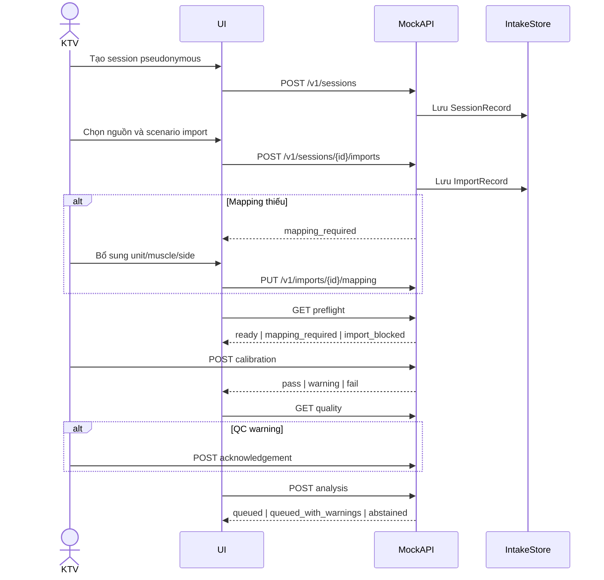

# Sequence Session & Data Intake Day 20

## Blockers

| Upstream | Blocker | Downstream bị chặn |
|---|---|---|
| Import | `import_rejected` | Mapping/Preflight/QC |
| Mapping | completeness < 1 | Preflight ready |
| Calibration | fail | Analysis handoff |
| QC | warning chưa acknowledge | Analysis handoff |
| QC | fail | Analysis handoff queued; trả abstained |
