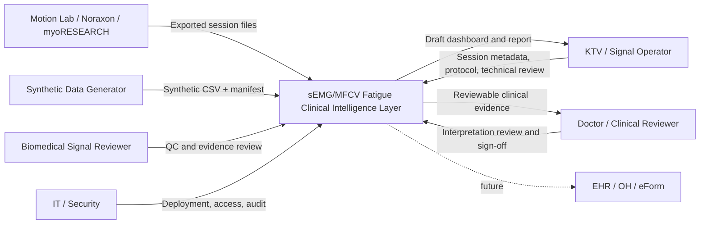
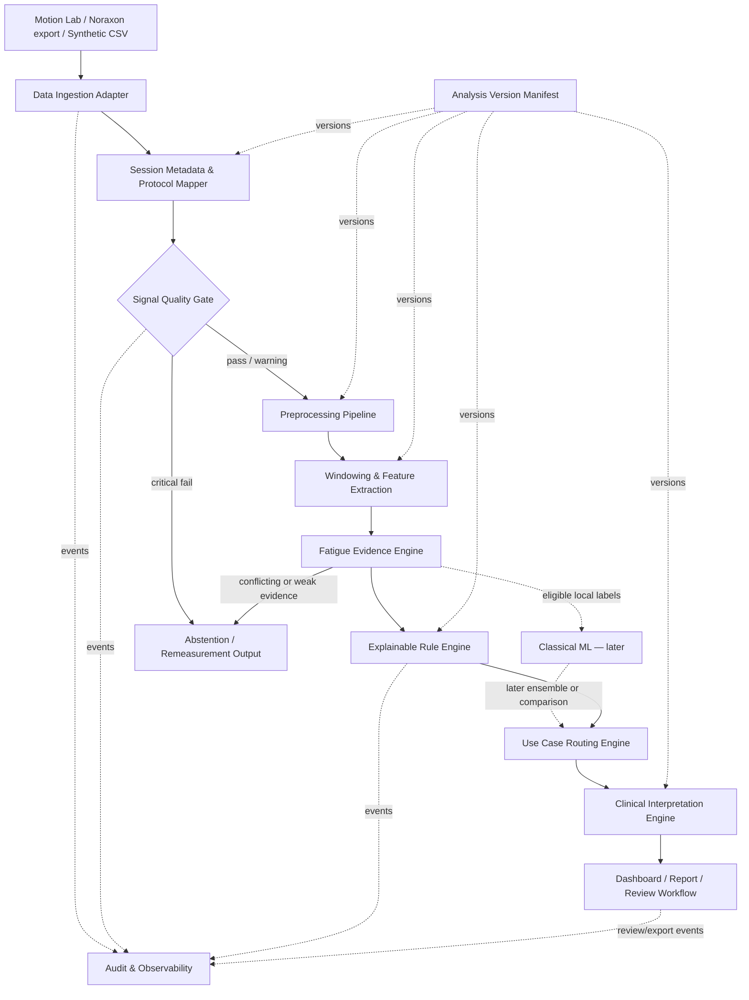
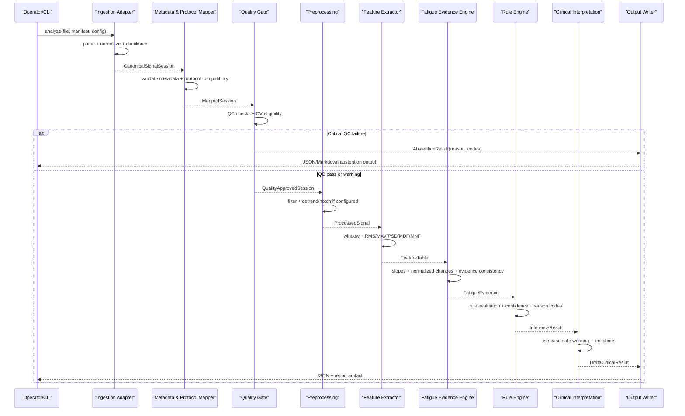
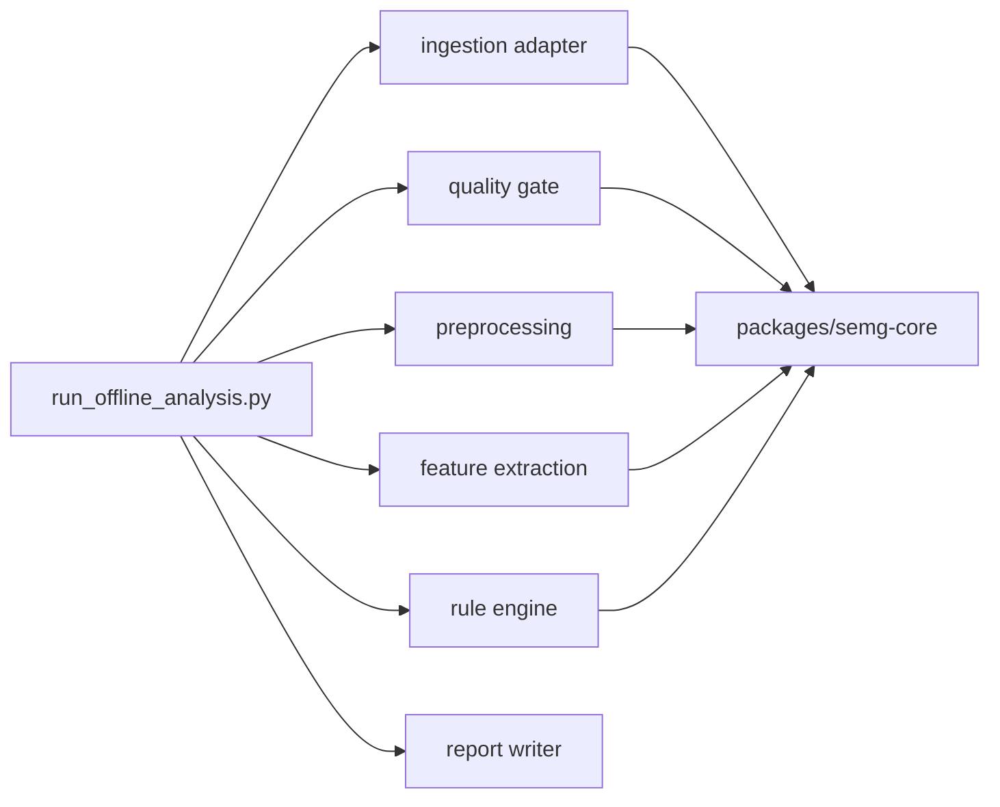
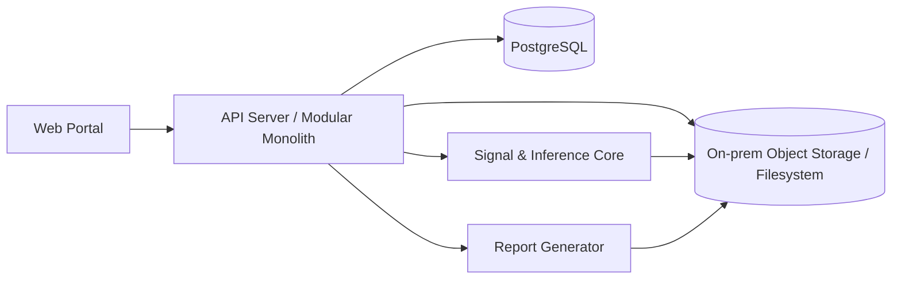

# High-Level Architecture — sEMG/MFCV Fatigue Clinical Intelligence Layer

> **Document ID:** ARCH-HLA-001  
> **Project:** sEMG/MFCV Muscle Fatigue Assessment Platform  
> **Repository path:** `docs/03-architecture/high-level-architecture.md`  
> **Status:** Draft for MVP-0 implementation  
> **Version:** 0.1.0  
> **Last updated:** 2026-07-13  
> **Primary owner:** Duy (Solo Developer)
> **Required approvers before pilot:** Product Owner, Biomedical Signal Processing Lead, Clinical/KTV Reviewer, Security/IT Representative  
> **Classification:** Internal — no real patient data or raw clinical signal embedded in this document

---

## 1. Executive summary

The system is an **offline-first clinical intelligence layer** that processes sEMG data exported from Motion Lab/Noraxon or generated as synthetic CSV for development and demonstration. It does not replace Noraxon/myoRESEARCH, does not acquire EMG directly in MVP-0, and does not produce autonomous diagnoses or treatment decisions.

The system converts a measurement session into a structured, reviewable chain of evidence:

```text
Motion Lab / Noraxon export / Synthetic CSV
        ↓
Data Ingestion Adapter
        ↓
Session Metadata & Protocol Mapper
        ↓
Signal Quality Gate
        ↓
Preprocessing Pipeline
        ↓
Windowing & Feature Extraction
        ↓
Fatigue Evidence Engine
        ↓
Explainable Rule Engine / Classical ML later
        ↓
Use Case Routing Engine
        ↓
Clinical Interpretation Engine
        ↓
Dashboard / Report / Review Workflow
```

The architecture is intentionally designed around five safety and delivery principles:

1. **Offline-first for MVP-0.** The first executable product accepts files and produces deterministic analysis artifacts. It does not depend on device streaming, message brokers, or low-latency infrastructure.
2. **Near-real-time is demo wording only.** A simulated or replayed stream may be shown in demonstrations, but it is not a validated clinical operating mode.
3. **Rule engine before machine learning.** Explainable rules and explicit thresholds are the initial inference mechanism. Classical ML is introduced only when sufficiently usable local labels and leakage-safe validation are available.
4. **Quality gate before analysis.** Critical signal or metadata failures block fatigue inference. The valid output is `abstained`, not a forced fatigue/non-fatigue prediction.
5. **MFCV/CV remains optional.** Conduction velocity is enabled only when electrode geometry, channel ordering, sampling rate, muscle-fiber orientation, signal correlation and protocol requirements are confirmed.

The architecture separates:

- **measurement evidence** from **clinical interpretation**;
- **quality status** from **fatigue status**;
- **algorithm output** from **human-approved report**;
- **generic sEMG features** from **use-case-specific meaning**;
- **MVP-0 feasibility code** from later production services.

---

## 2. Purpose of this document

This document defines the target high-level architecture for MVP-0 and the controlled evolution path toward MVP-1 and a local workflow pilot. It provides a shared technical contract for product, signal processing, backend, dashboard, QA, clinical review and operations.

It is intended to answer:

- What enters and leaves the system?
- Which modules exist and what is each module responsible for?
- Which stage is allowed to block downstream processing?
- How are protocol, preprocessing, feature and rule versions recorded?
- How is abstention represented?
- Where does clinical interpretation occur?
- Which components are required in MVP-0 and which are deferred?
- What conditions must be met before MFCV or classical ML can be activated?
- How do repository folders map to runtime responsibilities?

This document is **not**:

- a detailed filter-design specification;
- a complete API specification;
- a clinical protocol;
- a regulatory submission;
- a deployment runbook;
- a model validation report;
- an authorization to use the system for autonomous clinical decision-making.

Detailed behavior must be defined in the linked downstream specifications.

---

## 3. Product and clinical boundaries

### 3.1 Intended architectural role

The platform sits **after signal acquisition/export** and before final human-reviewed reporting.

```text
Noraxon / Motion Lab
    └── acquisition, synchronization, raw/processed export

sEMG/MFCV Fatigue Clinical Intelligence Layer
    ├── import and normalize
    ├── verify data quality and eligibility
    ├── preprocess and segment
    ├── calculate interpretable fatigue biomarkers
    ├── apply explainable decision logic
    ├── route results to the correct use case
    ├── generate conservative interpretation
    └── support technical and clinical review
```

### 3.2 In scope for MVP-0

- Synthetic CSV and generic CSV import.
- Initial Noraxon-export adapter after the real format is audited.
- Session and protocol metadata validation.
- Signal quality checks with pass/warning/fail outcomes.
- Offline preprocessing.
- Fixed-window feature extraction.
- RMS, MAV, MDF, MNF and trend/slope evidence.
- Optional CV/MFCV eligibility output; calculation disabled by default.
- Explainable rule-based fatigue evidence aggregation.
- Structured JSON result.
- Human-readable Markdown/HTML report prototype.
- Audit metadata sufficient to reproduce an analysis run.
- Synthetic golden test signals and deterministic regression tests.

### 3.3 Explicitly out of scope for MVP-0

- Direct device control or replacement of myoRESEARCH.
- Clinical-grade real-time streaming.
- Automated exercise stopping or load prescription.
- Autonomous diagnosis of muscle or peripheral nerve disease.
- Automated return-to-play clearance.
- EHR/FHIR/HL7 integration.
- Deep learning.
- Cloud multi-tenant deployment.
- Multi-site model training.
- MFCV claims before hardware eligibility is confirmed.
- Use of real patient data in the Git repository.

### 3.4 Safety boundary

The architecture distinguishes four states that must never be collapsed into one another:

| State | Meaning | Allowed downstream behavior |
|---|---|---|
| `quality_pass` | Data satisfies the currently versioned minimum quality criteria | Feature extraction and inference may proceed |
| `quality_warning` | Analysis may proceed, but evidence or limitations must be surfaced | Proceed with reduced confidence and mandatory review flag |
| `quality_fail` | A critical quality or protocol condition is violated | Block inference and return abstention |
| `inconclusive` | Data passed minimum quality, but fatigue evidence is internally weak or conflicting | Return inconclusive; do not force fatigue/no-fatigue |

**Absence of detected fatigue is not equivalent to insufficient data.**

---

## 4. Day 1 architecture decisions

| ID | Decision | Rationale | Architectural consequence |
|---|---|---|---|
| AD-01 | Offline-first for MVP-0 | Reduces integration risk and allows deterministic validation on files | Primary entry point is CLI/library; no broker or streaming dependency |
| AD-02 | “Near-real-time” wording only for demo | Streaming latency, signal stability and clinical safety are not validated | Replay mode is isolated from clinical claims and report wording |
| AD-03 | Rule engine first | Small local dataset and uncertain labels make ML metrics vulnerable to overfit and leakage | Rules, thresholds and reason codes are versioned and fully explainable |
| AD-04 | Classical ML only after usable local labels | Published metrics cannot be transferred directly to a local workflow | Model activation requires local dataset, subject/session-safe split and model card |
| AD-05 | Quality gate blocks unsafe analysis | Bad sEMG can generate plausible but wrong feature trends | Critical QC failure returns `abstained` and prevents FRS/inference |
| AD-06 | MFCV/CV is optional | Requires known electrode spacing, array geometry, orientation and signal propagation quality | CV module is feature-flagged and disabled until eligibility is proven |
| AD-07 | Human review is mandatory before final report | The system is decision support, not autonomous clinical judgment | Technical/clinical review state is part of the domain model |
| AD-08 | Version everything affecting output | Reproducibility is required for QA and future audit | Protocol, preprocessing, features, rule/model and report template versions are stored per run |
| AD-09 | Monorepo during early stage | Two-person team needs visibility across core, API, UI, docs and QA | Shared schemas and end-to-end change review remain practical |
| AD-10 | Raw clinical signal never committed | Reduces privacy and governance risk | Repository contains only synthetic samples, manifests, hashes and schemas |

These decisions should later be formalized in Architecture Decision Records under `docs/03-architecture/adr/`.

---

## 5. Architecture principles

### 5.1 Clinical workflow before model sophistication

The architecture optimizes the complete workflow:

```text
import → verify → analyze → explain → review → report
```

A sophisticated classifier without protocol context, quality gates, review and auditability is not considered a viable clinical product.

### 5.2 Signal quality before fatigue inference

All downstream calculations depend on data quality. Quality checks therefore have higher execution priority than feature extraction or prediction.

### 5.3 Evidence before interpretation

The system first produces measurable evidence such as:

- usable-window ratio;
- RMS/MAV trend;
- MDF/MNF trend;
- slope uncertainty;
- fatigue-onset evidence;
- side-to-side difference when comparable;
- CV/MFCV only when eligible.

Clinical wording is generated only after this evidence is available.

### 5.4 Explainability by construction

Every result must include machine-readable reason codes and human-readable evidence. A score without a traceable basis is not acceptable.

### 5.5 Conservative failure behavior

When uncertain, the system should:

- reject malformed input;
- warn on non-critical deviation;
- abstain on critical quality failure;
- return `inconclusive` for conflicting evidence;
- require human review before report finalization.

### 5.6 Reproducibility

The same input, metadata and versioned configuration must produce the same output within defined numerical tolerances.

### 5.7 Replaceable modules and stable contracts

File adapters, feature extractors, rules and models must be replaceable without changing the entire workflow. Stable internal schemas are preferred over tight coupling between implementations.

### 5.8 On-premises-compatible design

The architecture must remain deployable within a hospital or Motion Lab network. Cloud services are not mandatory for core analysis.

### 5.9 Minimal infrastructure until justified

MVP-0 uses a Python package and offline CLI. Databases, web apps, object storage and asynchronous workers are introduced only when the workflow requires them.

---

## 6. System context

### 6.1 Actors and external systems

| Actor/System | Role | Interaction with platform |
|---|---|---|
| Motion Lab / Noraxon / myoRESEARCH | Upstream acquisition and export | Provides raw or processed session files and device metadata |
| Synthetic data generator | Development/test source | Produces controlled pass/fail/fatigue patterns without PHI |
| KTV / signal operator | Technical workflow user | Creates/imports a session, verifies setup, reviews QC and requests remeasurement |
| Biomedical signal reviewer | Technical reviewer | Reviews preprocessing, artifacts, features and CV eligibility |
| Doctor / clinical reviewer | Clinical reviewer | Reviews interpretation and decides whether the report may be finalized |
| Product/demo user | Non-clinical viewer | Views synthetic/replayed demonstrations with explicit disclaimer |
| IT/Security administrator | Deployment and access governance | Manages environment, storage, roles, logs and backup in later phases |
| EHR/OH/eForm | Future integration | Deferred until workflow and report have local validation |

### 6.2 C4-style context diagram



### 6.3 Trust boundary

The core trust boundary contains:

- raw signal references or files;
- session and protocol metadata;
- quality results;
- processed data;
- features;
- inference results;
- reviews;
- reports;
- audit records.

No component may assume that input files are trustworthy merely because they came from a known device. File structure, metadata completeness, unit, sampling rate and channel mapping must still be validated.

---

## 7. High-level logical architecture



### 7.1 Architectural layers

| Layer | Primary purpose | MVP-0 implementation |
|---|---|---|
| Acquisition boundary | Receive exported or synthetic data | File input only |
| Ingestion | Parse and normalize external formats | Python adapter interface + CSV adapter |
| Context mapping | Establish protocol, muscle, side, device and session meaning | Validated manifest/schema |
| Quality and eligibility | Decide whether analysis is permitted | Deterministic QC checks and reason codes |
| Signal processing | Filter and normalize signal consistently | Versioned offline pipeline |
| Feature/evidence | Calculate measurable fatigue-related features | RMS/MAV/MDF/MNF/slopes |
| Inference | Aggregate evidence conservatively | Versioned explainable rules |
| Routing | Map output to the correct clinical/product use case | Metadata-driven rules |
| Interpretation | Generate controlled clinical-safe wording | Template and phrase rules |
| Presentation/review | Display, review, approve and export | JSON + Markdown/HTML prototype |
| Governance | Reproduce and audit output | Run manifest, hashes, versions and logs |

---

## 8. End-to-end processing contract

### 8.1 Canonical execution sequence

```text
1. Create analysis request.
2. Register input file and compute checksum.
3. Parse source format through an ingestion adapter.
4. Normalize signal units, time axis and channel identifiers.
5. Validate mandatory session metadata and protocol mapping.
6. Execute signal quality and MFCV eligibility checks.
7. If critical QC fails: stop and return abstention.
8. Apply versioned preprocessing.
9. Segment into valid windows.
10. Calculate window-level features.
11. Aggregate trends and fatigue evidence.
12. Run rule engine; optionally compare with a validated ML model later.
13. Route the result according to session context.
14. Generate controlled clinical interpretation.
15. Present draft output for technical and clinical review.
16. Export final report only after required sign-off.
17. Persist the version manifest, result hashes and audit events.
```

### 8.2 Offline MVP-0 sequence diagram



---

## 9. Core component responsibilities

## 9.1 Data Ingestion Adapter

### Purpose

Convert external files into a canonical internal session representation without applying fatigue interpretation.

### Supported inputs by phase

| Input | MVP-0 | MVP-1 | Notes |
|---|---:|---:|---|
| Synthetic CSV | Required | Required | Golden tests and demo |
| Generic CSV | Required | Required | Initial real-world interoperability path |
| Noraxon CSV/TXT export | After audit | Required if available | Adapter based on actual export sample |
| MAT | Deferred | Optional | Research interoperability |
| C3D | Deferred | Optional | Motion/force synchronization use cases |
| Live device API/SDK | No | Later | Not part of clinical MVP-0 |

### Input contract

At minimum, an input session must resolve:

- time axis or sampling rate;
- one or more channel arrays;
- signal unit or explicit unknown-unit status;
- channel identifier;
- source file checksum;
- source type and adapter version.

### Output contract

```python
from dataclasses import dataclass
from typing import Mapping
import numpy as np

@dataclass(frozen=True)
class CanonicalSignalSession:
    session_id: str
    sampling_rate_hz: float
    time_s: np.ndarray
    channels: Mapping[str, np.ndarray]
    signal_unit: str
    source_type: str
    source_file_sha256: str
    importer_version: str
```

The production implementation may use Pydantic or another validated schema, but the semantics must remain stable.

### Failure behavior

Reject the input when:

- file format is unsupported or corrupt;
- sample counts are inconsistent;
- sampling rate is missing and cannot be derived;
- numeric parsing fails;
- channel data is empty;
- file exceeds configured limits without explicit override.

### Repository mapping

```text
services/signal-ingestion-service/
packages/semg-core/semg_core/io.py
integrations/devices/generic-csv/
docs/06-ai-signal-processing/signal-import-spec.md
```

---

## 9.2 Session Metadata & Protocol Mapper

### Purpose

Attach the biological and workflow context required to interpret a signal correctly.

### Mandatory metadata for MVP-0

- `session_id`;
- de-identified subject ID for repeated-session tests, when applicable;
- target muscle;
- body side;
- task/protocol ID and version;
- contraction type;
- expected duration;
- acquisition device/source;
- sampling rate;
- channel-to-muscle mapping;
- acquisition date/time or synthetic marker;
- intended use case context;
- previous-session availability;
- injury/surgery side only when used for comparison;
- real/synthetic/demo data flag.

### Protocol compatibility rules

The mapper verifies that:

- the imported duration can satisfy the protocol;
- expected target muscle and available channels agree;
- required baseline/rest/task segments are identifiable;
- side-to-side comparison has compatible protocols;
- longitudinal comparison uses compatible muscle, task, device/config and normalization rules;
- MFCV-required electrode geometry is present before declaring eligibility.

### Output

A `MappedSession` containing canonical signal plus validated protocol and metadata.

### Failure behavior

- Missing critical metadata → block analysis.
- Optional metadata missing → warning and disable dependent use cases.
- Protocol mismatch → abstain or restrict output to technical feature exploration.

### Repository mapping

```text
clinical/protocols/
packages/clinical-protocols/
docs/02-clinical/protocol-library.md
docs/05-data/data-model.md
```

---

## 9.3 Signal Quality Gate

### Purpose

Determine whether the signal is sufficiently valid for the requested analysis and which capabilities are permitted.

### Initial QC categories

| Category | Example checks | Typical result |
|---|---|---|
| Structural validity | Duration, sampling rate, channel completeness | pass/fail |
| Numerical integrity | NaN/Inf, constant signal, impossible ranges | pass/fail |
| Saturation/clipping | Repeated rail values or flat peaks | warning/fail |
| Dropout | Long zero/constant segments or missing samples | warning/fail |
| Baseline noise | Excessive rest noise | warning/fail |
| Power-line contamination | 50 Hz and harmonics relative to broadband power | warning |
| Motion artifact | Excess low-frequency energy/transients | warning/fail |
| Stationarity/usable windows | Fraction of windows meeting criteria | pass/warning/fail |
| Channel relationship | Correlation, polarity, delay plausibility | warning/fail for CV |
| Metadata/protocol | Required context and protocol compliance | pass/fail |
| MFCV eligibility | Array geometry, spacing, orientation, sampling and correlation | eligible/not eligible |

### Quality outcome schema

```json
{
  "status": "pass",
  "quality_score": 0.91,
  "usable_window_ratio": 0.87,
  "critical_failures": [],
  "warnings": ["POWERLINE_NOISE_ELEVATED"],
  "bad_channels": [],
  "mfcv_eligibility": {
    "status": "not_eligible",
    "reason_codes": ["LINEAR_ARRAY_NOT_CONFIRMED"]
  },
  "qc_config_version": "qc_v0.1"
}
```

### Blocking rules

Analysis must stop when a configured critical condition occurs, including:

- missing or incompatible sampling rate;
- insufficient duration for the protocol;
- too few usable windows;
- severe clipping/dropout;
- absent mandatory channel or metadata;
- signal unit or scale impossible to resolve when needed for the requested output;
- protocol deviation that invalidates comparison.

### Abstention output

```json
{
  "status": "abstained",
  "abstention_stage": "signal_quality_gate",
  "reason_codes": [
    "USABLE_WINDOW_RATIO_BELOW_MINIMUM",
    "ELECTRODE_CONTACT_UNSTABLE"
  ],
  "user_message_vi": "Dữ liệu không đủ điều kiện phân tích. Kiểm tra lại điện cực và lặp lại phép đo theo protocol.",
  "fatigue_assessment": null
}
```

### Repository mapping

```text
services/quality-gate-service/
packages/semg-core/semg_core/qc.py
docs/06-ai-signal-processing/signal-validation-spec.md
docs/02-clinical/quality-escalation-policy.md
```

---

## 9.4 Preprocessing Pipeline

### Purpose

Transform quality-approved raw signals into a deterministic representation suitable for feature extraction while retaining traceability to the original data.

### Candidate steps

```text
unit normalization
→ optional de-meaning/detrending
→ band-pass filtering
→ optional 50 Hz notch if justified by QC/config
→ artifact mask propagation
→ optional resampling
→ optional rectification/envelope for amplitude visualization
```

Rectification and envelope calculation are not substitutes for the signal used in spectral features. MDF/MNF must be computed from the correctly preprocessed non-rectified signal according to the feature specification.

### Configuration policy

No filter parameter should be hard-coded across the codebase. The pipeline reads a versioned configuration, for example:

```yaml
version: preprocess_v0.1
bandpass:
  enabled: true
  low_hz: 20.0
  high_hz: 400.0
  order: 4
  design: butterworth
notch:
  enabled: conditional
  frequency_hz: 50.0
  quality_factor: 30.0
detrend:
  enabled: true
resample:
  enabled: false
zero_phase: true
```

The final values are provisional until confirmed against the actual device export and protocol.

### Output

- processed channel arrays;
- retained artifact mask;
- preprocessing configuration version;
- warnings about edge effects or unsupported frequency limits;
- deterministic output hash where practical.

### Repository mapping

```text
services/preprocessing-service/
packages/semg-core/semg_core/preprocessing.py
docs/06-ai-signal-processing/preprocessing-spec.md
```

---

## 9.5 Windowing & Feature Extraction

### Purpose

Segment signals into comparable windows and calculate interpretable time- and frequency-domain features.

### MVP-0 features

| Feature | Level | Role |
|---|---|---|
| RMS | Window | Amplitude/power proxy |
| MAV | Window | Robust amplitude summary |
| PSD | Window | Basis for spectral features and inspection |
| MDF | Window | Median power frequency |
| MNF | Window | Power-weighted mean frequency |
| Usable-window flag | Window | Exclude invalid evidence |
| RMS slope | Session/channel | Amplitude trend |
| MAV slope | Session/channel | Amplitude trend support |
| MDF slope and percent change | Session/channel | Spectral fatigue evidence |
| MNF slope and percent change | Session/channel | Spectral fatigue evidence |
| Slope confidence / goodness-of-fit | Session/channel | Reliability of trend |
| Fatigue-onset candidate | Session/channel | Time at which persistent evidence emerges |

### Windowing requirements

Windowing must be protocol-aware. Initial defaults may use 500–1000 ms windows and 50% overlap, but the values must remain configurable and validated.

Each feature row must preserve:

- session ID;
- channel/muscle/side;
- window index;
- start and end time;
- validity flag;
- feature values and units;
- preprocessing version;
- feature extractor version.

### Frequency estimation

Welch PSD is recommended for the initial implementation because it provides a practical variance/stability trade-off for windowed sEMG. Exact FFT length, detrending and overlap must be versioned.

### Output schema example

```json
{
  "session_id": "SYNTH_001",
  "channel_id": "VL_R_01",
  "window_index": 12,
  "start_s": 6.0,
  "end_s": 7.0,
  "valid": true,
  "features": {
    "rms_uv": 84.2,
    "mav_uv": 66.7,
    "mdf_hz": 78.5,
    "mnf_hz": 83.1
  },
  "feature_extractor_version": "features_semg_v0.1"
}
```

### Repository mapping

```text
services/feature-extraction-service/
packages/semg-core/semg_core/windowing.py
packages/semg-core/semg_core/features.py
docs/06-ai-signal-processing/segmentation-windowing-spec.md
docs/06-ai-signal-processing/feature-extraction-spec.md
```

---

## 9.6 Fatigue Evidence Engine

### Purpose

Convert raw feature sequences into structured, protocol-aware evidence without making the final clinical interpretation.

### Responsibilities

- select valid windows;
- calculate baseline and end-region summaries;
- estimate slopes and uncertainty;
- calculate normalized percentage changes;
- detect persistent trend onset;
- assess cross-feature consistency;
- assess channel/muscle aggregation;
- calculate side-to-side evidence only when comparable;
- include CV/MFCV evidence only when eligible;
- flag conflicting evidence.

### Evidence object

```json
{
  "frequency_evidence": {
    "mdf_start_hz": 86.4,
    "mdf_end_hz": 72.8,
    "mdf_drop_percent": 15.7,
    "mdf_slope_hz_per_s": -0.23,
    "mdf_slope_r2": 0.81,
    "mnf_drop_percent": 17.1
  },
  "amplitude_evidence": {
    "rms_change_percent": 18.5,
    "rms_slope_uv_per_s": 0.42
  },
  "onset_evidence": {
    "candidate_onset_s": 41.0,
    "persistence_windows": 5
  },
  "consistency": {
    "status": "supportive",
    "conflicts": []
  },
  "mfcv_evidence": {
    "available": false,
    "reason": "not_eligible"
  }
}
```

### Evidence status

| Status | Meaning |
|---|---|
| `supportive` | Multiple expected fatigue trends agree |
| `weak` | Trends are small or uncertain |
| `conflicting` | Features disagree materially |
| `not_computable` | Insufficient valid windows after QC |

The engine must not claim that RMS always rises during every fatigue protocol. Amplitude behavior is context-dependent and must be treated as supporting evidence rather than a universal truth.

### Repository mapping

Initially this logic may live in:

```text
packages/semg-core/semg_core/fatigue_rules.py
services/inference-service/src/explainability.py
```

It may become a separate service only when workflow scale justifies the split.

---

## 9.7 Explainable Rule Engine

### Purpose

Produce a conservative fatigue assessment from versioned evidence rules.

### MVP-0 output states

- `fatigue_evidence_detected`;
- `no_clear_fatigue_evidence`;
- `inconclusive`;
- `abstained`.

Avoid presenting a binary diagnosis when evidence is weak or conflicting.

### Rule design principles

- thresholds are explicit and versioned;
- decisions include reason codes;
- QC state modifies confidence;
- warning-level QC cannot be hidden;
- missing optional evidence does not automatically fail the entire analysis;
- required evidence depends on protocol and use case;
- a single amplitude feature must not dominate the decision;
- thresholds initially represent engineering hypotheses, not validated clinical cutoffs.

### Rule configuration example

```yaml
version: fatigue_rule_v0.1
required:
  minimum_valid_windows: 20
  minimum_usable_window_ratio: 0.70
frequency_evidence:
  mdf_drop_percent_supportive: 10.0
  mdf_slope_max_hz_per_s: -0.10
  minimum_slope_r2: 0.50
amplitude_evidence:
  rms_increase_percent_supportive: 10.0
consistency:
  supportive_features_required: 2
output:
  allow_binary_status: false
  require_human_review: true
```

These thresholds are placeholders until local validation.

### Explainability output

```json
{
  "status": "fatigue_evidence_detected",
  "confidence": 0.79,
  "requires_review": true,
  "reason_codes": [
    "MDF_DECREASE_PERSISTENT",
    "MNF_DECREASE_PERSISTENT",
    "RMS_INCREASE_SUPPORTIVE"
  ],
  "limitations": [
    "THRESHOLDS_NOT_LOCALLY_VALIDATED",
    "MFCV_NOT_AVAILABLE"
  ],
  "rule_version": "fatigue_rule_v0.1"
}
```

### Repository mapping

```text
services/inference-service/rules/
services/inference-service/src/rule_engine.py
services/inference-service/src/abstention.py
services/inference-service/src/explainability.py
docs/06-ai-signal-processing/fatigue-rule-engine-spec.md
```

---

## 9.8 Classical ML — later capability

### Activation prerequisites

Classical ML must remain disabled until all of the following are met:

1. Local data use is approved.
2. Label definition is documented.
3. Label source is stronger than an arbitrary window split.
4. Subject/session identifiers are available for leakage-safe splitting.
5. Dataset manifest and preprocessing versions are frozen.
6. Class balance and sample size are understood.
7. Baseline rules are implemented for comparison.
8. Evaluation includes recall, precision, F1, calibration and abstention behavior.
9. Performance is reported by subject/session, not only by window.
10. A model card and limitations are approved.

### Candidate models

- Logistic Regression;
- Linear Discriminant Analysis;
- Support Vector Machine;
- Random Forest;
- K-Nearest Neighbors as a research comparison.

No model is selected merely because it achieved a high metric in a published study. Local population, device, protocol, labels and validation strategy may differ substantially.

### Integration pattern

```text
Fatigue Evidence
   ├── Rule Engine result — authoritative MVP baseline
   └── Classical ML result — shadow/comparison mode first

Reconciliation Layer
   ├── agreement → surface supporting evidence
   ├── disagreement → mark needs review
   └── low confidence → inconclusive/abstain
```

The first ML deployment should run in **shadow mode**, without changing the final report, until it is validated.

---

## 9.9 Use Case Routing Engine

### Purpose

Select the correct interpretation and report structure from metadata, not from EMG signal alone.

### Supported initial routes

| Route | Triggering context | Output emphasis |
|---|---|---|
| `general_fatigue_assessment` | No longitudinal or injury context | Current-session evidence |
| `longitudinal_rehab_tracking` | Compatible previous sessions exist | Change over time and comparability |
| `post_surgery_or_injury_asymmetry` | Injury/surgery side and bilateral comparable measurement | Side-to-side evidence |
| `return_to_play_support` | Athlete context and RTP target | Endurance/symmetry evidence with strong non-clearance disclaimer |
| `motion_lab_phase_analysis` | Valid synchronized motion/force phase data | Phase-specific evidence; later |
| `in_session_ktv_review` | Near-real-time/replay demo context | Early fatigue flag for review only |

### Routing rules

- Routing must be deterministic and explainable.
- Multiple routes may be relevant, but only one is primary.
- Unsupported routes must not be inferred from signal patterns.
- Longitudinal comparison requires compatibility checks.
- RTP output must never state that an athlete is cleared.

### Output example

```json
{
  "primary_use_case": "longitudinal_rehab_tracking",
  "secondary_use_cases": ["post_surgery_or_injury_asymmetry"],
  "routing_reason_codes": [
    "PREVIOUS_COMPATIBLE_SESSION_AVAILABLE",
    "INJURY_SIDE_AVAILABLE"
  ]
}
```

### Repository mapping

Initially:

```text
packages/semg-core/semg_core/explainability.py
services/api-server/src/services/longitudinal_service.py
```

A dedicated module may be created under `services/inference-service/src/use_case_routing.py`.

---

## 9.10 Clinical Interpretation Engine

### Purpose

Translate technical evidence into controlled, non-diagnostic, use-case-specific language for review.

### Inputs

- quality result;
- fatigue evidence;
- inference status and reason codes;
- use-case route;
- protocol and muscle context;
- previous-session comparison when valid;
- limitations and confidence;
- approved wording/template version.

### Outputs

- concise summary;
- evidence explanation;
- limitations;
- suggested review action;
- mandatory disclaimer;
- report status `draft` until review.

### Example

```json
{
  "summary_vi": "Ghi nhận bằng chứng tín hiệu phù hợp với xu hướng mỏi cơ trong protocol hiện tại.",
  "evidence_vi": [
    "MDF giảm 15,7% trong các cửa sổ hợp lệ.",
    "MNF giảm ổn định theo thời gian.",
    "RMS tăng và được xem là bằng chứng hỗ trợ."
  ],
  "recommended_review_vi": "KTV/bác sĩ xem xét kết quả cùng tải tập, lực, triệu chứng và đánh giá lâm sàng tổng thể.",
  "limitations_vi": [
    "Ngưỡng hiện tại chưa được hiệu chỉnh trên dữ liệu địa phương.",
    "Phiên đo không đủ điều kiện tính MFCV."
  ],
  "disclaimer_vi": "Kết quả hỗ trợ đánh giá chức năng, không thay thế chẩn đoán hoặc quyết định lâm sàng.",
  "report_status": "draft",
  "wording_version": "clinical_wording_v0.1"
}
```

### Prohibited behavior

The engine must not output:

- “Bệnh nhân bị bệnh…”;
- “Bắt buộc dừng tập”;
- “Đủ điều kiện thi đấu”;
- “Không mỏi” when QC failed;
- treatment prescription without clinician judgment;
- causal claims unsupported by the measured evidence.

### Repository mapping

```text
reports/wording/
reports/templates/
services/report-generation-service/src/disclaimer.py
docs/02-clinical/report-interpretation-guide.md
```

---

## 9.11 Dashboard / Report / Review Workflow

### Purpose

Expose the chain of evidence and ensure a human review gate before a final report is released.

### Minimum workflow states

```text
created
→ imported
→ qc_pending
→ qc_failed | analysis_ready
→ analyzed
→ technical_review_pending
→ clinical_review_pending
→ approved | rejected | repeat_requested
→ report_finalized
```

### MVP-0 presentation

- CLI output;
- structured JSON;
- Markdown/HTML draft report;
- saved plots for development and technical review.

### MVP-1 presentation

- session import/context screen;
- signal-quality screen;
- fatigue-evidence screen;
- use-case routing summary;
- clinical interpretation screen;
- review/sign-off screen;
- report preview/export;
- longitudinal trend where compatible.

### Review policy

| Review | Required checks | Possible actions |
|---|---|---|
| Technical/KTV review | Correct file, muscle, side, protocol, channel mapping, QC warnings, artifact visibility | accept technical result, request repeat, add comment |
| Clinical review | Interpretation, limitations, relevance to clinical context, prohibited claims | approve, reject, revise wording, request repeat |

The final report must include reviewer identity, timestamp and the versions used for analysis.

### Repository mapping

```text
apps/web-portal/
services/api-server/src/routes/reviews.py
services/report-generation-service/
reports/templates/
clinical/review-templates/
```

---

## 10. MFCV/CV optional architecture

### 10.1 Why MFCV is isolated

MFCV estimation is not a generic feature available from every bipolar sEMG export. It depends on the acquisition geometry and propagation model. Therefore it is implemented behind an explicit eligibility gate.

### 10.2 Eligibility inputs

The system must confirm:

- linear or otherwise validated electrode array;
- known inter-electrode distance;
- ordered adjacent channels along the muscle fibers;
- electrode orientation approximately aligned with propagation direction;
- target muscle appropriate for the selected method;
- adequate sampling rate and delay resolution;
- acceptable adjacent-channel similarity/correlation;
- no innervation-zone or tendon placement invalidating the selected channel region;
- protocol and segment duration compatible with the estimator.

### 10.3 Eligibility state

```json
{
  "mfcv_eligibility": {
    "status": "not_eligible",
    "reason_codes": [
      "INTER_ELECTRODE_DISTANCE_UNKNOWN",
      "CHANNEL_ORDER_NOT_CONFIRMED"
    ],
    "estimation_attempted": false
  }
}
```

### 10.4 Module behavior

```text
Eligibility fail
    → CV/MFCV fields remain unavailable
    → other sEMG features may continue if QC passes
    → report explicitly states why CV/MFCV is unavailable

Eligibility pass
    → estimate delay between approved adjacent channels
    → calculate CV = distance / delay
    → reject implausible values or low-correlation segments
    → aggregate only accepted windows
    → include estimator version and uncertainty
```

### 10.5 Feature flag

```yaml
capabilities:
  mfcv:
    enabled: false
    estimator_version: null
    require_explicit_eligibility: true
```

MFCV must not be enabled merely by setting this flag; the runtime eligibility result must also pass.

---

## 11. Canonical data model

### 11.1 Primary entities

| Entity | Purpose |
|---|---|
| `SubjectReference` | De-identified reference for repeated sessions |
| `AssessmentSession` | One measurement and analysis context |
| `ProtocolDefinition` | Versioned measurement protocol |
| `DeviceDefinition` | Device/export metadata |
| `ElectrodeConfiguration` | Channel mapping, geometry and orientation |
| `RawSignalReference` | File path/object reference, checksum and source metadata |
| `QualityResult` | QC status, reason codes and capability eligibility |
| `AnalysisRun` | Links input to exact algorithm/config versions |
| `FeatureTable` | Window and aggregate features |
| `FatigueEvidence` | Structured evidence derived from features |
| `InferenceResult` | Rule/model status, confidence and reasons |
| `UseCaseRoutingResult` | Primary/secondary use-case route |
| `ClinicalInterpretation` | Controlled draft wording and limitations |
| `ReviewRecord` | Technical/clinical review action |
| `ReportArtifact` | Draft/final report and integrity hash |
| `AuditEvent` | Traceable user/system action |

### 11.2 Analysis run manifest

Every run must include:

```json
{
  "analysis_id": "uuid",
  "session_id": "SYNTH_001",
  "source_file_sha256": "...",
  "protocol_version": "quad-isometric-60s.v0.1",
  "importer_version": "generic_csv_v0.1",
  "qc_config_version": "qc_v0.1",
  "preprocess_config_version": "preprocess_v0.1",
  "feature_extractor_version": "features_semg_v0.1",
  "evidence_engine_version": "fatigue_evidence_v0.1",
  "rule_or_model_version": "fatigue_rule_v0.1",
  "routing_version": "use_case_router_v0.1",
  "wording_version": "clinical_wording_v0.1",
  "report_template_version": "clinical_report_v0.1",
  "software_commit": "git-sha",
  "created_at": "ISO-8601"
}
```

### 11.3 Data classification

| Data class | Example | Repository policy |
|---|---|---|
| Synthetic | Generated sEMG and manifests | May be committed if small and documented |
| Configuration | YAML/JSON protocol, QC, preprocessing and rules | Must be versioned |
| De-identified feature data | Approved research export | Do not commit by default; controlled storage |
| Raw clinical signal | Noraxon/session files | Never commit; protected on-premises storage |
| Identifiable clinical data | MRN/name/contact | Outside MVP-0 repository and tightly controlled |
| Report artifact | Draft/final report | Controlled storage; no PHI in filenames |

---

## 12. Repository-to-runtime mapping

The repository is a monorepo, but MVP-0 should avoid unnecessary service deployment. Code is organized by future responsibility while executed initially as a modular offline application.

| Runtime responsibility | Primary repository location | MVP-0 execution mode |
|---|---|---|
| Canonical signal library | `packages/semg-core/` | In-process Python package |
| Ingestion | `services/signal-ingestion-service/` | Called by offline pipeline |
| QC | `services/quality-gate-service/` | In-process module |
| Preprocessing | `services/preprocessing-service/` | In-process module |
| Feature extraction | `services/feature-extraction-service/` | In-process module |
| Rule inference | `services/inference-service/` | In-process module |
| Offline orchestration | `ai-core/pipelines/run_offline_analysis.py` | CLI entry point |
| Synthetic data | `data-platform/synthetic-data/` | Development/test generator |
| Report | `reports/` and `services/report-generation-service/` | Markdown/HTML generation |
| Validation | `qa-validation/` and `ai-core/validation-reports/` | Automated tests + evidence |
| Web/API | `apps/web-portal/`, `services/api-server/` | Deferred to MVP-1 |

### 12.1 MVP-0 executable composition



This avoids creating network boundaries that do not yet provide operational value.

---

## 13. Deployment architecture by phase

## 13.1 MVP-0 — offline feasibility

```text
Developer workstation / controlled local environment
├── Python virtual environment
├── CLI pipeline
├── synthetic or approved sample files
├── versioned YAML/JSON configuration
├── JSON/CSV/plot outputs
└── local validation report
```

Characteristics:

- no user authentication;
- no database required;
- no production object storage;
- deterministic single-session analysis;
- output stored in a run directory;
- only synthetic or specifically approved de-identified samples.

Suggested run directory:

```text
runs/{analysis_id}/
├── manifest.json
├── input-reference.json
├── qc-result.json
├── features.parquet
├── fatigue-evidence.json
├── inference-result.json
├── interpretation.json
├── plots/
└── report.md
```

## 13.2 MVP-1 — local web/offline prototype



Characteristics:

- RBAC for operator/reviewer/admin;
- upload, QC, analysis, review and report workflow;
- raw files stored on-premises;
- database stores references, metadata, versions and audit records;
- analysis may initially run synchronously or via a simple local worker;
- no Kafka/Redis requirement unless actual workload proves it necessary.

## 13.3 MVP-2 — local workflow pilot

Adds:

- hardened on-prem deployment;
- TLS, backup and restore;
- immutable or append-only audit behavior;
- asynchronous jobs if needed;
- operational monitoring;
- formal reviewer sign-off;
- local validation dataset governance;
- optional integration design with OH/eForm/EMR;
- controlled model shadow mode.

## 13.4 Near-real-time demo mode

A replay process may feed pre-recorded or synthetic windows to the same analysis logic:

```text
pre-recorded file
→ replay scheduler
→ rolling buffer
→ QC status
→ feature update
→ provisional evidence visualization
```

Constraints:

- output is provisional;
- no final report until the complete session is processed;
- no automatic treatment action;
- visible synthetic/replay disclaimer;
- latency is a demo metric, not a clinical performance claim.

---

## 14. Internal interfaces and contracts

### 14.1 Preferred interface pattern

Each stage accepts a validated object and returns either:

- a validated success object; or
- a structured failure/abstention object.

Avoid returning unstructured dictionaries with implicit fields.

```python
from dataclasses import dataclass
from typing import Generic, TypeVar

T = TypeVar("T")

@dataclass(frozen=True)
class PipelineError:
    stage: str
    code: str
    message: str
    recoverable: bool

@dataclass(frozen=True)
class StageResult(Generic[T]):
    value: T | None
    errors: tuple[PipelineError, ...] = ()
    warnings: tuple[PipelineError, ...] = ()

    @property
    def ok(self) -> bool:
        return self.value is not None and not self.errors
```

### 14.2 Error taxonomy

| Prefix | Domain | Examples |
|---|---|---|
| `INGEST_` | File/parser | unsupported format, corrupt file |
| `META_` | Metadata/protocol | missing muscle, protocol mismatch |
| `QC_` | Signal quality | clipping, dropout, low usable ratio |
| `PRE_` | Preprocessing | invalid cutoff, insufficient Nyquist margin |
| `FEAT_` | Feature extraction | PSD failure, too few valid windows |
| `MFCV_` | CV eligibility/estimation | unknown spacing, low correlation |
| `RULE_` | Rule evaluation | missing required evidence |
| `ROUTE_` | Use-case routing | unsupported context |
| `INTERP_` | Wording/interpretation | missing approved template |
| `REVIEW_` | Human review | missing sign-off, invalid override |
| `REPORT_` | Report generation | rendering failure |

### 14.3 API evolution

The external API is deferred to MVP-1, but internal schemas should be compatible with future endpoints:

- `POST /v1/sessions/import`;
- `POST /v1/sessions/{id}/quality-check`;
- `POST /v1/sessions/{id}/analyze`;
- `GET /v1/sessions/{id}/evidence`;
- `GET /v1/sessions/{id}/interpretation`;
- `POST /v1/sessions/{id}/reviews`;
- `GET /v1/sessions/{id}/report`.

`openapi.yaml` becomes the authoritative external contract in MVP-1.

---

## 15. Security, privacy and data governance

### 15.1 Core controls

- Raw clinical signal remains on-premises or in a site-approved protected store.
- No PHI in file names, logs, commit history or test fixtures.
- Input file checksum is recorded before processing.
- Analysis artifacts reference the raw file rather than copying it unnecessarily.
- Access is role-based in MVP-1 and later.
- Final report export is an auditable action.
- Secrets are injected by environment or approved secret management, never committed.
- Synthetic demo data is unmistakably labeled synthetic.

### 15.2 Minimum audit events for MVP-1

- session created;
- file uploaded/imported;
- QC executed;
- analysis executed;
- configuration/version changed;
- result viewed;
- technical review submitted;
- clinical review submitted;
- override or repeat request recorded;
- report generated/exported;
- data deleted or archived.

### 15.3 Logging restrictions

Logs must not contain:

- raw signal arrays;
- patient names or MRNs;
- complete report contents;
- authentication secrets;
- unredacted file system paths containing identifiable information.

---

## 16. Observability and auditability

### 16.1 Technical metrics

| Metric | Purpose |
|---|---|
| Import success/failure count | Adapter reliability |
| Analysis duration by stage | Performance bottleneck |
| QC pass/warning/fail rate | Data quality and operational readiness |
| Usable-window ratio distribution | Signal quality monitoring |
| Abstention rate and reasons | Safety behavior and workflow fit |
| Feature-computation failure rate | DSP robustness |
| Report-generation failure rate | Workflow reliability |

### 16.2 Clinical/workflow metrics for later pilot

- repeat measurement rate;
- technical review turnaround time;
- clinical review turnaround time;
- report comprehension score;
- reviewer disagreement rate;
- frequency of overridden warnings;
- longitudinal comparison eligibility rate;
- MFCV eligibility rate.

### 16.3 Traceability

Each final result must be traceable to:

```text
source file checksum
+ session metadata
+ protocol version
+ QC config
+ preprocessing config
+ feature version
+ rule/model version
+ wording/report version
+ reviewers
+ software commit
```

---

## 17. Failure handling and resilience

### 17.1 Failure philosophy

Failures are categorized as:

- **recoverable input errors** — user can correct metadata or provide another file;
- **remeasurement-required quality failures** — acquisition must be repeated;
- **capability limitations** — analysis continues without MFCV or longitudinal comparison;
- **inconclusive evidence** — data is usable but does not support a clear result;
- **system failures** — unexpected software or infrastructure error.

### 17.2 Failure matrix

| Failure | System response | User-visible action |
|---|---|---|
| Unsupported file | Reject import | Convert/export to supported format |
| Missing critical metadata | Block mapping | Complete required fields |
| Severe clipping/dropout | Abstain | Check electrode/device and repeat measurement |
| Elevated power-line noise | Warning or fail based on threshold | Inspect setup; apply conditional notch only if permitted |
| Too few valid windows | Abstain | Repeat or lengthen protocol |
| MFCV geometry missing | Disable MFCV | Continue generic sEMG analysis with limitation |
| Conflicting MDF/MNF/RMS evidence | Inconclusive | Human review; do not force classification |
| Rule engine error | Fail analysis safely | No report; technical investigation |
| Report render failure | Preserve analysis, retry report | No recomputation required |
| Reviewer rejects result | Keep draft, mark rejected | Repeat or revise interpretation |

### 17.3 Idempotency

Re-running an analysis with the same source checksum, metadata and configuration should either:

- reuse the existing immutable run; or
- create a new run linked to the previous one with an explicit reason.

Silent overwriting of prior results is prohibited.

---

## 18. Performance and scalability targets

MVP-0 prioritizes correctness and reproducibility over throughput.

### 18.1 Provisional non-clinical targets

| Capability | MVP-0 target |
|---|---|
| Import a typical single-session CSV | < 10 seconds on development workstation |
| Offline complete analysis | < 5 minutes per session |
| Report generation | < 60 seconds after analysis |
| Deterministic rerun | Same result within documented numerical tolerance |
| Memory use | Bounded for supported file size; no full-copy cascades where avoidable |

These targets are engineering objectives, not validated clinical requirements.

### 18.2 Scaling strategy

Scale only when demonstrated need appears:

1. Optimize vectorized local processing.
2. Introduce chunked file reading for large exports.
3. Add local background worker.
4. Separate analysis worker from API process.
5. Add queue/broker only when concurrent workload justifies it.
6. Consider multi-site architecture after pilot evidence and governance readiness.

Kafka, Kubernetes and distributed streaming are intentionally excluded from MVP-0.

---

## 19. Verification and validation strategy

### 19.1 Test pyramid

| Test level | Examples |
|---|---|
| Unit | RMS/MAV/MDF/MNF formulas, filters, slope, reason-code logic |
| Golden signal | Fixed synthetic signal → expected QC/features/evidence |
| Property/invariant | MDF within band, RMS non-negative, no NaN output |
| Integration | CSV → QC → preprocessing → features → rule → JSON |
| Contract | JSON schema and future OpenAPI compatibility |
| Negative/safety | Clipping/dropout/noise/missing metadata → correct abstention |
| Report snapshot | Required disclaimer, versions and review status present |
| Clinical readability | KTV/doctor understand wording and limitations |
| Analytical validation | Reproducibility and comparison against trusted reference implementation |

### 19.2 Required MVP-0 golden cases

1. Clean synthetic stable signal.
2. Clean synthetic fatigue-like spectral shift.
3. Severe clipping.
4. Dropout.
5. High low-frequency motion artifact.
6. Elevated 50 Hz contamination.
7. Insufficient duration.
8. Missing protocol metadata.
9. MFCV not eligible.
10. Conflicting feature trends producing `inconclusive`.

### 19.3 Leakage prevention for future ML

Data splitting must occur at subject/session level before window expansion. Windows from the same session must not be divided across training and test sets.

### 19.4 Release gate

MVP-0 is not complete until:

- golden tests pass;
- deterministic rerun is demonstrated;
- QC failures block inference;
- abstention output is correctly rendered;
- MFCV remains disabled unless explicitly eligible;
- report includes limitation and non-diagnostic wording;
- output records all required versions.

---

## 20. Architecture risks and mitigations

| Risk | Architectural impact | Mitigation |
|---|---|---|
| Noraxon export format differs across configurations | Adapter instability | Adapter interface, actual sample audit, format-specific tests |
| Only processed metrics are exportable | Raw-signal pipeline blocked | Support processed-metric pathway separately; document lower confidence and lost QC capability |
| Synthetic demo overstates readiness | Stakeholder trust risk | Prominent synthetic/replay flag and offline-first claim boundary |
| Realtime claim made too early | Safety and delivery risk | Isolated replay mode; no clinical report from provisional stream |
| Signal quality is poor | False fatigue evidence | Strong QC gate, usable-window metric and abstention |
| MFCV hardware is not eligible | Product scope mismatch | Optional capability and explicit eligibility output |
| Rules become hidden clinical thresholds | Overclaim/regulatory risk | Label thresholds as engineering hypotheses; version and validate locally |
| Small dataset yields inflated ML metrics | Wrong architecture direction | Rule baseline, session-wise split, shadow mode and model card |
| Longitudinal sessions are not comparable | Misleading progress trend | Protocol/device/normalization compatibility gate |
| UI hides limitations | Unsafe interpretation | Mandatory quality, confidence, limitations and review panels |
| Two-person team overbuilds infrastructure | Delayed core validation | Modular monolith/offline package first; postpone distributed systems |
| Version drift between docs and code | Non-reproducible output | Config schemas, manifest, CI checks and release checklist |

---

## 21. Architecture evolution roadmap

### Phase 0 — Repositioning and architecture baseline

Deliver:

- intended use and product boundary;
- this high-level architecture;
- initial ADRs;
- output schema draft;
- risk and decision log.

### Phase 1 — Motion Lab/Noraxon audit

Resolve:

- actual export formats;
- raw versus processed availability;
- units, sampling rate and channel metadata;
- synchronization data;
- MFCV hardware eligibility;
- data governance and local storage constraints.

Architecture impact: finalize adapter and protocol assumptions.

### Phase 2 — Offline signal pipeline MVP

Implement:

```text
CSV import
→ metadata/protocol validation
→ QC
→ preprocessing
→ RMS/MAV/MDF/MNF
→ fatigue evidence
→ rule output
→ JSON/Markdown report
```

### Phase 3 — Dashboard and report MVP

Add:

- API server as modular monolith;
- local database and object storage;
- web workflow;
- technical/clinical review;
- report generation and audit.

### Phase 4 — Pilot protocol design

Add:

- versioned first clinical protocol;
- target-muscle and placement guide;
- review templates;
- label and validation design.

### Phase 5 — Local validation

Add:

- threshold tuning;
- feature reliability analysis;
- reviewer agreement;
- rule-vs-ML comparison in shadow mode;
- updated model/rule cards.

### Phase 6 — Workflow pilot

Add:

- hardened on-prem deployment;
- RBAC and audit;
- operational monitoring;
- training and support runbook;
- formal go/no-go gates.

---

## 22. Open architecture questions

The following questions must remain explicit until answered by Motion Lab, clinical reviewers or local validation:

1. Which exact Noraxon export formats and columns are available?
2. Is raw EMG export permitted, or only processed metrics/report output?
3. What sampling rate is currently configured and what is the effective bandwidth?
4. Are signal units included and reliable in export metadata?
5. How are channels mapped to muscle, side and electrode position?
6. Is there a linear array or known inter-electrode geometry for MFCV?
7. Can channel timestamps be synchronized with VICON/force plate data?
8. Which initial protocol and target muscle will be used for local feasibility?
9. Which reference/label will define fatigability: force drop, RPE, time-to-task-failure, clinician annotation or a composite?
10. Which QC thresholds should be critical versus warning for the first protocol?
11. Will raw signals remain on local filesystem, NAS or object storage?
12. Who is authorized to conduct technical and clinical review?
13. Is a patient-level longitudinal identifier available in the pilot workflow?
14. What wording is acceptable for an internal research prototype versus a clinical pilot?
15. What evidence is required to enable near-real-time operation beyond a demo?

These questions should be tracked in `docs/00-executive/assumptions-and-open-questions.md` and linked to decision records.

---

## 23. Architecture Definition of Done

This document and its initial implementation are considered ready for MVP-0 engineering when all of the following are true:

- [ ] Intended use and product boundaries are reviewed.
- [ ] Offline-first execution is confirmed.
- [ ] Near-real-time is restricted to demo/replay wording.
- [ ] Generic CSV canonical schema is agreed.
- [ ] Required session metadata is defined.
- [ ] First protocol is selected or explicitly marked pending.
- [ ] QC outcome and abstention schema are agreed.
- [ ] Critical QC failures demonstrably block inference.
- [ ] Preprocessing configuration is versioned.
- [ ] RMS/MAV/MDF/MNF and trend feature definitions are documented.
- [ ] Fatigue evidence is separated from final interpretation.
- [ ] Rule output states include `inconclusive` and `abstained`.
- [ ] MFCV capability is disabled by default and guarded by eligibility.
- [ ] Use-case routing is metadata-driven.
- [ ] Clinical wording is non-diagnostic and requires review.
- [ ] Analysis manifest records all relevant versions and source checksum.
- [ ] Synthetic golden tests cover pass, fail and inconclusive cases.
- [ ] Repository contains no raw clinical data or PHI.
- [ ] Completes review of core architecture and integration implications.

---

## 24. Ownership and review model

Since this is currently a solo project developed by Duy, traditional cross-review is not possible. However, the following principles apply:

- Self-review is enforced through automated tests and strict adherence to the output schema.
- Clinical safety wording and final product claims MUST be reviewed by external clinical/product stakeholders before any real-world pilot or deployment.

---

## 25. Required downstream documents

This architecture depends on the following documents, which should be created or updated next:

```text
docs/01-product/intended-use-statement.md
docs/01-product/product-boundaries.md
docs/02-clinical/protocol-library.md
docs/02-clinical/quality-escalation-policy.md
docs/02-clinical/human-review-policy.md
docs/03-architecture/system-context.md
docs/03-architecture/module-dependency-map.md
docs/03-architecture/data-flow-diagram.md
docs/03-architecture/sequence-upload-to-report.md
docs/03-architecture/adr/ADR-0001-monorepo.md
docs/03-architecture/adr/ADR-0003-rule-based-before-deep-learning.md
docs/03-architecture/adr/ADR-0005-abstention-as-first-class-output.md
docs/05-data/data-model.md
docs/05-data/feature-table-spec.md
docs/06-ai-signal-processing/signal-import-spec.md
docs/06-ai-signal-processing/signal-validation-spec.md
docs/06-ai-signal-processing/preprocessing-spec.md
docs/06-ai-signal-processing/segmentation-windowing-spec.md
docs/06-ai-signal-processing/feature-extraction-spec.md
docs/06-ai-signal-processing/mfcv-cv-calculation-spec.md
docs/06-ai-signal-processing/fatigue-rule-engine-spec.md
docs/06-ai-signal-processing/confidence-and-abstention-spec.md
docs/08-validation-qa/signal-processing-test-plan.md
qa-validation/test-plans/signal-golden-test-plan.md
reports/wording/prohibited-claims.md
```

---

## 26. References and internal source hierarchy

### Authoritative project sources

1. `docs/01-product/intended-use-statement.md` — allowed use and claims.
2. `docs/01-product/product-boundaries.md` — in-scope and prohibited behavior.
3. `clinical/protocols/*.yaml` — executable protocol definition.
4. `docs/06-ai-signal-processing/*.md` — detailed DSP and inference specifications.
5. Versioned configuration under service `configs/` and `rules/` folders.
6. `openapi.yaml` — external API contract from MVP-1 onward.
7. Validation reports and release evidence — proof of implemented behavior.

### Scientific references informing design

The architecture is informed by internal project research concerning:

- sEMG amplitude and spectral features;
- MDF/MNF changes during sustained contraction;
- CV/MFCV estimation from multi-channel arrays;
- preprocessing, windowing and feature extraction;
- classical ML baselines for fatigue classification;
- limitations arising from small datasets, subjective labels and signal quality.

Scientific findings guide the design but do not replace local validation or establish universal clinical thresholds.

---

## Appendix A — Canonical result envelope

```json
{
  "analysis_id": "ANL_001",
  "session_id": "SYNTH_001",
  "status": "needs_review",
  "data_source": {
    "type": "synthetic_csv",
    "sha256": "...",
    "synthetic": true
  },
  "session_context": {
    "target_muscle": "vastus_lateralis",
    "side": "right",
    "protocol_version": "quad-isometric-60s.v0.1",
    "primary_intent": "longitudinal_rehab_tracking"
  },
  "signal_quality": {
    "status": "pass",
    "usable_window_ratio": 0.87,
    "warnings": ["POWERLINE_NOISE_ELEVATED"],
    "mfcv_eligibility": "not_eligible"
  },
  "fatigue_evidence": {
    "mdf_drop_percent": 15.7,
    "mnf_drop_percent": 17.1,
    "rms_change_percent": 18.5,
    "mdf_slope_hz_per_s": -0.23,
    "fatigue_onset_s": 41.0,
    "consistency": "supportive"
  },
  "inference": {
    "status": "fatigue_evidence_detected",
    "confidence": 0.79,
    "reason_codes": [
      "MDF_DECREASE_PERSISTENT",
      "MNF_DECREASE_PERSISTENT",
      "RMS_INCREASE_SUPPORTIVE"
    ],
    "rule_version": "fatigue_rule_v0.1"
  },
  "use_case_routing": {
    "primary_use_case": "longitudinal_rehab_tracking",
    "secondary_use_cases": []
  },
  "clinical_interpretation": {
    "summary_vi": "Ghi nhận bằng chứng tín hiệu phù hợp với xu hướng mỏi cơ trong protocol hiện tại.",
    "recommended_review_vi": "KTV/bác sĩ xem xét cùng tải tập, lực và đánh giá lâm sàng tổng thể.",
    "disclaimer_vi": "Kết quả hỗ trợ đánh giá chức năng, không thay thế quyết định lâm sàng.",
    "status": "draft"
  },
  "versions": {
    "importer": "generic_csv_v0.1",
    "qc": "qc_v0.1",
    "preprocessing": "preprocess_v0.1",
    "features": "features_semg_v0.1",
    "evidence": "fatigue_evidence_v0.1",
    "inference": "fatigue_rule_v0.1",
    "routing": "use_case_router_v0.1",
    "wording": "clinical_wording_v0.1",
    "report": "clinical_report_v0.1"
  }
}
```

---

## Appendix B — Architecture review checklist

### Product boundary

- [ ] Does the architecture clearly state that it does not replace Noraxon?
- [ ] Does it avoid autonomous diagnosis and treatment claims?
- [ ] Is near-real-time isolated as demo/replay behavior?

### Signal and AI core

- [ ] Is QC executed before preprocessing/inference?
- [ ] Are critical QC failures blocking?
- [ ] Are feature definitions versioned?
- [ ] Is evidence separated from interpretation?
- [ ] Does the rule engine expose reason codes?
- [ ] Is classical ML deferred until local labels and safe validation exist?
- [ ] Is window leakage explicitly prevented?

### MFCV/CV

- [ ] Is eligibility explicit?
- [ ] Are electrode spacing, orientation and channel order required?
- [ ] Is estimation disabled by default?
- [ ] Does non-eligibility leave generic sEMG analysis available?

### Clinical workflow

- [ ] Is human review required before final report?
- [ ] Are `abstained` and `inconclusive` first-class outputs?
- [ ] Are prohibited claims excluded?
- [ ] Are limitations always visible?

### Engineering governance

- [ ] Is the analysis run reproducible from checksum and versions?
- [ ] Are raw clinical signals excluded from Git?
- [ ] Are golden tests defined?
- [ ] Can modules be replaced through stable contracts?
- [ ] Is the MVP-0 deployment intentionally minimal?

---

**End of document**
