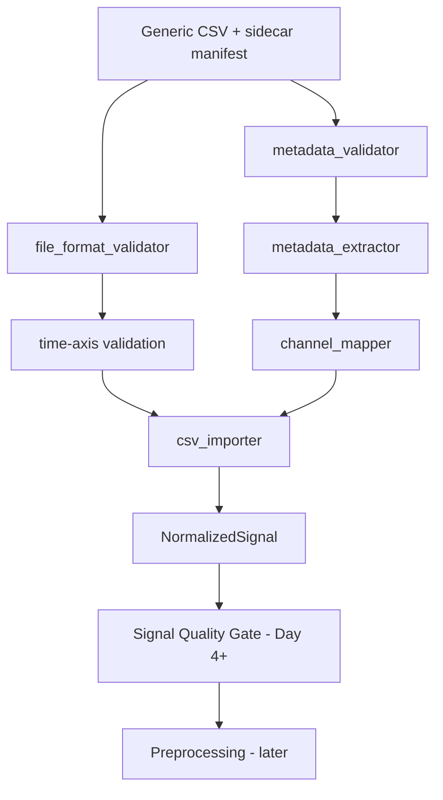

# Module Dependency Map — Day 3 Ingestion Slice

## Dependency rules

1. The importer depends on the Day 2 input contract.
2. Unit normalization happens before canonical object creation.
3. Structural or integrity failure blocks object creation.
4. A canonical object is not the same as a QC-passed session.
5. Downstream code consumes `NormalizedSignal`, not vendor CSV columns.
6. MFCV capability is not inferred by the importer.