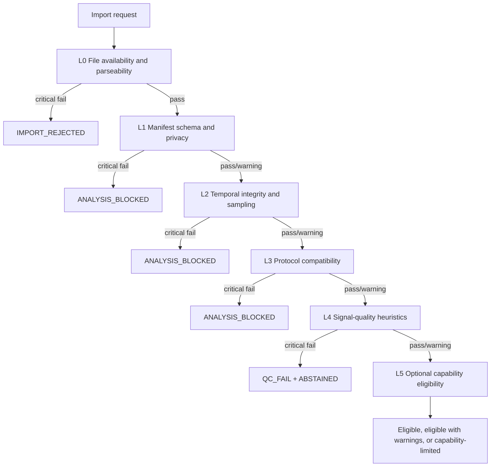

# Signal Validation Specification — sEMG/MFCV Fatigue Clinical Intelligence Layer

> **Document ID:** DSP-SVS-001  
> **Repository path:** `docs/06-ai-signal-processing/signal-validation-spec.md`  
> **Project:** sEMG/MFCV Muscle Fatigue Assessment Platform  
> **Version:** 0.1.0  
> **Status:** Draft — self-reviewed for MVP-0 engineering; external biomedical/clinical review required  
> **Last updated:** 2026-07-14  
> **Primary owner:** Duy — Product, AI/Signal Processing, Architecture and QA  
> **Required reviewers before local pilot:** Biomedical Signal Processing Reviewer, Motion Lab/Noraxon Operator, Clinical/KTV Reviewer, Security/Privacy Representative  
> **Classification:** Internal; no real patient identifiers or raw clinical recordings may be embedded in this document

---

## 1. Executive summary

This specification defines the **layered validation contract** applied to every imported sEMG session before preprocessing, feature extraction, fatigue inference or report generation.

The validation pipeline is deliberately separated into six layers:

```text
L0 — File availability and parseability
        ↓
L1 — Manifest/schema and privacy validation
        ↓
L2 — Temporal integrity and sampling validation
        ↓
L3 — Protocol compatibility
        ↓
L4 — Signal-quality heuristics
        ↓
L5 — Optional MFCV/CV and auxiliary-capability eligibility
```

The central safety rules are:

1. **File validation, metadata validation, protocol compatibility and signal-quality assessment are not collapsed into one generic error.**
2. **A critical failure in L0–L4 blocks fatigue inference and returns an explicit abstention outcome.**
3. **A protocol mismatch has its own reason code and is not mislabeled as poor signal quality.**
4. **MFCV/CV ineligibility is a capability-gate result, not fabricated as a conduction-velocity value.**
5. **Missing force or VICON synchronization does not automatically block basic single-channel/multi-channel sEMG analysis unless the selected protocol or use case explicitly requires those inputs.**
6. **All numerical thresholds in MVP-0 are provisional engineering defaults until verified on device-specific and local Motion Lab data.**

The expected system behavior is conservative:

```text
Malformed input        → IMPORT_REJECTED
Valid file, bad metadata/protocol/time → ANALYSIS_BLOCKED
Usable metadata, poor signal           → QC_FAIL + ABSTAINED
Usable signal with warnings            → ELIGIBLE_WITH_WARNINGS
Insufficient fatigue evidence           → INCONCLUSIVE
Missing MFCV setup                      → MFCV_INELIGIBLE, basic sEMG may continue
```

---

## 2. Purpose

This document provides the normative validation contract for:

- the Generic CSV importer used in MVP-0;
- future Noraxon/myoRESEARCH file adapters after technical audit;
- synthetic golden fixtures;
- the session metadata and protocol mapper;
- the signal quality gate;
- downstream preprocessing, feature extraction and inference services;
- dashboard/report wording for validation and abstention outcomes;
- QA tests and handoff acceptance criteria.

It answers the following questions:

- Which checks occur before a signal is considered analyzable?
- Which failures are structural, temporal, protocol-related or signal-quality-related?
- Which conditions block all analysis?
- Which conditions create a warning but allow analysis?
- Which optional capabilities are unavailable without blocking basic sEMG processing?
- Which machine-readable reason codes must be returned?
- How are provisional thresholds versioned and surfaced?
- What must be logged for reproducibility and audit?

---

## 3. Scope

### 3.1 In scope for MVP-0

- Generic CSV signal files with one shared sampling clock.
- JSON sidecar session manifest.
- Synthetic fixtures stored in the repository.
- Offline file processing.
- Session-level validation.
- Channel-level and active-phase-level signal quality checks.
- One or more bipolar sEMG channels.
- Protocol compatibility for versioned protocol files.
- Optional MFCV/CV eligibility assessment.
- Optional force-channel and VICON synchronization capability flags.
- Explicit pass, warning, fail, blocked and not-evaluated outcomes.
- Structured reason codes and validation evidence.

### 3.2 Out of scope for MVP-0

- Direct acquisition from Noraxon hardware.
- Clinical-grade real-time validation.
- Automatic electrode-placement verification from images.
- Full physiological validation of every threshold.
- Automatic correction of malformed timestamps.
- Automatic inference of muscle, side or signal unit from amplitude or column name.
- MFCV calculation when eligibility is not confirmed.
- Autonomous diagnosis or exercise-prescription decisions.
- Acceptance of direct patient identifiers in repository fixtures.
- Irregular sampling, per-channel sampling clocks or packet-loss reconstruction.

### 3.3 Relationship to other specifications

| Document/artifact | Relationship |
|---|---|
| `docs/03-architecture/high-level-architecture.md` | Defines quality gate as a blocking architectural boundary |
| `docs/06-ai-signal-processing/signal-import-spec.md` | Defines the imported CSV/manifest contract and canonical normalized object |
| `docs/06-ai-signal-processing/preprocessing-spec.md` | Receives only sessions allowed by this validation specification |
| `docs/06-ai-signal-processing/segmentation-windowing-spec.md` | Uses validated protocol phases and timebase |
| `docs/06-ai-signal-processing/feature-extraction-spec.md` | Must not run on critically failed sessions |
| `docs/06-ai-signal-processing/mfcv-cv-calculation-spec.md` | Receives only sessions with `mfcv_eligibility = eligible` |
| `docs/06-ai-signal-processing/confidence-and-abstention-spec.md` | Consumes quality status and reason codes |
| `clinical/protocols/*.yaml` | Source of protocol constraints and required session parameters |
| `services/quality-gate-service/configs/qc_v0.1.yaml` | Versioned provisional thresholds and policies |
| `packages/common-schemas/json/qc-result.schema.json` | Machine-readable validation output contract |

---

## 4. Normative language

The keywords **MUST**, **MUST NOT**, **REQUIRED**, **SHOULD**, **SHOULD NOT** and **MAY** are used as normative implementation terms.

- **MUST / REQUIRED:** mandatory for conformance.
- **SHOULD:** expected unless a documented reason exists.
- **MAY:** optional behavior that must not break the core contract.

---

## 5. Core design principles

### 5.1 Separation of concerns

The following are distinct concepts and MUST be represented separately:

| Concept | Example | Correct system field |
|---|---|---|
| File failure | CSV missing | `import_status = rejected` |
| Metadata failure | Missing muscle or unit | `metadata_status = fail` |
| Temporal failure | Duplicate timestamp | `temporal_status = fail` |
| Protocol failure | Active phase too short | `protocol_status = fail` |
| Signal quality failure | Severe clipping | `signal_quality_status = fail` |
| Capability failure | No linear electrode array | `mfcv_eligibility = ineligible` |
| Evidence uncertainty | MDF and RMS trends conflict | `fatigue_assessment = inconclusive` |

A generic message such as `invalid_signal` is not sufficient for handoff, debugging, audit or clinical safety.

### 5.2 Conservative blocking

Critical failures MUST block downstream fatigue inference.

```text
critical validation failure
    → analysis_eligibility = blocked
    → fatigue inference not executed
    → FRS not calculated
    → report states that data are not sufficient for analysis
```

### 5.3 No silent repair

The system MUST NOT silently:

- sort timestamps;
- drop duplicate rows;
- infer missing units;
- infer muscle or body side from a column name;
- extend an active phase;
- replace NaN/Inf values before recording the validation result;
- invent force/VICON synchronization;
- fabricate MFCV when electrode geometry is absent.

A later preprocessing policy MAY mask or impute limited values only after validation has recorded the issue and the behavior is explicitly versioned.

### 5.4 Threshold provenance and Threshold policy

Every threshold MUST be associated with:

- configuration version;
- status such as `provisional`, `device_calibrated` or `locally_validated`;
- scope such as synthetic data, Generic CSV or a specific Noraxon export profile;
- reviewer/approval state when promoted beyond engineering use.

### 5.5 Human-readable and machine-readable outputs

Every blocking or warning condition MUST produce:

- a stable reason code;
- a severity;
- a layer identifier;
- a human-readable message;
- affected file/channel/phase when applicable;
- measured value and threshold when applicable;
- remediation guidance.

---

## 6. Validation execution model

### 6.1 Execution order



### 6.2 Short-circuit policy

- L0 failure MUST stop all later layers because data cannot be loaded reliably.
- L1 critical failure MUST stop L2–L5.
- L2 critical failure MUST stop protocol segmentation, feature extraction and inference.
- L3 critical failure MUST stop protocol-dependent signal analysis.
- L4 critical failure MUST stop feature extraction and fatigue inference.
- L5 ineligibility MUST NOT fabricate optional outputs.
- L5 ineligibility MUST NOT block basic sEMG analysis unless the selected protocol or requested use case marks the capability as mandatory.

### 6.3 Error collection policy

Within a layer, the implementation SHOULD collect all detectable failures rather than returning only the first one, provided collection does not create unsafe or misleading secondary errors.

Example:

```text
L1 may report simultaneously:
- META_SAMPLING_RATE_MISSING
- META_CHANNELS_EMPTY
- PRIVACY_DIRECT_IDENTIFIER_PRESENT
```

L0 may stop immediately after an unreadable JSON document because its internal fields cannot be inspected safely.

---

## 7. Status model

### 7.1 Layer status enum

Each layer MUST return one of:

```text
not_evaluated
pass
warning
fail
```

### 7.2 Overall import status

```text
not_started
accepted
rejected
```

### 7.3 Overall analysis eligibility

```text
blocked
eligible_with_warnings
eligible
```

### 7.4 Signal quality status

```text
not_evaluated
pass
warning
fail
```

### 7.5 Capability status

Each optional capability MUST use:

```text
not_requested
not_evaluated
eligible
ineligible
unavailable
```

Recommended capability fields:

```text
mfcv
force_analysis
vicon_phase_alignment
side_to_side_comparison
longitudinal_comparison
```

---

# 8. L0 — File availability and parseability

## 8.1 Objective

L0 verifies that all required input files exist, are non-empty, are readable and can be parsed according to the selected adapter.

L0 answers:

> “Can the system safely open and parse the declared import bundle?”

It does not evaluate physiological quality.

## 8.2 Inputs

- Import request.
- Manifest path.
- Signal file path referenced by manifest or import request.
- Adapter configuration.
- Optional protocol registry path.

## 8.3 Required checks

| Check | Required behavior | Default severity |
|---|---|---:|
| Manifest exists | Path resolves to a regular readable file | Critical |
| Manifest non-empty | Size greater than zero | Critical |
| Manifest parseable | Valid JSON for MVP-0 | Critical |
| Signal file declared | Manifest includes `signal_file` | Critical |
| Signal file exists | Referenced CSV resolves to readable file | Critical |
| Signal file non-empty | Contains header and at least one data row | Critical |
| Adapter supported | `adapter_id` is known and enabled | Critical |
| CSV parseable | Header/data rows can be read with configured delimiter/encoding | Critical |
| Required headers present | Time column and declared signal columns exist | Critical |
| Duplicate headers absent | Column names are unique | Critical |

## 8.4 Fail examples

- Manifest does not exist.
- Manifest file is empty.
- JSON syntax is invalid.
- CSV does not exist.
- CSV is empty.
- CSV has only a header and no sample rows.
- CSV parser fails because rows have inconsistent field counts.
- Manifest references a signal column absent from the CSV.
- Adapter configuration is missing or unsupported.

## 8.5 L0 reason codes

| Code | Meaning | Severity |
|---|---|---:|
| `FILE_MANIFEST_NOT_FOUND` | Manifest path does not exist | Critical |
| `FILE_MANIFEST_EMPTY` | Manifest file has zero usable content | Critical |
| `FILE_MANIFEST_PARSE_ERROR` | JSON parser failed | Critical |
| `FILE_SIGNAL_REFERENCE_MISSING` | Manifest does not declare a signal file | Critical |
| `FILE_SIGNAL_NOT_FOUND` | Signal file does not exist | Critical |
| `FILE_SIGNAL_EMPTY` | Signal file has no usable rows | Critical |
| `FILE_SIGNAL_PARSE_ERROR` | CSV parser failed | Critical |
| `FILE_UNSUPPORTED_ADAPTER` | Adapter identifier is unavailable | Critical |
| `FILE_REQUIRED_COLUMN_MISSING` | Required time/signal column is absent | Critical |
| `FILE_DUPLICATE_COLUMN_NAME` | CSV header contains duplicates | Critical |
| `FILE_ROW_WIDTH_INCONSISTENT` | Data rows do not match header width | Critical |
| `FILE_ENCODING_UNSUPPORTED` | File cannot be decoded under the configured policy | Critical |

## 8.6 L0 pass criteria

L0 passes only when:

- manifest and signal file exist;
- both are non-empty;
- JSON and CSV parse successfully;
- required columns exist;
- input bundle is readable using the configured adapter.

## 8.7 L0 output example

```json
{
  "layer": "L0",
  "status": "pass",
  "checks": [
    {
      "check_id": "manifest_parse",
      "status": "pass",
      "reason_code": null
    },
    {
      "check_id": "csv_parse",
      "status": "pass",
      "reason_code": null,
      "observed": {
        "row_count": 1001,
        "column_count": 2
      }
    }
  ]
}
```

---

# 9. L1 — Manifest/schema and privacy validation

## 9.1 Objective

L1 verifies that the manifest conforms to its versioned schema, contains all required metadata, uses supported controlled values and contains no prohibited direct identifiers in repository fixtures or de-identified import modes.

L1 answers:

> “Do we know what this session is, what was measured and whether the metadata are safe and structurally sufficient?”

## 9.2 Inputs

- Parsed manifest object.
- Manifest JSON Schema.
- Adapter configuration.
- Protocol registry.
- Privacy policy and forbidden-key list.

## 9.3 Required metadata

The exact required fields are protocol- and adapter-dependent. The MVP-0 Generic CSV contract requires at least:

```text
schema_version
session_id
fixture_type or operating_mode
analysis_ready
data_source
signal_file
sampling_rate_hz
time_column
protocol.id
protocol.version
channels[*].column
channels[*].channel_id
channels[*].muscle
channels[*].side
channels[*].unit
channels[*].role
phase_markers
processing_history
```

## 9.4 Required semantic checks

| Check | Rule | Default severity |
|---|---|---:|
| Schema version recognized | Manifest schema version is supported | Critical |
| Session ID valid | Non-empty, pattern-compliant, no direct PHI | Critical |
| Sampling rate present | Numeric and positive | Critical |
| Channel list non-empty | At least one declared channel for basic sEMG | Critical |
| Channel IDs unique | No duplicate logical channel IDs | Critical |
| CSV columns unique in mapping | No signal column mapped twice unintentionally | Critical |
| Muscle present | Controlled or supported muscle identifier | Critical |
| Side present | `left`, `right`, `bilateral`, `midline` or approved enum | Critical |
| Unit present | Supported unit such as `uV`, `mV`, `V` | Critical |
| Role present | Example: `bipolar_semg`, `array_semg`, `force`, `event` | Critical |
| Protocol reference present | Protocol ID and semantic version | Critical |
| Phase markers well formed | IDs, start and end values structurally valid | Critical |
| Processing history present | Raw/filtered state is declared | Critical in MVP-0 |
| Direct identifier absent | No patient name, MRN, DOB, email, phone in fixture repository | Critical |
| Unknown fields policy | Reject or warn according to schema `additionalProperties` policy | Configurable |

## 9.5 Privacy checks

### 9.5.1 Forbidden keys for repository fixtures

At minimum, fixtures MUST reject keys matching or normalizing to:

```text
patient_name
full_name
first_name
last_name
mrn
medical_record_number
date_of_birth
dob
national_id
identity_card
phone
email
address
```

The list MUST be versioned and SHOULD include case-insensitive and separator-normalized matching.

### 9.5.2 Filename checks

Filenames SHOULD NOT include direct identifiers. A fixture filename such as:

```text
Nguyen_Van_A_MRN12345.csv
```

MUST be rejected from a repository fixture workflow.

### 9.5.3 Free-text checks

MVP-0 SHOULD minimize free-text fields. Where free text exists, automated detection MAY warn but MUST NOT be presented as a complete de-identification guarantee.

## 9.6 Fail examples

- Missing `sampling_rate_hz`.
- Empty `channels` array.
- Missing muscle, side or unit.
- Duplicate `channel_id`.
- Unknown schema version.
- Unsupported unit.
- Missing processing history.
- `patient_name`, MRN or DOB appears in a fixture manifest.
- Session ID contains a direct patient name.

## 9.7 L1 reason codes

| Code | Meaning | Severity |
|---|---|---:|
| `META_SCHEMA_VERSION_MISSING` | Manifest schema version absent | Critical |
| `META_SCHEMA_VERSION_UNSUPPORTED` | Version is not supported | Critical |
| `META_SCHEMA_VALIDATION_FAILED` | JSON Schema validation failed | Critical |
| `META_SESSION_ID_MISSING` | Session ID absent | Critical |
| `META_SAMPLING_RATE_MISSING` | Declared sampling rate absent | Critical |
| `META_SAMPLING_RATE_INVALID` | Sampling rate is non-numeric or non-positive | Critical |
| `META_CHANNELS_EMPTY` | No channels declared | Critical |
| `META_CHANNEL_ID_DUPLICATE` | Duplicate logical channel ID | Critical |
| `META_CHANNEL_COLUMN_DUPLICATE` | Duplicate physical CSV mapping | Critical |
| `META_MUSCLE_MISSING` | Muscle metadata absent | Critical |
| `META_MUSCLE_UNSUPPORTED` | Muscle not supported by selected protocol/catalog | Critical or protocol-layer fail |
| `META_SIDE_MISSING` | Body side absent | Critical |
| `META_SIDE_INVALID` | Body side value unsupported | Critical |
| `META_UNIT_MISSING` | Source unit absent | Critical |
| `META_UNIT_UNSUPPORTED` | Source unit cannot be normalized safely | Critical |
| `META_CHANNEL_ROLE_MISSING` | Channel role absent | Critical |
| `META_PROTOCOL_REFERENCE_MISSING` | Protocol ID/version absent | Critical |
| `META_PHASE_MARKERS_MISSING` | Phase marker collection absent | Critical for protocol-dependent analysis |
| `META_PROCESSING_HISTORY_MISSING` | Acquisition/filtering history absent | Critical in MVP-0 |
| `PRIVACY_DIRECT_IDENTIFIER_PRESENT` | Direct identifier detected | Critical |
| `PRIVACY_IDENTIFIER_IN_FILENAME` | Filename contains suspected identifier | Critical for fixtures |

## 9.8 L1 pass criteria

- Manifest is schema-valid.
- All required session/channel fields are present.
- Controlled values are supported.
- Direct identifiers are absent in fixture/de-identified modes.
- Metadata are sufficient to evaluate L2 and L3.

---

# 10. L2 — Temporal integrity and sampling validation

## 10.1 Objective

L2 validates the signal timebase and declared sampling characteristics.

L2 answers:

> “Are samples ordered correctly, uniformly enough for the supported pipeline and compatible with the declared/protocol sampling rate?”

## 10.2 Inputs

- Parsed numeric time column.
- Declared sampling rate.
- Protocol minimum sampling rate.
- Adapter tolerance configuration.
- Number of samples.

## 10.3 Core mathematics

Given timestamps:

```text
t[0], t[1], ..., t[N-1]
```

sample intervals are:

```text
dt[n] = t[n] - t[n-1],  n = 1,...,N-1
```

The robust inferred sampling interval is:

```text
dt_median = median(dt)
```

The inferred sampling rate is:

```text
Fs_inferred = 1 / dt_median
```

The relative mismatch between declared and inferred rate is:

```text
relative_error = |Fs_declared - Fs_inferred| / Fs_declared
```

MVP-0 provisional default:

```text
relative_error_tolerance = 0.01  # 1%
```

This threshold is an engineering default and MUST be labeled provisional.

## 10.4 Required checks

| Check | Rule | Default severity |
|---|---|---:|
| Time numeric | All required timestamp values parse as finite numbers | Critical |
| Strictly increasing | `dt[n] > 0` for all intervals | Critical |
| No duplicate timestamps | No `dt[n] = 0` | Critical |
| No decreasing timestamps | No `dt[n] < 0` | Critical |
| Declared/inferred match | Relative mismatch within configured tolerance | Critical in MVP-0 |
| Protocol minimum rate | Declared and inferred Fs meet protocol minimum | Critical |
| Shared sampling clock | All signal columns align row-wise to the same time vector | Critical |
| Jitter within supported limit | Optional uniformity metric within configured tolerance | Warning/critical after validation |
| Sufficient sample count | Enough samples to represent required phases/windows | Usually handled jointly with L3 |

## 10.5 Optional jitter metrics

For an offline uniformly sampled pipeline, the implementation SHOULD compute:

```text
MAD_dt = median(|dt - median(dt)|)
relative_jitter = MAD_dt / median(dt)
```

No universal clinical threshold is asserted in v0.1. Any warning/fail limit MUST remain provisional until device-specific export behavior is audited.

## 10.6 Fail examples

- Timestamp decreases at row 351.
- Two consecutive rows have the same timestamp.
- `sampling_rate_hz = 1000` but inferred rate is approximately 800 Hz.
- Declared or inferred rate is below protocol minimum.
- Time column contains NaN or non-numeric text.
- Channels are not aligned to a shared row-wise clock.

## 10.7 L2 reason codes

| Code | Meaning | Severity |
|---|---|---:|
| `TIME_COLUMN_NON_NUMERIC` | Time value cannot be parsed | Critical |
| `TIME_COLUMN_NONFINITE` | Time contains NaN/Inf | Critical |
| `TIME_TIMESTAMP_DUPLICATE` | Consecutive or repeated timestamp detected | Critical |
| `TIME_TIMESTAMP_DECREASE` | Time is not monotonic increasing | Critical |
| `TIME_INTERVAL_NONPOSITIVE` | One or more `dt <= 0` | Critical |
| `TIME_SAMPLING_RATE_INFERENCE_FAILED` | Fs cannot be inferred safely | Critical |
| `TIME_DECLARED_INFERRED_FS_MISMATCH` | Relative mismatch exceeds tolerance | Critical |
| `TIME_FS_BELOW_PROTOCOL_MINIMUM` | Sampling rate violates protocol | Critical |
| `TIME_EXCESSIVE_JITTER` | Time-step variation exceeds provisional policy | Warning or critical |
| `TIME_SHARED_CLOCK_VIOLATION` | Channels do not share the required timebase | Critical |
| `TIME_INSUFFICIENT_SAMPLES` | Sample count cannot support required processing | Critical |

## 10.8 Example calculation

For timestamps spaced at 1 ms:

```text
dt_median = 0.001 s
Fs_inferred = 1 / 0.001 = 1000 Hz
```

If the manifest declares `1000 Hz`:

```text
relative_error = 0
```

If it declares `1200 Hz`:

```text
relative_error = |1200 - 1000| / 1200 ≈ 0.1667
```

The latter fails a 1% provisional tolerance.

## 10.9 L2 pass criteria

- Time vector is finite and strictly increasing.
- No duplicate timestamps exist.
- Fs can be inferred.
- Declared and inferred Fs agree within versioned tolerance.
- Fs meets protocol minimum.
- Shared sampling-clock assumption is satisfied.

---

# 11. L3 — Protocol compatibility

## 11.1 Objective

L3 verifies that the imported session is compatible with a known, versioned protocol and contains the phases, muscle context and session parameters needed for valid analysis.

L3 answers:

> “Even if the file is structurally valid, was this session recorded in a way that supports the selected analysis protocol?”

## 11.2 Inputs

- Protocol ID and version from manifest.
- Protocol registry and schema.
- Phase markers.
- Session muscle/side metadata.
- Session-level effort parameters such as `%MVC`.
- Acquisition metadata.

## 11.3 Required checks

| Check | Rule | Default severity |
|---|---|---:|
| Protocol known | ID exists in registry | Critical |
| Protocol version supported | Exact or explicitly compatible version | Critical |
| Protocol file schema-valid | Versioned YAML passes protocol schema | Critical |
| Active phase exists | Required `active_phase_id` present | Critical |
| Phase intervals valid | `start_s >= 0`, `end_s > start_s`, inside signal bounds | Critical |
| Active duration sufficient | Meets required duration/fraction policy | Critical |
| Target muscle compatible | Manifest muscle matches protocol target/catalog | Critical |
| Side supplied | Side present when protocol requires session parameter | Critical |
| `%MVC` supplied | Required session effort parameter exists and is in valid range | Critical |
| Minimum channel count met | Basic protocol channel requirement satisfied | Critical |
| Raw signal requirement met | Protocol requiring raw data is not given processed-only metrics | Critical |
| Required baseline phase present | If protocol/QC needs baseline | Critical or warning per protocol |
| Required auxiliary data present | Only if protocol marks force/VICON as mandatory | Critical |

## 11.4 Duration calculation

For an active phase:

```text
active_duration_s = end_s - start_s
```

A protocol can define an exact target duration and a minimum accepted fraction:

```text
minimum_accepted_duration_s
    = protocol_active_duration_s × minimum_fraction
```

Provisional MVP-0 configuration example:

```text
protocol_active_duration_s = 60
minimum_fraction = 0.90
minimum_accepted_duration_s = 54
```

The `0.90` fraction is provisional and must not be interpreted as a clinical standard.

## 11.5 Fail examples

- Protocol ID is unknown.
- Protocol version is unsupported.
- `active_contraction` phase is missing.
- Active phase is only 1 second for a 60-second protocol.
- Vastus lateralis protocol is paired with a biceps channel.
- Required `target_mvc_percent` is absent.
- `%MVC` is outside 0–100.
- Required raw signal is unavailable.
- Phase marker lies outside the actual recording duration.

## 11.6 L3 reason codes

| Code | Meaning | Severity |
|---|---|---:|
| `PROTOCOL_ID_UNKNOWN` | Protocol ID not found | Critical |
| `PROTOCOL_VERSION_UNKNOWN` | Protocol version not recognized | Critical |
| `PROTOCOL_VERSION_INCOMPATIBLE` | Version exists but is incompatible | Critical |
| `PROTOCOL_SCHEMA_INVALID` | Protocol definition fails schema | Critical |
| `PROTOCOL_ACTIVE_PHASE_MISSING` | Required active phase absent | Critical |
| `PROTOCOL_PHASE_INTERVAL_INVALID` | Start/end values invalid | Critical |
| `PROTOCOL_PHASE_OUT_OF_SIGNAL_BOUNDS` | Phase exceeds signal time range | Critical |
| `PROTOCOL_ACTIVE_DURATION_TOO_SHORT` | Active duration below configured minimum | Critical |
| `PROTOCOL_TARGET_MUSCLE_MISMATCH` | Session muscle incompatible | Critical |
| `PROTOCOL_BODY_SIDE_MISSING` | Required side not supplied | Critical |
| `PROTOCOL_MVC_PERCENT_MISSING` | Required `%MVC` absent | Critical |
| `PROTOCOL_MVC_PERCENT_INVALID` | `%MVC` outside accepted domain | Critical |
| `PROTOCOL_CHANNEL_COUNT_INSUFFICIENT` | Too few channels for selected protocol | Critical |
| `PROTOCOL_RAW_SIGNAL_REQUIRED` | Processed-only input supplied where raw is required | Critical |
| `PROTOCOL_BASELINE_PHASE_MISSING` | Required baseline phase absent | Critical or warning |
| `PROTOCOL_REQUIRED_AUXILIARY_INPUT_MISSING` | Mandatory force/VICON input absent | Critical |
| `PROTOCOL_PROCESSING_HISTORY_INCOMPATIBLE` | Prior filtering/processing conflicts with protocol | Critical or warning |

## 11.7 Expected-negative fixture

The Day 2 format-only fixture intentionally declares:

```text
protocol active duration: 60 seconds
fixture active phase:     1 second
```

Expected results:

```text
L0 = pass
L1 = pass
L2 = pass, assuming valid 1000-Hz timestamps
L3 = fail
reason_code = PROTOCOL_ACTIVE_DURATION_TOO_SHORT
analysis_eligibility = blocked
```

This is not a CSV-format failure and MUST NOT be reported as `FILE_SIGNAL_PARSE_ERROR` or `SIGNAL_POOR_QUALITY`.

## 11.8 L3 pass criteria

- Protocol and version are recognized.
- Required phases exist and are within signal bounds.
- Active duration is sufficient under the configured provisional policy.
- Target muscle and side are compatible.
- Required session parameters such as `%MVC` are present.
- Required raw/auxiliary inputs are available.

---

# 12. L4 — Signal-quality heuristics

## 12.1 Objective

L4 evaluates whether the numeric sEMG samples are sufficiently usable for the configured analysis.

L4 answers:

> “Does the imported recording contain enough technically usable signal to support preprocessing and fatigue evidence extraction?”

L4 is not a diagnosis and does not determine fatigue by itself.

## 12.2 Inputs

- L0–L3 validated normalized signal.
- Validated active and baseline phase ranges.
- QC configuration version.
- Channel units normalized to canonical unit where safe.
- Optional device calibration profile.

## 12.3 Channel-level and session-level behavior

Checks SHOULD produce channel-level results first, then aggregate to session-level status.

```text
channel QC results
    ↓
usable channel count
    ↓
usable window ratio
    ↓
session signal-quality status
```

A failed channel does not necessarily fail the entire session when enough valid channels remain for the selected protocol. The protocol minimum channel count determines the session-level outcome.

## 12.4 L4 checks

### 12.4.1 Non-finite values

#### Definition

For channel samples `x[0...N-1]`:

```text
nonfinite_ratio
    = count(isNaN(x) or isInf(x)) / N
```

#### Provisional policy

```text
warning_fraction = 0.001  # 0.1%
fail_fraction    = 0.01   # 1%
```

These values are provisional engineering defaults.

#### Reason codes

- `SIGNAL_NONFINITE_VALUES_PRESENT`
- `SIGNAL_NONFINITE_RATIO_EXCESSIVE`

### 12.4.2 Flatline

#### Definition

A flatline is a contiguous region where signal variation remains below a scale-aware tolerance for longer than a configured duration.

A simple implementation may use:

```text
abs(x[n] - x[n-1]) <= epsilon_scale_aware
```

for a contiguous run.

#### Provisional policy

```text
minimum_contiguous_duration_ms = 250
warning_total_fraction = 0.01
fail_total_fraction    = 0.05
```

The amplitude tolerance MUST be unit- or scale-aware and MUST NOT use an unexplained fixed voltage threshold across devices.

#### Reason codes

- `SIGNAL_FLATLINE_SEGMENT_DETECTED`
- `SIGNAL_FLATLINE_FRACTION_EXCESSIVE`

### 12.4.3 Clipping/saturation

#### Definition

Clipping is suspected when a large fraction of samples repeats the same upper or lower extrema, or when device-specific ADC limits are repeatedly reached.

Candidate generic metric:

```text
repeated_extrema_ratio
    = count(x == observed_min or x == observed_max) / N
```

This generic metric is weak without device calibration and MUST be treated cautiously.

#### Provisional policy

```text
warning_fraction        = 0.005
fail_candidate_fraction = 0.02
```

In v0.1, clipping SHOULD remain warning-only unless a device/ADC range is confirmed or clipping is extreme.

#### Reason codes

- `SIGNAL_CLIPPING_SUSPECTED`
- `SIGNAL_CLIPPING_EXTREME`

### 12.4.4 Power-line contamination

#### Definition

Using a PSD estimate, calculate power around the configured line frequency relative to power in the analysis band.

For Vietnam, default line frequency is 50 Hz:

```text
line_band = [49, 51] Hz
analysis_band = [20, 400] Hz

line_power_ratio
    = power(line_band) / power(analysis_band)
```

Harmonics MAY be evaluated separately after the initial implementation.

#### Provisional policy

```text
warning_power_ratio        = 0.20
fail_candidate_power_ratio = 0.40
```

These are not clinically validated thresholds.

#### Reason codes

- `SIGNAL_POWERLINE_CONTAMINATION_WARNING`
- `SIGNAL_POWERLINE_CONTAMINATION_HIGH`

### 12.4.5 Motion artefact

#### Definition

A generic heuristic compares low-frequency energy to intended sEMG-band energy:

```text
low_band      = [0.5, 20] Hz
analysis_band = [20, 400] Hz

motion_artifact_ratio
    = power(low_band) / power(analysis_band)
```

This ratio can be affected by task type, preprocessing and hardware filters. It is a heuristic, not ground truth.

#### Provisional policy

```text
warning_power_ratio        = 0.30
fail_candidate_power_ratio = 0.60
```

In v0.1 this SHOULD remain warning-only unless combined with additional evidence or locally validated.

#### Reason codes

- `SIGNAL_MOTION_ARTIFACT_SUSPECTED`
- `SIGNAL_MOTION_ARTIFACT_HIGH`

### 12.4.6 Baseline noise

#### Definition

When a `baseline_rest` phase exists, compute baseline RMS or robust dispersion per channel.

```text
baseline_rms = sqrt(mean(x_baseline^2))
```

A robust alternative MAY use median absolute deviation.

#### Policy

- Baseline-noise assessment requires a valid baseline phase.
- Absolute thresholds are disabled in MVP-0 unless device gain and unit calibration are confirmed.
- Relative or cohort-informed thresholds may be introduced later.

#### Reason codes

- `SIGNAL_BASELINE_PHASE_UNAVAILABLE`
- `SIGNAL_BASELINE_NOISE_ELEVATED`
- `SIGNAL_BASELINE_NOISE_NOT_EVALUATED`

### 12.4.7 Usable channel count

The session MUST retain at least the protocol-defined minimum usable sEMG channel count after channel-level QC.

#### Reason codes

- `SIGNAL_CHANNEL_UNUSABLE`
- `SIGNAL_USABLE_CHANNEL_COUNT_INSUFFICIENT`

### 12.4.8 Usable-window ratio

After coarse window-level artifact marking, the system SHOULD calculate:

```text
usable_window_ratio
    = number_of_usable_windows / total_candidate_windows
```

The exact warning/fail threshold belongs to the QC configuration and remains provisional.

#### Reason codes

- `SIGNAL_USABLE_WINDOW_RATIO_LOW`
- `SIGNAL_NO_USABLE_WINDOWS`

## 12.5 L4 severity policy for MVP-0

| Check | MVP-0 default |
|---|---|
| NaN/Inf ratio above fail threshold | Critical |
| Extreme flatline | Critical |
| Insufficient usable channels | Critical |
| No usable windows | Critical |
| Suspected clipping without device calibration | Warning |
| Power-line contamination | Warning |
| Motion artefact ratio | Warning |
| Elevated baseline noise without device calibration | Warning |

This policy MUST be versioned in `qc_v0.1.yaml` and labeled provisional.

## 12.6 Fail/warning examples

- 3% of samples are NaN: critical fail under current provisional defaults.
- A channel is flat for 8% of the active phase: critical candidate.
- Repeated extrema suggest clipping: warning until device range is confirmed.
- Strong 50-Hz peak: warning and reduced confidence.
- Strong low-frequency energy: motion-artefact warning.
- Baseline RMS appears high: warning only until locally calibrated.

## 12.7 L4 reason codes summary

| Code | Meaning | Default severity |
|---|---|---:|
| `SIGNAL_NONFINITE_VALUES_PRESENT` | NaN/Inf present below fail threshold | Warning |
| `SIGNAL_NONFINITE_RATIO_EXCESSIVE` | Non-finite fraction too high | Critical |
| `SIGNAL_FLATLINE_SEGMENT_DETECTED` | Flat segment detected | Warning |
| `SIGNAL_FLATLINE_FRACTION_EXCESSIVE` | Flatline fraction too high | Critical |
| `SIGNAL_CLIPPING_SUSPECTED` | Generic clipping evidence | Warning |
| `SIGNAL_CLIPPING_EXTREME` | Extreme/device-confirmed clipping | Critical candidate |
| `SIGNAL_POWERLINE_CONTAMINATION_WARNING` | Excess line-frequency power | Warning |
| `SIGNAL_POWERLINE_CONTAMINATION_HIGH` | Severe contamination | Warning/critical after validation |
| `SIGNAL_MOTION_ARTIFACT_SUSPECTED` | Elevated low-frequency ratio | Warning |
| `SIGNAL_MOTION_ARTIFACT_HIGH` | Severe motion-artifact evidence | Warning/critical after validation |
| `SIGNAL_BASELINE_PHASE_UNAVAILABLE` | Baseline-required check cannot run | Warning or protocol fail |
| `SIGNAL_BASELINE_NOISE_ELEVATED` | Baseline noise above provisional policy | Warning |
| `SIGNAL_CHANNEL_UNUSABLE` | Channel excluded from downstream analysis | Warning |
| `SIGNAL_USABLE_CHANNEL_COUNT_INSUFFICIENT` | Too few usable channels remain | Critical |
| `SIGNAL_USABLE_WINDOW_RATIO_LOW` | Too few windows usable | Warning/critical by config |
| `SIGNAL_NO_USABLE_WINDOWS` | No valid analysis windows remain | Critical |

## 12.8 L4 pass criteria

L4 passes when:

- no critical signal-quality check fails;
- protocol-required usable channels remain;
- usable windows remain;
- warnings, if any, are captured and surfaced;
- downstream confidence is qualified according to warning policy.

---

# 13. L5 — Optional MFCV/CV and auxiliary-capability eligibility

## 13.1 Objective

L5 determines which optional analyses are technically eligible. It does not calculate those analyses.

L5 answers:

> “Which optional capabilities are supported by this session’s hardware, geometry, metadata and synchronization?”

## 13.2 Core policy

A capability failure MUST NOT fabricate an output.

Correct:

```json
{
  "mfcv": {
    "status": "ineligible",
    "reason_codes": [
      "CAP_MFCV_LINEAR_ARRAY_NOT_CONFIRMED",
      "CAP_MFCV_IED_UNKNOWN"
    ],
    "value_m_per_s": null
  }
}
```

Incorrect:

```json
{
  "mfcv_m_per_s": 4.1
}
```

when electrode geometry is unknown.

## 13.3 MFCV/CV eligibility requirements

MFCV eligibility SHOULD require all of the following:

```text
linear electrode array confirmed
+ inter-electrode distance known
+ electrode order known
+ array oriented along muscle fibres
+ sufficient adjacent channels
+ sampling rate at or above configured minimum
+ compatible raw signal available
+ no critical channel-quality failure
+ adjacent-channel relationship/correlation acceptable
```

The current protocol reference uses:

```text
minimum adjacent channels = 3
minimum sampling rate      = 1000 Hz
adjacent correlation       = 0.75 research reference
```

The correlation threshold is a research reference and MUST remain marked `not_clinically_validated` until local validation.

## 13.4 MFCV reason codes

| Code | Meaning |
|---|---|
| `CAP_MFCV_LINEAR_ARRAY_NOT_CONFIRMED` | Linear electrode configuration not verified |
| `CAP_MFCV_IED_UNKNOWN` | Inter-electrode distance unavailable |
| `CAP_MFCV_ORIENTATION_UNKNOWN` | Orientation along fibres not confirmed |
| `CAP_MFCV_CHANNEL_ORDER_UNKNOWN` | Spatial channel order unavailable |
| `CAP_MFCV_ADJACENT_CHANNELS_INSUFFICIENT` | Too few adjacent channels |
| `CAP_MFCV_FS_INSUFFICIENT` | Sampling rate below MFCV minimum |
| `CAP_MFCV_RAW_SIGNAL_UNAVAILABLE` | Only processed metrics are available |
| `CAP_MFCV_CHANNEL_QUALITY_INSUFFICIENT` | Adjacent channels fail QC |
| `CAP_MFCV_ADJACENT_CORRELATION_LOW` | Correlation below research-reference threshold |
| `CAP_MFCV_ELIGIBLE` | All configured eligibility checks pass |

## 13.5 Force-channel eligibility

Force analysis status SHOULD be evaluated separately.

| Condition | Status |
|---|---|
| Force channel declared and synchronized | `eligible` |
| Force channel absent, protocol says preferred | `unavailable`, basic sEMG continues |
| Force channel absent, protocol says required | L3 protocol fail |
| Force unit/calibration missing | `ineligible` for quantitative force analysis |

Reason codes:

- `CAP_FORCE_CHANNEL_UNAVAILABLE`
- `CAP_FORCE_SYNC_UNCONFIRMED`
- `CAP_FORCE_UNIT_UNKNOWN`
- `CAP_FORCE_CALIBRATION_UNKNOWN`
- `CAP_FORCE_ELIGIBLE`

## 13.6 VICON synchronization eligibility

| Condition | Status |
|---|---|
| Synchronization marker/timebase verified | `eligible` |
| No VICON data and use case does not require it | `unavailable` |
| VICON claimed but sync metadata absent | `ineligible` |
| Protocol requires phase alignment but no sync | L3 protocol fail |

Reason codes:

- `CAP_VICON_DATA_UNAVAILABLE`
- `CAP_VICON_SYNC_UNCONFIRMED`
- `CAP_VICON_TIMEBASE_INCOMPATIBLE`
- `CAP_VICON_ELIGIBLE`

## 13.7 L5 pass semantics

L5 does not have a single pass/fail for the entire session. It returns a status per capability.

Example:

```json
{
  "capabilities": {
    "basic_semg": {"status": "eligible"},
    "mfcv": {"status": "ineligible"},
    "force_analysis": {"status": "unavailable"},
    "vicon_phase_alignment": {"status": "unavailable"}
  }
}
```

The above session may still proceed with RMS/MAV/MDF/MNF analysis.

---

# 14. Aggregation and blocking rules

## 14.1 Default severity levels

```text
info
warning
critical
```

## 14.2 Layer-to-overall aggregation

| Condition | Overall outcome |
|---|---|
| Any L0 critical fail | `import_status = rejected`, `analysis_eligibility = blocked` |
| Any L1–L3 critical fail | `import_status = accepted`, `analysis_eligibility = blocked` |
| Any L4 critical fail | `signal_quality_status = fail`, `analysis_eligibility = blocked` |
| No critical fail, at least one warning | `analysis_eligibility = eligible_with_warnings` |
| No critical fail/warning | `analysis_eligibility = eligible` |
| L5 capability ineligible only | Basic analysis follows L0–L4 result; optional output omitted |

## 14.3 Fatigue inference policy

Fatigue inference MUST execute only when:

```text
L0 = pass
L1 = pass or warning
L2 = pass or warning
L3 = pass or warning
L4 = pass or warning
analysis_eligibility != blocked
```

Warnings MUST be propagated into confidence and report limitations.

## 14.4 FRS policy

Fatigue Resistance Score MUST NOT be calculated when:

- analysis eligibility is blocked;
- no usable active-phase windows remain;
- protocol context is invalid;
- critical quality failure exists;
- required baseline/reference context is missing for the selected formula.

The output MUST use `null` rather than a fabricated zero.

---

# 15. Canonical validation result schema

## 15.1 Recommended top-level object

```json
{
  "schema_version": "signal-validation-result.v0.1",
  "validation_id": "uuid",
  "session_id": "SYNTH_D2_FORMAT_001",
  "created_at": "2026-07-14T10:00:00+07:00",
  "validator_version": "signal-validator.v0.1.0",
  "qc_config_version": "qc_v0.1",
  "protocol_ref": {
    "id": "quad-isometric-60s",
    "version": "0.1.0"
  },
  "import_status": "accepted",
  "analysis_eligibility": "blocked",
  "signal_quality_status": "not_evaluated",
  "layers": {
    "L0": {"status": "pass", "findings": []},
    "L1": {"status": "pass", "findings": []},
    "L2": {"status": "pass", "findings": []},
    "L3": {
      "status": "fail",
      "findings": [
        {
          "reason_code": "PROTOCOL_ACTIVE_DURATION_TOO_SHORT",
          "severity": "critical",
          "message": "Active phase duration is below the protocol minimum.",
          "observed": 1.0,
          "threshold": 54.0,
          "unit": "s",
          "phase_id": "active_contraction",
          "remediation": "Provide a recording with a valid active phase or use the fixture only for format testing."
        }
      ]
    },
    "L4": {"status": "not_evaluated", "findings": []},
    "L5": {"status": "not_evaluated", "findings": []}
  },
  "capabilities": {
    "basic_semg": {"status": "ineligible"},
    "mfcv": {"status": "not_evaluated"},
    "force_analysis": {"status": "not_evaluated"},
    "vicon_phase_alignment": {"status": "not_evaluated"}
  },
  "abstention": {
    "required": true,
    "reason_codes": ["PROTOCOL_ACTIVE_DURATION_TOO_SHORT"]
  },
  "threshold_provenance": {
    "status": "provisional_engineering_defaults",
    "locally_validated": false
  }
}
```

## 15.2 Finding object

Each finding SHOULD contain:

```json
{
  "reason_code": "TIME_DECLARED_INFERRED_FS_MISMATCH",
  "layer": "L2",
  "severity": "critical",
  "status": "fail",
  "message": "Declared sampling rate differs from the timestamp-inferred sampling rate.",
  "channel_id": null,
  "phase_id": null,
  "row_index": null,
  "observed": 800.2,
  "threshold": 0.01,
  "unit": "Hz / relative fraction",
  "remediation": "Verify export time units and manifest sampling_rate_hz."
}
```

---

# 16. Reason-code naming convention

## 16.1 Prefixes

| Prefix | Layer/domain |
|---|---|
| `FILE_` | L0 file and parsing |
| `META_` | L1 metadata/schema |
| `PRIVACY_` | L1 privacy |
| `TIME_` | L2 temporal/sampling |
| `PROTOCOL_` | L3 protocol compatibility |
| `SIGNAL_` | L4 signal quality |
| `CAP_MFCV_` | L5 MFCV capability |
| `CAP_FORCE_` | L5 force capability |
| `CAP_VICON_` | L5 VICON capability |
| `SYSTEM_` | Unexpected internal validator failure |

## 16.2 Stability rules

- Reason codes are API/report contracts and SHOULD remain stable.
- Human-readable wording MAY be improved without changing code meaning.
- A changed meaning requires a new reason code.
- Deprecated codes MUST be documented and mapped during migrations.

---

# 17. Threshold configuration and provenance

## 17.1 Mandatory metadata for threshold configs

A QC config MUST include:

```yaml
schema_version: qc-config.v0.1
config_id: qc_v0.1
status: provisional_engineering_defaults
scope: synthetic_and_generic_csv_mvp0
clinical_validation_status: not_validated
```

## 17.2 Provisional threshold table

| Check | Candidate MVP-0 value | Status |
|---|---:|---|
| Declared/inferred Fs relative tolerance | 1% | Provisional |
| Minimum active duration fraction | 90% | Provisional |
| Non-finite warning ratio | 0.1% | Provisional |
| Non-finite fail ratio | 1% | Provisional |
| Flatline minimum contiguous duration | 250 ms | Provisional |
| Flatline warning total fraction | 1% | Provisional |
| Flatline fail total fraction | 5% | Provisional |
| Clipping warning repeated-extrema ratio | 0.5% | Provisional, device-dependent |
| Power-line warning power ratio | 20% | Provisional |
| Motion-artifact warning ratio | 30% | Provisional |
| MFCV minimum adjacent channels | 3 | Protocol/research reference |
| MFCV minimum Fs | 1000 Hz | Protocol/research reference |
| MFCV adjacent correlation | 0.75 | Research reference, not locally validated |

None of these values may be presented as universally validated clinical thresholds.

## 17.3 Promotion states

Recommended lifecycle:

```text
provisional_engineering_defaults
    ↓
device_profile_verified
    ↓
local_analytical_validation
    ↓
clinical_workflow_approved
```

Each promotion requires documented evidence and reviewer sign-off.

---

# 18. Reference implementation pseudocode

```python
from __future__ import annotations

from dataclasses import dataclass, field
from enum import Enum
from pathlib import Path
from typing import Any


class LayerStatus(str, Enum):
    NOT_EVALUATED = "not_evaluated"
    PASS = "pass"
    WARNING = "warning"
    FAIL = "fail"


@dataclass(frozen=True)
class Finding:
    reason_code: str
    layer: str
    severity: str
    message: str
    observed: Any | None = None
    threshold: Any | None = None
    channel_id: str | None = None
    phase_id: str | None = None
    remediation: str | None = None


@dataclass
class LayerResult:
    status: LayerStatus
    findings: list[Finding] = field(default_factory=list)

    @property
    def has_critical_failure(self) -> bool:
        return any(f.severity == "critical" for f in self.findings)


def validate_session(
    manifest_path: Path,
    adapter_config_path: Path,
    protocol_registry: Path,
    qc_config_path: Path,
) -> dict[str, Any]:
    result: dict[str, Any] = {
        "import_status": "not_started",
        "analysis_eligibility": "blocked",
        "signal_quality_status": "not_evaluated",
        "layers": {},
        "capabilities": {},
    }

    l0, parsed_bundle = validate_l0_files(
        manifest_path=manifest_path,
        adapter_config_path=adapter_config_path,
    )
    result["layers"]["L0"] = l0
    if l0.has_critical_failure:
        result["import_status"] = "rejected"
        return finalize(result)

    result["import_status"] = "accepted"

    l1 = validate_l1_manifest_and_privacy(parsed_bundle)
    result["layers"]["L1"] = l1
    if l1.has_critical_failure:
        return finalize(result)

    l2 = validate_l2_time_and_sampling(parsed_bundle)
    result["layers"]["L2"] = l2
    if l2.has_critical_failure:
        return finalize(result)

    l3, protocol = validate_l3_protocol(
        parsed_bundle=parsed_bundle,
        protocol_registry=protocol_registry,
    )
    result["layers"]["L3"] = l3
    if l3.has_critical_failure:
        return finalize(result)

    l4 = validate_l4_signal_quality(
        parsed_bundle=parsed_bundle,
        protocol=protocol,
        qc_config_path=qc_config_path,
    )
    result["layers"]["L4"] = l4
    result["signal_quality_status"] = l4.status.value
    if l4.has_critical_failure:
        return finalize(result)

    l5 = evaluate_l5_capabilities(parsed_bundle, protocol)
    result["layers"]["L5"] = l5["layer_result"]
    result["capabilities"] = l5["capabilities"]

    has_warning = any(
        layer.status == LayerStatus.WARNING
        for layer in result["layers"].values()
    )
    result["analysis_eligibility"] = (
        "eligible_with_warnings" if has_warning else "eligible"
    )
    return finalize(result)
```

Implementation requirements:

- Functions MUST be deterministic for the same inputs/configuration.
- Unexpected exceptions MUST be converted into an auditable `SYSTEM_VALIDATION_ERROR`, not silently swallowed.
- A system error MUST block analysis.

---

# 19. Repository implementation mapping

```text
packages/semg-core/semg_core/
├── validation.py                 # L1–L3 reusable validation functions
├── qc.py                         # L4 reusable signal-quality functions
└── io.py                         # Canonical normalized object loading

services/signal-ingestion-service/src/
├── importers/csv_importer.py     # L0 parsing
└── validators/
    ├── file_format_validator.py  # L0
    └── metadata_validator.py     # L1

services/quality-gate-service/
├── configs/qc_v0.1.yaml
└── src/
    ├── quality_gate.py           # Orchestration and aggregation
    ├── reason_codes.py           # Stable reason-code registry
    ├── result_schema.py          # Output model
    └── checks/
        ├── temporal_check.py
        ├── protocol_compatibility_check.py
        ├── nonfinite_check.py
        ├── flatline_check.py
        ├── clipping_check.py
        ├── powerline_noise_check.py
        ├── motion_artifact_check.py
        ├── baseline_noise_check.py
        └── cv_eligibility_check.py

packages/common-schemas/json/
└── qc-result.schema.json

qa-validation/
├── test-data/
└── automated-tests/
    └── run_golden_signal_tests.py
```

For MVP-0, these modules MAY begin inside `packages/semg-core/` and be promoted into services later. The contract in this specification must remain stable across refactoring.

---

# 20. Logging and audit requirements

Every validation run MUST record:

```text
validation_id
session_id
input file names
source file SHA-256
manifest SHA-256
adapter ID/version
manifest schema version
protocol ID/version
validator version
QC config version
start/end timestamp
layer statuses
reason codes
observed values and thresholds
analysis eligibility
capability statuses
```

Logs MUST NOT include raw signal arrays or direct identifiers by default.

---

# 21. UI and report wording

## 21.1 File failure

```text
Không thể nhập dữ liệu vì tệp hoặc manifest không hợp lệ.
```

## 21.2 Metadata/protocol failure

```text
Dữ liệu đã được đọc nhưng chưa đáp ứng hợp đồng metadata/protocol để phân tích.
```

## 21.3 Signal-quality failure

```text
Dữ liệu không đủ chất lượng để phân tích mỏi cơ. Hệ thống không tạo điểm mỏi hoặc kết luận trạng thái mỏi.
```

## 21.4 MFCV ineligibility

```text
Phiên đo không đủ điều kiện kỹ thuật để ước lượng MFCV/CV. Các phân tích sEMG cơ bản vẫn có thể được thực hiện nếu các cổng chất lượng khác đạt yêu cầu.
```

## 21.5 Prohibited wording

The system MUST NOT say:

```text
MFCV = 0
MFCV bình thường
Không mỏi
Tín hiệu tốt hoàn toàn
Đủ điều kiện thi đấu
```

when the relevant analysis was not eligible or was not executed.

---

# 22. Test plan

## 22.1 L0 tests

| Test | Expected result |
|---|---|
| Manifest missing | `FILE_MANIFEST_NOT_FOUND`, import rejected |
| Invalid JSON | `FILE_MANIFEST_PARSE_ERROR`, import rejected |
| CSV missing | `FILE_SIGNAL_NOT_FOUND`, import rejected |
| Empty CSV | `FILE_SIGNAL_EMPTY`, import rejected |
| Missing signal column | `FILE_REQUIRED_COLUMN_MISSING`, import rejected |
| Inconsistent CSV row width | `FILE_ROW_WIDTH_INCONSISTENT`, import rejected |

## 22.2 L1 tests

| Test | Expected result |
|---|---|
| Missing sampling rate | `META_SAMPLING_RATE_MISSING`, blocked |
| Empty channel list | `META_CHANNELS_EMPTY`, blocked |
| Missing muscle/side/unit | corresponding metadata reason code, blocked |
| Duplicate channel ID | `META_CHANNEL_ID_DUPLICATE`, blocked |
| Patient name in fixture | `PRIVACY_DIRECT_IDENTIFIER_PRESENT`, blocked |
| Unsupported unit | `META_UNIT_UNSUPPORTED`, blocked |

## 22.3 L2 tests

| Test | Expected result |
|---|---|
| Strict 1000-Hz timestamps | pass |
| Duplicate timestamp | `TIME_TIMESTAMP_DUPLICATE`, blocked |
| Decreasing timestamp | `TIME_TIMESTAMP_DECREASE`, blocked |
| Declared 1000 Hz, inferred 800 Hz | `TIME_DECLARED_INFERRED_FS_MISMATCH`, blocked |
| Fs below protocol minimum | `TIME_FS_BELOW_PROTOCOL_MINIMUM`, blocked |
| Non-finite time value | `TIME_COLUMN_NONFINITE`, blocked |

## 22.4 L3 tests

| Test | Expected result |
|---|---|
| Unknown protocol | `PROTOCOL_ID_UNKNOWN`, blocked |
| Unknown version | `PROTOCOL_VERSION_UNKNOWN`, blocked |
| No active phase | `PROTOCOL_ACTIVE_PHASE_MISSING`, blocked |
| 1-second active phase for 60-second protocol | `PROTOCOL_ACTIVE_DURATION_TOO_SHORT`, blocked |
| Wrong muscle | `PROTOCOL_TARGET_MUSCLE_MISMATCH`, blocked |
| Missing `%MVC` | `PROTOCOL_MVC_PERCENT_MISSING`, blocked |

## 22.5 L4 tests

| Test fixture | Expected result |
|---|---|
| NaN ratio below warning | pass or info according to config |
| NaN ratio between warning/fail | warning |
| NaN ratio above fail | critical fail |
| Flatline over fail fraction | critical fail |
| Repeated extrema | clipping warning in v0.1 |
| Strong 50-Hz component | power-line warning |
| Strong sub-20-Hz component | motion-artifact warning |
| No baseline phase | not evaluated or warning according to protocol |

## 22.6 L5 tests

| Test | Expected result |
|---|---|
| Single bipolar channel | MFCV ineligible; basic sEMG unaffected |
| Linear array but IED missing | `CAP_MFCV_IED_UNKNOWN` |
| IED and orientation known, only two channels | insufficient adjacent channels |
| Eligible 3+ adjacent channels and adequate Fs | MFCV capability eligible |
| No force channel, force only preferred | force unavailable; no basic-analysis block |
| VICON required but no sync | L3 protocol fail |

---

# 23. Golden-fixture expectations

The repository SHOULD include at least:

```text
golden_valid_basic_semg.csv
golden_valid_basic_semg.manifest.json
qc_fail_nonfinite.csv
qc_fail_flatline.csv
qc_warn_clipping.csv
qc_warn_powerline.csv
qc_warn_motion_artifact.csv
protocol_fail_short_active.csv
mfcv_ineligible_single_channel.csv
mfcv_eligible_array.csv
```

Each fixture MUST have an expected result JSON containing:

- expected layer status;
- expected reason codes;
- expected analysis eligibility;
- expected capability statuses;
- numerical tolerance where a metric is asserted.

---

# 24. Acceptance criteria / Definition of Done

This specification is considered implemented for MVP-0 when all of the following are true.

## 24.1 Separation criteria

- [ ] File validation and signal QC are separate layer outputs.
- [ ] Metadata/privacy failures are not labeled signal-quality failures.
- [ ] Time/sampling failures have L2-specific reason codes.
- [ ] Protocol mismatches have L3-specific reason codes.
- [ ] Signal-quality heuristics have L4-specific reason codes.
- [ ] MFCV/CV eligibility is represented independently from basic sEMG quality.

## 24.2 Blocking criteria

- [ ] L0 critical fail rejects import.
- [ ] L1–L3 critical fail blocks analysis.
- [ ] L4 critical fail blocks feature extraction/inference.
- [ ] Blocked sessions do not receive FRS or fatigue labels.
- [ ] Abstention output includes reason codes and remediation.

## 24.3 Capability criteria

- [ ] MFCV failure does not fabricate `0`, `normal` or any numeric output.
- [ ] Missing array/IED/orientation produces explicit MFCV ineligibility.
- [ ] Missing optional force/VICON data does not block basic sEMG unless protocol requires it.
- [ ] Capability statuses are stored in the validation result.

## 24.4 Threshold criteria

- [ ] Every threshold is stored in a versioned configuration.
- [ ] MVP-0 thresholds are labeled provisional.
- [ ] Device-specific or locally validated thresholds are not claimed prematurely.
- [ ] Observed metric and applied threshold are included in findings.

## 24.5 QA criteria

- [ ] Unit tests exist for every reason code family.
- [ ] Expected-negative fixture returns `PROTOCOL_ACTIVE_DURATION_TOO_SHORT`.
- [ ] Golden valid fixture reaches `analysis_eligibility = eligible`.
- [ ] A single-channel valid session returns MFCV ineligible without blocking basic analysis.
- [ ] Re-running the same fixture/config produces deterministic results.
- [ ] Output validates against `qc-result.schema.json` or its successor.

---

# 25. Handoff checklist

Before this specification is handed to another engineer or used for implementation review:

- [ ] `signal-import-spec.md` and manifest schema are complete.
- [ ] Protocol schema and `quad-isometric-60s.v0.1.yaml` validate.
- [ ] `qc_v0.1.yaml` matches all provisional values documented here.
- [ ] Reason-code registry exists in code and documentation.
- [ ] Generic CSV validator returns layer-specific results.
- [ ] No fixture contains direct identifiers.
- [ ] SHA-256 is computed over original file bytes and recorded.
- [ ] Expected-negative fixture passes L0–L2 and fails L3 only.
- [ ] MFCV is disabled by default unless L5 eligibility passes.
- [ ] External review items remain marked `EXTERNAL_REVIEW_REQUIRED`.

---

# 26. Open questions requiring external review

| ID | Question | Required reviewer | Current status |
|---|---|---|---|
| OQ-01 | Which Noraxon export formats and timestamp semantics are available locally? | Motion Lab/Noraxon operator | `EXTERNAL_REVIEW_REQUIRED` |
| OQ-02 | Are signals raw, hardware-filtered or software-filtered before export? | Motion Lab/Noraxon operator | `EXTERNAL_REVIEW_REQUIRED` |
| OQ-03 | Which device-specific ADC/saturation limits can support reliable clipping detection? | Biomedical signal reviewer/vendor | `EXTERNAL_REVIEW_REQUIRED` |
| OQ-04 | Which baseline-noise thresholds are appropriate for the local device/setup? | Biomedical signal reviewer | `EXTERNAL_REVIEW_REQUIRED` |
| OQ-05 | Is 90% of protocol duration an acceptable engineering minimum for local pilot data? | Clinical/KTV + signal reviewer | `EXTERNAL_REVIEW_REQUIRED` |
| OQ-06 | Is linear-array geometry available on the current Noraxon setup? | Motion Lab operator | `EXTERNAL_REVIEW_REQUIRED` |
| OQ-07 | What inter-electrode distance and channel order are available? | Motion Lab operator | `EXTERNAL_REVIEW_REQUIRED` |
| OQ-08 | Which use cases require force or VICON synchronization as mandatory rather than optional? | Clinical/Motion Lab reviewer | `EXTERNAL_REVIEW_REQUIRED` |

---

# 27. Final implementation rule

The validation system is correct only when it can clearly distinguish:

```text
“cannot read the file”
from
“metadata are incomplete or unsafe”
from
“timebase is invalid”
from
“recording is incompatible with the protocol”
from
“signal quality is insufficient”
from
“basic sEMG is usable but MFCV/force/VICON capability is unavailable”
```

When evidence is insufficient, the system MUST abstain. It must never convert missing eligibility, invalid protocol or poor signal quality into a fabricated fatigue or MFCV result.
