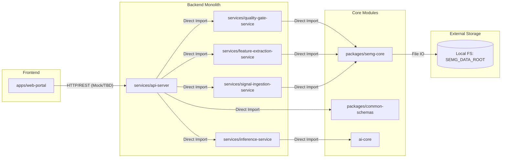
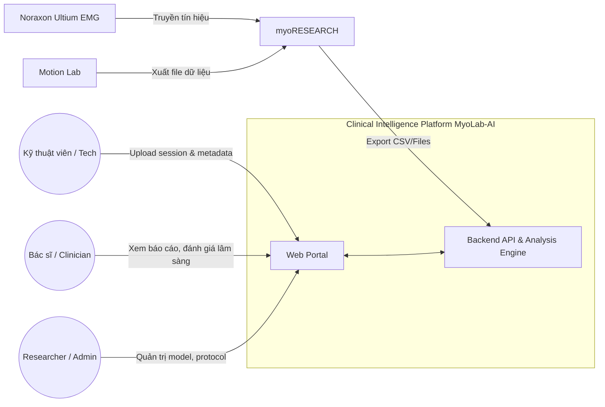
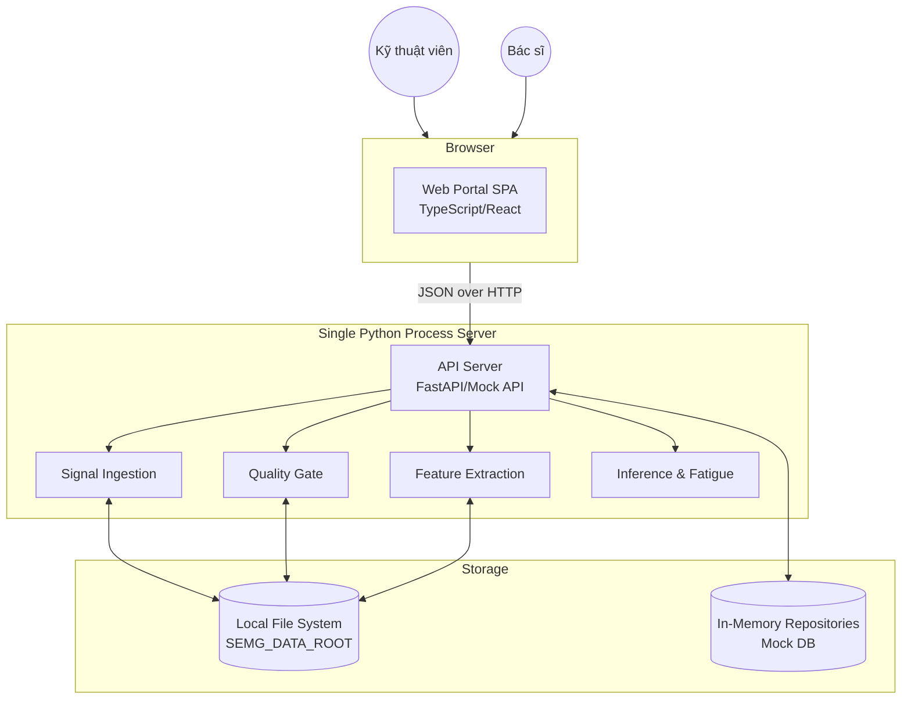
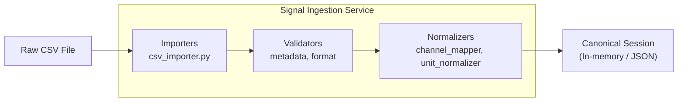
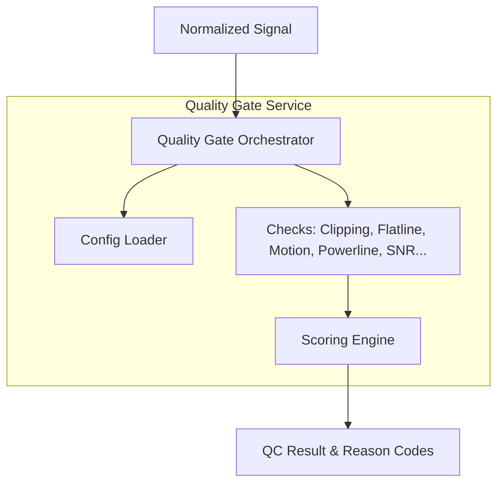
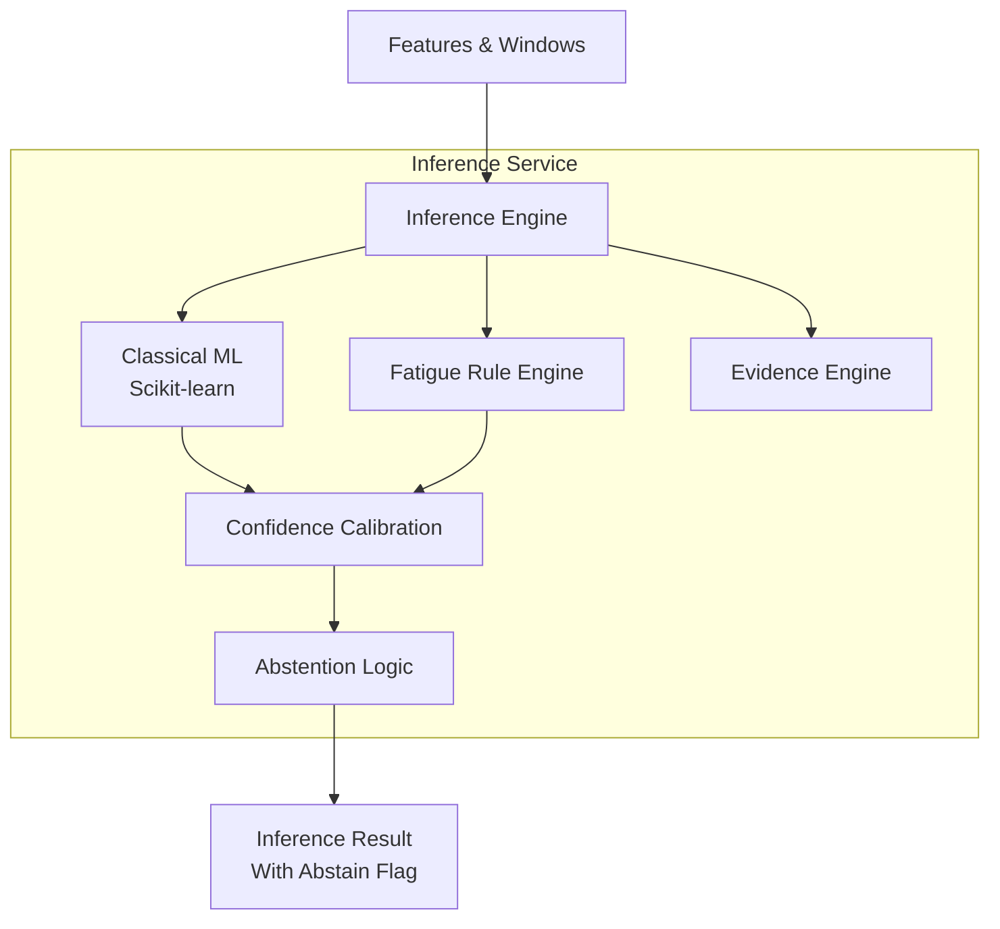
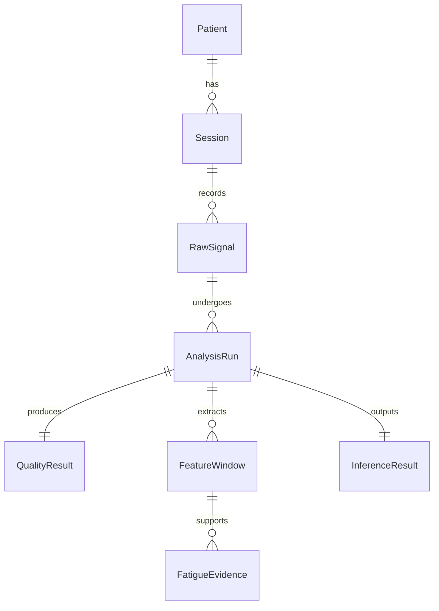
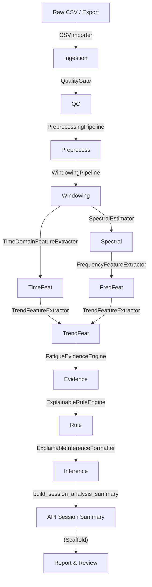

# Codebase Architecture Audit

## 1. Executive Summary
MyoLab-AI (Clinical Intelligence Platform) đang được xây dựng theo kiến trúc **Modular Monolith**. Hệ thống sở hữu một nền tảng lõi xử lý tín hiệu sEMG (Signal Processing Pipeline) và đánh giá lâm sàng cực kỳ chặt chẽ, được thiết kế theo tư tưởng "Fail-Fast", tuân thủ nghiêm ngặt **Clinical AI Safety** và **Explainable AI** (Sử dụng Rule-based Engine kết hợp Classical ML thay vì Black-box DL).

Trong quá trình từ Day 30 đến Day 34, dự án đã trưởng thành về mặt MLOps với việc áp dụng các cơ chế **Handoff Gates**, **Sealed Tests**, Dual Dataset Harmonization, và kiến trúc **Few-shot Personalization** ở cấp độ Subject. Tuy nhiên, về mặt hạ tầng phần mềm (Infrastructure & Delivery), hệ thống vẫn đang ở giai đoạn sơ khai (Scaffold), với Data Storage chủ yếu dựa trên Local File System và các API tích hợp đang chạy Mock.

## 2. Scope and Method
Cuộc Audit này không chỉ dựa trên việc đọc tài liệu thiết kế (Documentation) mà sử dụng phương pháp đối chiếu chéo (Cross-validation) giữa các tầng:
- **Documentation & Execution Plans:** Đối chiếu tầm nhìn thiết kế (các file `docs/plans/DAY*.md`).
- **Source Code & Project Structure:** Kiểm tra sự tồn tại và cách tổ chức của các thư mục `apps/`, `services/`, `packages/`, `ai-core/`.
- **Runtime Wiring:** Đọc các tệp khởi chạy (ví dụ `day*_app.py`, `run_*.sh`) để xem các component thực sự giao tiếp như thế nào ở thời điểm hiện tại (Import trực tiếp hay gọi API).
- **Configuration & Tests:** Xem xét các file schema JSON, `.env` và các kịch bản kiểm thử trong `qa-validation/` để xác định Nguồn gốc sự thật (Source of Truth).

## 3. Evidence Classification
Để đảm bảo tính khách quan, mọi nhận định trong báo cáo được phân loại theo mức độ bằng chứng:
- **VERIFIED_FROM_CODE:** Đã đọc source code, thấy các file script hoặc class thực sự hoạt động.
- **VERIFIED_FROM_CONFIG:** Cấu hình tồn tại (`.env`, `docker-compose.yml`, JSON Schemas).
- **SCAFFOLD_ONLY:** Thư mục hoặc file tồn tại, tên class/hàm đã có nhưng bên trong rỗng hoặc chỉ trả về Mock data.
- **DOCUMENTATION_ONLY:** Chỉ tồn tại trong các file kế hoạch (`docs/plans/`) hoặc tài liệu thiết kế hệ thống nhưng chưa thấy dấu vết implement trong source code.

## 4. Repository Inventory
*(Đã hoàn thành Phase 0 & Phase 1)*

### Phase 1: Module Inventory & Classification

#### 4.1 Repository Map (Top-level)
```text
/home/duyvd9/massive/projects/semg-fatigue/MyoLab-AI
├── ai-core/            # ML Workspace (data, modeling, pipelines, evaluation)
├── apps/
│   ├── clinician-report-viewer/
│   └── web-portal/     # Frontend portal
├── clinical/           # Clinical definitions, protocols
├── data-platform/      # Data contracts, schemas, privacy
├── day34_personalization_handoff/
├── docs/               # Architecture, API, ML docs
├── integrations/       # Devices, EHR integrations
├── mlops/              # MLOps scripts, configs
├── packages/
│   ├── clinical-protocols/
│   ├── common-schemas/
│   └── semg-core/      # Signal processing core logic
├── qa-validation/      # Test plans, fixtures, check logs
├── scripts/            # CLI and dev/ops runners
└── services/           # Backend API and decoupled business logics
    ├── api-server/
    ├── feature-extraction-service/
    ├── inference-service/
    ├── integration-service/
    ├── preprocessing-service/
    ├── quality-gate-service/
    ├── report-generation-service/
    └── signal-ingestion-service/
```

#### 4.2 Module Inventory & Classification

| Module                                                        | Purpose                         | Main Languages        | Entrypoint                      | Dependencies                         | Runtime Status                         | Evidence (Files)                           | Classification            |
| ---------------------------------------------------------------| ---------------------------------| -----------------------| ---------------------------------| --------------------------------------| ----------------------------------------| --------------------------------------------| ---------------------------|
| `apps/web-portal`                                             | Frontend UI cho Clinicians/Tech | TypeScript, JS, React | `package.json`, Next/Vite (TBD) | `packages/common-schemas`            | Chạy thực tế (mock hoặc gọi API local) | 410 file code (ts, tsx)                    | **ACTIVE_IMPLEMENTED**    |
| `apps/clinician-report-viewer`                                | UI hiển thị báo cáo             | N/A                   | N/A                             | N/A                                  | Chưa có code                           | 0 code files                               | **SCAFFOLD_ONLY**         |
| `packages/semg-core`                                          | Core DSP, Quality, Features     | Python                | `__init__.py`                   | numpy, scipy                         | Import bởi các module khác             | 39 file Python (có `qc.py`, `features.py`) | **ACTIVE_IMPLEMENTED**    |
| `packages/common-schemas`                                     | JSON Schemas / Contracts        | JSON                  | N/A                             | Không                                | Load lúc runtime/test                  | Nhiều file `.schema.json`                  | **ACTIVE_IMPLEMENTED**    |
| `ai-core`                                                     | ML Pipelines, Modeling, Eval    | Python                | `scripts/ml`                    | sklearn, pandas                      | Data extraction/Modeling               | 89 file code                               | **ACTIVE_IMPLEMENTED**    |
| `services/api-server`                                         | HTTP API & Orchestration        | Python                | `src/mock_api/day*_app.py`      | fastapi (dự kiến), internal services | Local mock API/Check scripts           | 86 file code                               | **ACTIVE_IMPLEMENTED**    |
| `services/quality-gate-service`                               | QC, Signal Check                | Python                | N/A                             | `semg-core`                          | Gọi từ script kiểm thử hoặc API        | 22 file code                               | **ACTIVE_IMPLEMENTED**    |
| `services/feature-extraction-service`                         | Trích xuất đặc trưng            | Python                | N/A                             | `semg-core`                          | Được gọi bởi check script              | 33 file code                               | **ACTIVE_IMPLEMENTED**    |
| `services/inference-service`                                  | Task A/B Inference              | Python                | N/A                             | `ai-core`                            | Được gọi bởi check script              | 22 file code                               | **ACTIVE_IMPLEMENTED**    |
| `services/signal-ingestion-service`                           | Parse/Import file EMG           | Python                | N/A                             | `semg-core`                          | Được gọi bởi check script              | 15 file code                               | **ACTIVE_IMPLEMENTED**    |
| `services/preprocessing-...`, `report-...`, `integration-...` | Các service phụ trợ khác        | Python                | N/A                             | N/A                                  | Khung chứa code giới hạn               | <10 file code / service                    | **PARTIALLY_IMPLEMENTED** |
| `clinical`, `data-platform`, `integrations`, `mlops`          | Domain Knowledge, Configs, YAML | JSON, YAML, MD        | N/A                             | N/A                                  | Không thực thi (chỉ metadata)          | Không có code chính                        | **DOCUMENTATION_ONLY**    |
| `qa-validation`                                               | Testing & QA, Traces            | Python, JSON          | `pytest`, `scripts/dev/run_*`   | N/A                                  | Thường xuyên chạy                      | Hàng trăm file test/log                    | **TEST_ONLY**             |

*Ghi chú:* Hầu hết các service (trong `services/`) được gọi dạng package thay vì chạy độc lập như microservices, được chứng minh bởi các `day*_app.py` và `run_day*_checks.sh` import nội bộ thay vì gọi qua mạng. Do đó runtime architecture thiên về modular monolith.

### Phase 0: Preflight and Repository Safety

| Hạng mục           | Kết quả                                                | Bằng chứng                                                                 | Trạng thái           |
| --------------------| --------------------------------------------------------| ----------------------------------------------------------------------------| ----------------------|
| Repository root    | `/home/duyvd9/massive/projects/semg-fatigue/MyoLab-AI` | pwd                                                                        | VERIFIED_FROM_CODE   |
| Branch             | `day34/personalization-and-fewshot-adaptation`         | `git status`                                                               | VERIFIED_FROM_CODE   |
| Commit             | `18049e3efd717f83e2c0ab0c0b3522ac0fde1b26`             | `git log -1`                                                               | VERIFIED_FROM_CODE   |
| Monorepo           | Yes                                                    | `packages/`, `apps/`, `services/`, `pnpm-workspace.yaml`, `pyproject.toml` | VERIFIED_FROM_CODE   |
| Main languages     | Python, TypeScript/JavaScript                          | `pyproject.toml`, `package.json`                                           | VERIFIED_FROM_CODE   |
| Build system       | `uv` (Python), `pnpm` (Node)                           | `uv.lock`, `pnpm-workspace.yaml`                                           | VERIFIED_FROM_CODE   |
| Container strategy | Docker                                                 | `docker-compose.yml`, `.github/workflows/docker-build.yml`                 | VERIFIED_FROM_CONFIG |
| Test frameworks    | `pytest`                                               | `requirements.txt`, `.pytest_cache`, `qa-validation/tests/`                | VERIFIED_FROM_CODE   |

## 5. Dependency và Runtime Graph (Phase 2)

### 5.1 Mermaid Dependency Graph


### 5.2 Dependency Matrix

| Producer | Consumer | Interface | Protocol/format | Synchronous? | Evidence |
| -------- | -------- | --------- | --------------- | ------------ | -------- |
| `services/*` | `api-server` | Python API | Direct import / Call | Yes | `import services.analysis_job_service` in `day*_app.py` |
| `semg_core` | `services/*` | Python API | Direct import / Call | Yes | `api-server/src/services/longitudinal_service.py` imports `semg_core` |
| `ai-core` | `inference-service` | Python API | Direct import / Call | Yes | Dependency tự nhiên của ML Inference |
| Local Disk | `semg_core` / `services` | OS API | `.npz`, `.json`, `.csv` | Yes | `.env` chứa `SEMG_DATA_ROOT` |

### 5.3 External Dependencies

| External system | Purpose | Integration method | Required? | Fallback | Evidence |
| --------------- | ------- | ------------------ | --------- | -------- | -------- |
| `SEMG_DATA_ROOT` | Lưu trữ dữ liệu ngoài repo | File System / Path | Có | Không | `.env` |
| GitHub Actions | CI/CD & Testing | YAML Runner | Có | Scripts local | `.github/workflows/*` |
| Database | Lưu trữ trạng thái API | In-memory Mock | N/A | N/A | `InMemoryAnalysisJobRepository` trong `analysis_job_service.py` |

## 6. Runtime Architecture
*(Đã hoàn thành Phase 2 - Chi tiết ở phần 5)*

## 7. System Context



## 8. Container Architecture


*Lưu ý: Không có Database container thực (đang dùng In-Memory Dicts) và Object Storage thực (đang dùng Local FS).*

## 9. Component Architecture

### 9.1 Signal Ingestion Service Component


### 9.2 Quality Gate Service Component


### 9.3 Inference Service Component (Task A & B)


## 9.5 Phân tích Architecture Style (Thực tế)

- **Style:** **Modular Monolith**
- **Bằng chứng:** 
  - Source code được tách thành nhiều module (giả lập Microservices) trong thư mục `services/` (ví dụ `quality-gate-service`, `inference-service`).
  - Tuy nhiên, runtime wiring (Phase 2) chỉ ra tất cả các service này được import trực tiếp bằng Python (`import services.analysis_job_service`) trong `api-server`. 
  - Không có Docker networks, message queues hay service mesh kết nối chúng.
- **Đánh giá:** Kiến trúc Modular Monolith ở giai đoạn này là hoàn toàn hợp lý (giảm chi phí vận hành, dễ debug) đồng thời giữ được ranh giới rõ ràng (Bounded Contexts) để scale-out thành Microservices trong tương lai nếu cần thiết.

## 10. Data Architecture

### 10.1 Entity Relationship Diagram (Conceptual)


### 10.2 Data Ownership & Storage Logic

| Entity | Source of Truth (Schema) | Created by | Storage (Runtime) | Versioned? |
|---|---|---|---|---|
| `Patient`/`Session` | `packages/common-schemas/json/*.schema.json` | Noraxon/Export | `SEMG_DATA_ROOT` (File) | Yes (via hash) |
| `RawSignal` | CSV/npz File Structure | Ingestion Service | `SEMG_DATA_ROOT` (File) | No (Immutable) |
| `QualityResult` | `qc-result.schema.json` | Quality Gate | File System (JSON) | Yes (pipeline_config) |
| `FatigueEvidence` | `fatigue-evidence-result.schema.json` | Inference Service | File System (JSON) | Yes |
| `InferenceResult` | `explainable-inference-result.schema.json` | Inference Service | File System (JSON) | Yes |
| `AnalysisManifest` | `offline-analysis-manifest.schema.json` | Orchestrator | File System (JSON) | Yes |
| Database Models | `api-server/src/models/*` | N/A (Scaffold) | In-Memory (Mock) | N/A |

### 10.3 Schema Drift Analysis

- **Khoảng trống giữa Contract và ORM (Database):** Nguồn gốc sự thật (Source of Truth) cho tất cả Data Contract hiện tại nằm ở **95 file JSON Schema** trong thư mục `packages/common-schemas/json/`. Trong khi đó, các file schema và model của DB (như `patient.py`, `session.py` trong `api-server/src/models/` và `schemas/`) hầu hết là các file rỗng (0 bytes).
- **Lưu trữ dạng Object Storage:** Hệ thống hiện tại hoàn toàn hoạt động theo cơ chế **File-based Storage** (tương tự Data Lake / Object Storage) kết hợp với In-Memory repositories cho API Server. Dữ liệu phân tích lưu dưới dạng các file từ `01-qc-result.json` đến `11-analysis-manifest.json` trong từng thư mục analysis.
- **Kết luận:** Sự khác biệt (Drift) giữa cấu trúc File lưu trữ và JSON Contract gần như = 0 vì các Pipeline xuất file JSON tuân thủ schema. Tuy nhiên, mức độ Drift giữa JSON Contract và Database/ORM Layer là 100% vì DB layer hiện mới chỉ là Scaffold. Kiến trúc data provenance dựa trên File Hash được áp dụng rất chặt chẽ (lưu hash trong `analysis_fingerprint_sha256` của `analysis_contract.py`).

### 10.4 Data Harmonization & Extractor Contracts (Mendeley & GRABMyo)
Dựa trên kiến trúc xử lý dữ liệu mở rộng (từ Day 27-31):
- **Data Extractor Architecture:** Hệ thống áp dụng mô hình `Extractor Contract` để xử lý nhiều loại Dataset công khai khác nhau (cụ thể là **Mendeley** và **GRABMyo**) mà không làm vỡ Pipeline lõi.
- **Isolation:** Mỗi dataset được extract và quản lý biệt lập với nhau (Không gộp chung - "No pooled datasets").
- **Feature Store:** Tín hiệu sau khi qua bộ lọc (Quality Gate) sẽ được băm (hash) và lưu lại dưới định dạng mảng (NPZ/Parquet), đóng vai trò như một Feature Store cố định phục vụ cho việc tracking các thí nghiệm ML (MLOps) phía sau.

## 11. End-to-End Pipeline

### 11.1 Sơ đồ Pipeline E2E


### 11.2 Bảng chi tiết các Node trong Pipeline

| Stage | Tên Module (Implementation) | Input | Output | Trạng thái triển khai | Failure Path / Behavior |
|---|---|---|---|---|---|
| Ingestion | `CSVImporter` (Ingestion Service) | `manifest_path` (CSV) | Signal, `ingestion-stage-result` | ✅ Implemented | Import rejected => Block downstream, xuất lỗi `import_rejected`. |
| Quality Gate | `QualityGate` (Quality Gate Service) | Signal | `qc-result` (QC metrics) | ✅ Implemented | Signal quá nhiễu => Downstream blocked. |
| Preprocessing | `PreprocessingPipeline` (Preprocessing Svc) | Signal, QC result | Cleaned Signal | ✅ Implemented | Blocked by QC => Trả về status "blocked". |
| Windowing | `WindowingPipeline` (semg-core) | Cleaned Signal | Windows | ✅ Implemented | Lỗi windowing => Fallback skip. |
| Feature Ext | `TimeDomain...`, `Frequency...`, `Trend...` | Windows | `time`, `freq`, `trend` JSON | ✅ Implemented | Lỗi kênh/window => Không có feature cho channel đó. |
| Inference | `FatigueEvidenceEngine`, `ExplainableRuleEngine` | Features | `fatigue-evidence`, `rule` JSON | ✅ Implemented | Không tìm thấy bằng chứng => Abstained. |
| Confidence | `ExplainableInferenceFormatter` | Rules, Evidence | `explainable-inference.json` | ✅ Implemented | Độ tin cậy thấp => Abstract / Warning. |
| Summary (API)| `build_session_analysis_summary` (API) | Các JSON outputs trên | `SessionAnalysisSummary` (DTO)| ✅ Implemented | N/A |
| Report & Rvw | `report_service.py`, `review_service.py` | API Summary | Clinical Report | 🔵 Scaffold only | N/A |

*Chú thích trạng thái:*
✅ Implemented and tested
🟡 Partially implemented
🔵 Scaffold/interface only
⚪ Documentation only
🔴 Missing

## 12. Signal Processing Pipeline
- **Status:** **Implemented** (Nằm tại package độc lập `packages/semg-core/semg_core`).
- **Tư tưởng thiết kế:** Hoàn toàn dựa trên các hàm thuần (Pure Functions) không trạng thái (stateless), chia nhỏ thành các domain cụ thể (preprocessing, windowing, features, spectral). Đảm bảo tính Deterministic.
- **Các thành phần cốt lõi:**
  - **Preprocessing (`preprocessing.py`):** Lọc Butterworth Bandpass và IIR Notch sử dụng phương pháp Zero-phase (lọc tiến-lùi `sosfiltfilt` kết hợp Second-Order Sections - SOS). Có loại bỏ nhiễu DC (mean-centering). 
  - **Windowing (`windowing.py`):** Cắt cửa sổ cố định (Fixed-window) tạo thành các "index plan" thay vì copy toàn bộ mảng dữ liệu. Có kiểm tra nghiêm ngặt `minimum_valid_sample_ratio` để loại cửa sổ chứa tín hiệu rác (NaN/Inf).
  - **Time Domain Features (`features.py`):** Tính toán RMS và MAV với kỹ thuật chống tràn số (overflow-safe numeric scaling).
  - **Spectral/Frequency Domain (`spectral.py`):** Ước lượng mật độ phổ (PSD) bằng Welch và Periodogram. Tích hợp kiểm tra bảo toàn năng lượng (Parseval's theorem check thông qua `parseval_ratio`) để đảm bảo không thất thoát tín hiệu khi chuyển đổi miền.

## 13. Task A Architecture (Gesture Recognition & Personalization)
- **Status:** **Implemented** (Phần lớn nằm ở pipeline ML Offline).
- **Phạm vi mô hình:** Sử dụng hoàn toàn các mô hình Classical ML (`scikit-learn`), được định nghĩa chặt chẽ trong `ai-core/modeling/day32/model_factory.py`.
- **Core Models:** `lda_shrinkage`, `logistic_regression`, `linear_svm`, `random_forest`, `dummy_majority`, `dummy_stratified`.
- **Optional Models:** `knn`, `qda_regularized`, `rbf_svm`, `gradient_boosting`.
- **Quy định kiến trúc:** Cấm ngặt nghèo các mô hình Deep Learning (CNN, LSTM, Transformer, AutoML) tại giai đoạn Day 32 (`PROHIBITED_DAY32`). 
- **Cách tiếp cận:** Mọi mô hình yêu cầu scale đều được bọc trong `Pipeline` cùng `StandardScaler` để đảm bảo không rò rỉ dữ liệu (data leakage) giữa các tập train/val trong quá trình Cross Validation.
- **MLOps & Handoff Gates (Day 32-34):**
  - **Sealed Test Isolation:** Tập Test luôn bị "khóa chặt" trong suốt quá trình phát triển (Chỉ mở vào cuối chu kỳ). Mọi bước Baseline modeling đều chạy Cross-validation trên Validation subject split.
  - **Few-Shot Personalization:** Kiến trúc Inference hỗ trợ **Subject-level Personalization** bằng kỹ thuật Few-shot (dùng 2-3 repetitions mỗi class để làm Calibration / Adaptation).
  - Duy trì quy tắc tách biệt tuyệt đối cho dữ liệu thử nghiệm: `calibration repetition ∩ evaluation repetition = ∅`.

## 14. Task B Architecture (Fatigue Assessment)
- **Status:** **Implemented** (Rule-based Explainable Engine).
- **Kiến trúc:** Dựa trên tập luật chuyên gia (Rule-based) thay vì Black-box ML, đảm bảo tính giải thích cao (Explainable AI) dùng trong lâm sàng.
- **Các Layer xử lý:**
  - `FatigueEvidenceEngine` (`evidence_engine.py`): Chuyển đổi số liệu thô (độ dốc, r-squared, phần trăm thay đổi từ trend features) thành các chứng cứ cấu trúc (supporting, contradicting, insufficient).
  - `ExplainableRuleEngine` (`rule_engine.py`): Áp dụng các luật pattern để rút ra `technical_conclusion`, đồng thời tạo ra các lý do rõ ràng như `decision_basis` (vd: `BASIS_FREQUENCY_DOMAIN_SUPPORT`) và `counterevidence` (vd: `COUNTEREVIDENCE_INSUFFICIENT_TREND`).

## 15. Task C Architecture (Longitudinal Recovery Score)
- **Status:** **Scaffold / Planned** (Chưa implement thành Code API nhưng đã được xác định thiết kế trong Execution Plan).
- **Kiến trúc đặc tả:** Dựa trên định hướng từ các Execution Plan trước Day 30, Task C **không phải là một mô hình ML (Classifier)**. 
- **Cơ chế hoạt động:** Đây là bài toán **Quantitative Assessment (Đánh giá định lượng)**, tập trung vào **Deterministic Metric Studies** (Các chỉ số được tính toán chính xác bằng công thức toán học - ví dụ phân tích thay đổi lực, biên độ theo thời gian). 
- **Mục tiêu:** Tính toán điểm phục hồi theo thời gian (Longitudinal Recovery Score) để theo dõi tiến triển của bệnh nhân trong các buổi tập vật lý trị liệu, không dính líu đến Black-box ML để giữ vững độ tin cậy y khoa.

## 16. Quality Gate and Abstention
- **Status:** **Implemented** (Cơ chế lõi hoạt động cực kỳ chặt chẽ).
- **Tư tưởng thiết kế:** **"Fail-Fast" và "Safe Abstention"** (Thà từ chối đưa ra kết quả còn hơn đưa ra kết quả sai trên dữ liệu xấu).
- **Quality Gate:** Được đặt ngay sau bước Ingestion. Nếu có lỗi nghiêm trọng (Import rejected hoặc QC rules fail), nó lập tức block toàn bộ các downstream processing (Preprocessing, Windowing, Feature Extraction).
- **Abstention (Từ chối dự đoán):** Được nhúng ở cấp độ Engine (`rule_engine.py`, `evidence_engine.py` có chứa các hàm `self._abstain(...)`). Nếu feature không đạt chất lượng tối thiểu (`EVIDENCE_NO_EVALUATED_CHANNEL` hoặc `RULE_ABSTAINED_BY_EVIDENCE`), hệ thống sẽ ngắt luồng và trả về trạng thái `abstained` hợp lệ, không gây crash ứng dụng.

## 17. API and Integration Architecture
- **Status:** **Partially Implemented / Mocked**.
- **Cấu trúc Backend:** Tổ chức theo chuẩn MVC/Service Layer thông thường (`routes`, `services`, `repositories`, `schemas`). 
- **Integration Runtime:** 
  - Đang chạy giả lập mock (`day19_app.py`, `day20_app.py`). 
  - Việc gọi các module phân tích (Inference, Quality Gate) được thực hiện Synchronous qua Direct Python Import, không có Event Bus (Kafka, RabbitMQ) hoặc gRPC.
  - Sử dụng Mock Repositories bằng In-Memory Dictionary, không có Database thực tế ở giai đoạn này.

## 18. Frontend Architecture
- **Status:** **Scaffold / Early Implementation**.
- **Cấu trúc:** Tồn tại tại `apps/web-portal`.
- **Tech Stack:** Sử dụng **Next.js 14** (App Router hoặc Pages Router), React 18, TypeScript, `lucide-react` cho icons. 
- **Testing:** Sử dụng **Playwright** cho End-to-End (E2E) testing (`test:e2e`).
- **Lưu ý:** Thư mục `apps/clinician-report-viewer` đã được tạo khung nhưng chưa có code. Nhìn chung UI chưa được implement hoàn chỉnh.

## 19. Deployment Architecture
- **Status:** **Scaffold**.
- **Cấu trúc:** Tồn tại các thư mục định hướng rõ ràng tại `infra/local` và `infra/onprem`.
- **Hiện trạng:** Các tệp như `docker-compose.yml`, `docker-compose.onprem.yml`, `init-db.sh` đã có tên nhưng kích thước hiện tại là 0 bytes (rỗng). Hệ thống chưa sẵn sàng để deploy tự động.

## 20. CI/CD and Automation
- **Status:** **Scaffold**.
- **Cấu trúc:** Tổ chức tại `.github/workflows/`.
- **Hiện trạng:** Các luồng công việc như `ci.yml`, `docker-build.yml`, `docs-check.yml`, `model-validation.yml`, `security-scan.yml` đã được định hình (stubbed), nhưng chưa chứa các step CI thực tế.

## 21. Infrastructure as Code (IaC)
- **Status:** **Scaffold**.
- **Cấu trúc:** Nhắm đến môi trường multi-cloud và on-premise với các file nằm trong `infra/cloud/terraform/`, `infra/cloud/kubernetes/` và `infra/monitoring/` (prometheus, grafana, loki).
- **Hiện trạng:** Giống Deployment, các file config đều rỗng.

## 22. Security and Privacy
- **Status:** **Scaffold**.
- **Cấu trúc:** Phân khu chuyên nghiệp, đạt tiêu chuẩn khắt khe cho thiết bị y tế (SaMD). Nằm trong thư mục `security-compliance/`.
- **Phân loại hiện có (Khung xương):**
  - **Cybersecurity:** Threat model, Vulnerability management, SBOM.
  - **Policies:** Acceptable use, Access control, Audit log, Data handling.
  - **Privacy:** Data subject requests, Deidentification SOP, Consent forms.
  - **Regulatory:** Clinical evaluation plan, Standards mapping (chuẩn bị cho FDA/CE).
  - **Risk:** Clinical safety case, Hazard log, Risk control matrix.
- **Hiện trạng:** Toàn bộ các file tài liệu hiện tại rỗng. Bộ khung cho thấy tầm nhìn hệ thống Medical Grade rất rõ ràng, nhưng việc tuân thủ thực tế chưa được viết ra.

## 23. Architectural Risks
 Dựa trên quá trình Audit toàn diện, dưới đây là các rủi ro cấu trúc lớn nhất ở giai đoạn hiện tại (MVP/Day 32):

1. **Thiếu vắng Database và Event Bus (Storage & Integration Risk):**
   - Hệ thống dựa hoàn toàn vào file nội bộ (`json`, `parquet`) và In-Memory dictionary. Không có Transactional DB (PostgreSQL) để lưu Metadata hay Time-Series DB (Influx/Clickhouse) để truy vấn tín hiệu lớn.
   - Các API gọi trực tiếp Inference Engine một cách Synchronous. Khi scale up, cần chuyển sang Asynchronous Messaging (RabbitMQ/Kafka) để phân tải tính toán.

2. **Frontend & Deployment "Rỗng" (Delivery Risk):**
   - Rất nhiều khung Deployment (Docker, Kubernetes) và Security được tạo ra đầy đủ danh mục nhưng nội dung đang rỗng. Đội ngũ cần mất một khoảng thời gian dài đáng kể để lấp đầy cấu hình CI/CD và Frontend (hiện chỉ có Next.js stub).

3. **Thắt cổ chai tại Offline Pipeline (Performance Risk):**
   - Toàn bộ pipeline hiện tại (từ `Ingestion` đến `Inference`) được thiết kế cực kỳ kỹ lưỡng theo hướng *Offline Research*. Khi chuyển dịch sang Real-time Streaming từ thiết bị EMG thật, kiến trúc Windowing (`windowing.py`) cần bổ sung cơ chế trượt (sliding over buffers) thay vì chỉ đọc file tĩnh.

## 24. Final Recommendations
- **Kế hoạch cho Phase tiếp theo (Day 35+):** Bắt đầu triển khai Storage thực tế (ví dụ: gán PostgreSQL / Clickhouse vào Repo thay vì InMemory) và triển khai Celery/Redis cho Job Queue để tách biệt Frontend với Heavy Inference.
- **Bảo lưu tính giải thích (Explainability):** Tiếp tục duy trì cơ chế **Abstention** và **Rule-based Engine** trong Task B. Đây là điểm sáng cực mạnh của hệ thống này so với các dự án AI Y tế khác thường làm black-box.
- **Hoàn thiện CI/CD:** Các file rỗng trong `.github/workflows` cần sớm được tích hợp ít nhất là `pytest` và `flake8/black` để chặn lỗi khi merge code.

**Kết luận Audit:** *Kiến trúc hiện tại (Modular Monolith) rất xuất sắc cho mục tiêu Nghiên cứu Lâm sàng (Clinical Research) với kỷ luật khắt khe về Validation và Quality Gate. Điểm yếu duy nhất là phần Infrastructure & Delivery chưa được implement.*

## 25. Recommended Target Architecture
Dựa trên hiện trạng Modular Monolith và mục tiêu trở thành nền tảng Clinical Intelligence Production-ready, kiến trúc mục tiêu (Target Architecture) đề xuất như sau:
1. **Event-driven Storage & API:** Chuyển đổi từ `In-Memory Repository` sang **PostgreSQL** cho metadata/session data. Tích hợp Time-series database hoặc Object Storage thực thụ (như MinIO/S3) để lưu trữ tín hiệu sEMG lớn thay vì Local File System.
2. **Asynchronous Task Processing:** Tách Inference và Feature Extraction ra khỏi luồng xử lý HTTP API đồng bộ bằng cách sử dụng **Celery + Redis / RabbitMQ**. Điều này giúp API Server không bị nghẽn (block) khi xử lý khối lượng tín hiệu lớn.
3. **Real-time Windowing Pipeline:** Nâng cấp `semg_core.windowing` để hỗ trợ Streaming buffers (Sliding windows trên live stream) thay vì chỉ đọc mảng tĩnh từ CSV/NPZ, đáp ứng yêu cầu của Task C và việc kết nối real-time.

## 26. Prioritized Next Actions
1. **Kích hoạt CI/CD & Code Quality Gates:** Bổ sung ngay các workflow chạy Unit Tests (`pytest`), Static Analysis (`flake8`, `mypy`) vào các file `.github/workflows` hiện đang rỗng.
2. **Triển khai Database Layer:** Implement các ORM Models (SQLAlchemy) để thay thế In-memory dicts, khớp nối Data Contracts (JSON Schema) vào Database để xóa bỏ Schema Drift.
3. **Khởi động Frontend Integration:** Kết nối Next.js Web Portal (hiện đang Scaffold) với các Mock APIs để tạo luồng UI cơ bản phục vụ trình diễn (Adjudication/Clinical Review).

## 27. Evidence Appendix
Các nhận định trong báo cáo này được tổng hợp và đối chiếu từ:
- [Source Code: semg-core](file:///home/duyvd9/massive/projects/semg-fatigue/MyoLab-AI/packages/semg-core)
- [Mock API Server Services](file:///home/duyvd9/massive/projects/semg-fatigue/MyoLab-AI/services/api-server/src/services/)
- [ML Modeling & Pipelines (ai-core)](file:///home/duyvd9/massive/projects/semg-fatigue/MyoLab-AI/ai-core/)
- Khối tài liệu Execution Plans: [docs/plans](file:///home/duyvd9/massive/projects/semg-fatigue/MyoLab-AI/docs/plans)
