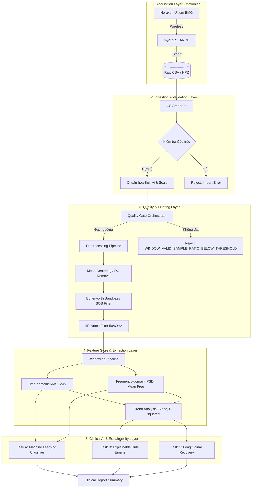

# Data Flow & Processing Pipeline (MyoLab-AI)

Tài liệu này mô tả kiến trúc dòng chảy dữ liệu (Data Pipeline) của hệ thống MyoLab-AI, tập trung vào vòng đời tín hiệu sEMG từ phần cứng Motionlab đến báo cáo chẩn đoán lâm sàng (Task A, B, C). Hệ thống được thiết kế theo mô hình **Unidirectional Data Flow** (Đơn chiều) kết hợp với **Zero-Trust Data Gate** (Chốt kiểm duyệt dữ liệu nghiêm ngặt), áp dụng nguyên tắc **Safe Abstention** (Từ chối chẩn đoán khi dữ liệu không đủ độ tin cậy) thay vì dự đoán sai.

---

## 1. Kiến trúc Tổng thể (High-Level Pipeline Architecture)

---

## 2. Chi tiết Thuật toán và Logic Khoa học tại Từng Layer

### 2.1. Layer 1: Acquisition (Thu nhận tín hiệu)
*   **Thiết bị:** Hệ thống cảm biến Noraxon Ultium EMG (Clinical-grade).
*   **Luồng xử lý tại Lab:** Phần mềm myoRESEARCH chịu trách nhiệm đồng bộ hóa (synchronization) đa kênh và ghi nhận tín hiệu. Kỹ thuật viên xuất tín hiệu thô (Raw Signal) chứa timestamp và ma trận biên độ (Amplitude Matrix) dạng file CSV/NPZ.

### 2.2. Layer 2: Ingestion & Validation
*   **Thuật toán Import (`CSVImporter`):** Parse file CSV/NPZ tốc độ cao. Dò tìm Metadata header để lấy Tần số lấy mẫu (Sampling Rate $f_s$), thông tin kênh (Channel Labels).
*   **Scale Normalization:** Scale giá trị điện thế bề mặt (thường ở mức $10^{-6}$ V) về một hệ quy chiếu chung (uV hoặc mV) để tránh thất thoát độ chính xác số học (float precision loss) ở các bước toán học phía sau.

### 2.3. Layer 3: Quality Gate & Preprocessing (Bộ lọc Khoa học lõi)
Đây là "bức tường lửa" bảo vệ tính toàn vẹn (Integrity) của AI y khoa. Mọi module tại đây đều tuân thủ nguyên tắc Deterministic (Tính toán xác định).

#### A. Quality Gate (Kiểm soát Tín hiệu Tĩnh và Bão hòa)
*   **Thuật toán Flatline Detection (`compute_flatline_stats`):** 
    Sử dụng kỹ thuật Median Absolute Deviation (MAD nhân với hằng số $1.4826$ xấp xỉ phân phối chuẩn) để tìm ra một biên độ dao động nền (Robust scale). Nếu chuỗi mẫu (samples) liên tục có giá trị biến thiên nhỏ hơn `absolute_floor_uV` và `relative_tolerance` trong một thời lượng `minimum_contiguous_duration_ms` cố định, hệ thống sẽ đánh cờ tín hiệu phẳng (Flatline).
*   **Thuật toán Clipping Detection (`repeated_extrema_fraction`):**
    Phát hiện hiện tượng bão hòa ADC (Analog-to-Digital Converter) bằng cách tìm kiếm các tập hợp mẫu lặp lại liên tiếp ở biên trị tuyệt đối lớn nhất (Global Extrema) của mảng tín hiệu.

#### B. Preprocessing (Tiền xử lý Tín hiệu Tần số)
Sử dụng thư viện Scipy (`scipy.signal`) để thiết kế bộ lọc IIR chuẩn xác:
*   **DC Removal (Mean Centering):** Cắt thành phần dòng một chiều $X_{centered} = X - \mu_X$.
*   **Butterworth Bandpass (SOS):** 
    Sử dụng cấu trúc Second-Order Sections (SOS) thay vì hàm truyền Transfer Function (b/a) truyền thống để triệt tiêu lỗi bất ổn định (instability) khi tạo bộ lọc bậc cao. Tín hiệu sEMG thường được lọc trong dải băng thông hữu ích (ví dụ $20Hz - 450Hz$), với `nyquist_margin_ratio` để tránh alias.
*   **IIR Notch Filter:** 
    Bộ lọc chặn đỉnh (Notch) tại $50Hz/60Hz$ với hệ số chất lượng $Q$ cao (`q_factor`) nhằm triệt nhiễu điện lưới sinh hoạt (Powerline interference) nhưng không làm biến dạng tần số cơ lân cận.
*   **Zero-Phase Filtering (`sosfiltfilt`):** Lọc tiến và lùi để triệt tiêu hoàn toàn sự lệch pha (Phase shift) của bộ lọc IIR, đảm bảo vị trí thời gian của sóng điện cơ không bị xê dịch.

### 2.4. Layer 4: Feature Extraction (Rút trích Đặc trưng sEMG)
*   **Windowing Pipeline:** Cắt tín hiệu dài thành các cửa sổ ngắn (vd $250ms$, $500ms$). Cơ chế `minimum_valid_sample_ratio` sẽ tự động loại bỏ các cửa sổ chứa mẫu NaN hoặc rác (Reason: `WINDOW_VALID_SAMPLE_RATIO_BELOW_THRESHOLD`). Sử dụng view thay vì copy array để tối ưu RAM.
*   **Time-Domain:** Tính toán các chỉ số cường độ cơ bắp:
    *   **RMS (Root Mean Square):** Đại diện cho công suất điện học của cơ.
    *   **MAV (Mean Absolute Value).**
*   **Frequency-Domain (`spectral.py`):** 
    Áp dụng cửa sổ Hanning (`np.hanning`) và biến đổi Fast Fourier Transform (FFT) để tính toán phổ công suất (Power Spectral Density - PSD). Rút trích chỉ số **Mean Frequency (MNF)** và **Median Frequency (MDF)**.
*   **Trend Extraction:** Tính toán độ dốc bình phương tối thiểu (Linear Slope) và hệ số tương quan $R^2$ của RMS và MDF theo thời gian để phản ánh khuynh hướng mỏi cơ.

### 2.5. Layer 5: Clinical AI & Explainability Layer
Các giá trị đặc trưng được dẫn vào 3 luồng bài toán (Tasks) khác biệt hoàn toàn:

#### Task A: Classifier (Machine Learning Nhận diện Hành động)
*   Sử dụng **Classical ML** (SVM, Random Forest, Logistic Regression - qua `scikit-learn`) kết hợp StandardScaler. 
*   Bảo vệ Data Leakage bằng Cross-Validation chặt chẽ. Hỗ trợ **Subject-level Few-Shot Personalization** (Cá nhân hóa theo từng bệnh nhân dựa trên vài lần đo hiệu chuẩn ban đầu).

#### Task B: Explainable Fatigue Assessment (Đánh giá mỏi cơ bằng Luật)
*   Sử dụng **Rule-based Engine** thay vì Black-box ML để đáp ứng tiêu chuẩn Y khoa (Explainable AI).
*   `FatigueEvidenceEngine`: Đánh giá chất lượng của Trend. Nếu $R^2 < minimum\_r\_squared$, hệ thống sẽ reject (`TREND_FIT_QUALITY_BELOW_THRESHOLD`). Nếu độ dốc vượt `minimum_percent_change`, nó sẽ tạo ra chứng cứ (`supporting` / `contradicting`).
*   `ExplainableRuleEngine`: Nhận chứng cứ, đối chiếu luật (ví dụ: MDF giảm + RMS tăng => Mỏi cơ) để sinh ra `decision_basis` hoặc `counterevidence`. Nếu không đủ chứng cứ, hệ thống tự động trả về `abstained`.

#### Task C: Longitudinal Recovery Score (Chỉ số Phục hồi Định lượng)
*   Không phải Classifier. Đây là bài toán **Deterministic Metric**, dùng để phân tích dọc theo thời gian (Cross-day, Cross-session). Tính toán mức độ phục hồi công suất cơ bắp trong chuỗi ngày tập luyện vật lý trị liệu của bệnh nhân.
