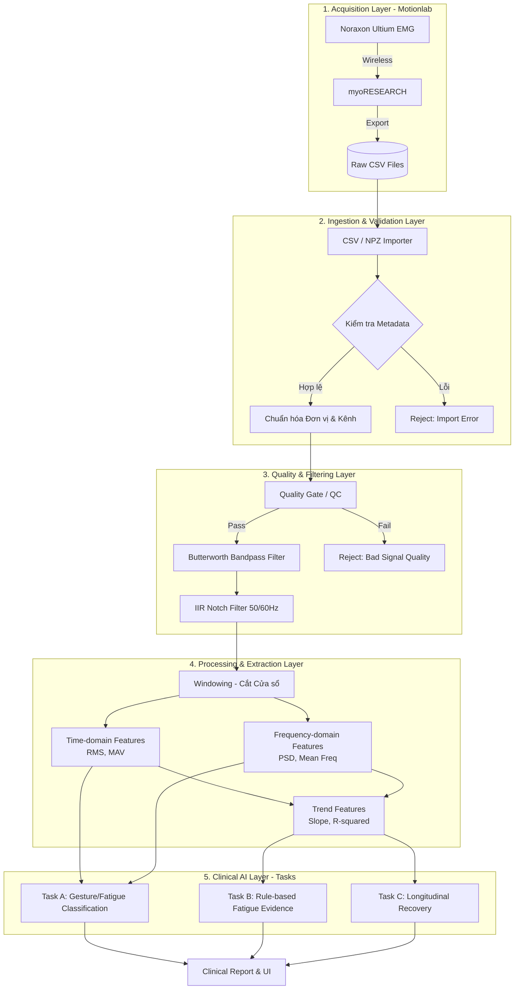

# Data Flow & Processing Pipeline (MyoLab-AI)

Tài liệu này mô tả chi tiết luồng dữ liệu (Data Flow) của hệ thống MyoLab-AI, tập trung vào vòng đời của tín hiệu sEMG từ lúc được thu nhận tại Motionlab cho đến khi phân tích ra kết quả lâm sàng (Tasks A, B, C).

## 1. Tổng quan các Layer Xử lý (Data Layers)

Hệ thống được thiết kế theo dạng **Pipeline một chiều (Unidirectional Data Flow)**, dữ liệu đi qua các trạm kiểm soát nghiêm ngặt. Nếu tín hiệu quá nhiễu hoặc không hợp lệ, hệ thống sẽ ngắt luồng (Fail-Fast) thay vì cố gắng xử lý.

---

## 2. Chi tiết từng Layer

### 2.1. Layer 1: Acquisition (Thu nhận tín hiệu tại Motionlab)
*   **Thiết bị:** Hệ thống cảm biến Noraxon Ultium EMG gắn trên các nhóm cơ của bệnh nhân (ví dụ: cơ nhị đầu, cơ delta).
*   **Phần mềm thu nhận:** myoRESEARCH (của Noraxon) nhận tín hiệu không dây.
*   **Xuất dữ liệu (Export):** Kỹ thuật viên tại Motionlab xuất dữ liệu từ myoRESEARCH dưới dạng file CSV thô (chứa timestamp và biên độ điện thế của các kênh).

### 2.2. Layer 2: Ingestion & Validation (Tiếp nhận và Chuẩn hóa)
*   **Importer:** Module `CSVImporter` (trong `signal-ingestion-service`) đọc file CSV.
*   **Validation:** Kiểm tra số lượng kênh (channels), tần số lấy mẫu (sampling rate), và format của file.
*   **Normalization:** Tín hiệu có thể bị lệch đơn vị (V vs mV vs µV). Hệ thống tự động scale (chuẩn hóa) về một đơn vị tiêu chuẩn (ví dụ: mV) và mapping lại tên các cơ (Channel Mapping).

### 2.3. Layer 3: Quality & Filtering (Kiểm soát chất lượng và Lọc nhiễu)
Đây là "bức tường lửa" quan trọng nhất để bảo vệ các mô hình AI phía sau khỏi dữ liệu rác.
*   **Quality Gate (QC):**
    *   Kiểm tra tín hiệu phẳng (Flatline check) - Cảm biến bị lỏng hoặc rơi.
    *   Kiểm tra Clipping - Tín hiệu vượt quá giới hạn đo của cảm biến (bão hòa).
    *   Kiểm tra SNR (Signal-to-Noise Ratio).
    *   *Quyết định:* Nếu tín hiệu không đạt ngưỡng tối thiểu, QC sẽ đánh cờ **Fail** và hệ thống từ chối đưa ra chẩn đoán (cơ chế *Safe Abstention*).
*   **Filtering (Lọc nhiễu):** (Nằm trong `semg-core/preprocessing.py`)
    *   **Loại bỏ nhiễu DC:** Đưa trung bình tín hiệu về 0 (mean-centering).
    *   **Butterworth Bandpass Filter:** Lọc dải tần số sEMG hữu ích (thường từ 20Hz - 450Hz).
    *   **Notch Filter:** Lọc nhiễu điện lưới (50Hz ở VN/Châu Âu, 60Hz ở Mỹ). Sử dụng lọc tiến-lùi (`sosfiltfilt`) để không làm lệch pha (Zero-phase).

### 2.4. Layer 4: Processing & Extraction (Trích xuất đặc trưng)
Sau khi tín hiệu sạch, hệ thống sẽ phân tách để tìm ra các "đặc trưng" (features) đại diện cho sự mỏi cơ.
*   **Windowing:** Chia tín hiệu dài thành các cửa sổ nhỏ (ví dụ 250ms hoặc 500ms) chồng lên nhau (sliding/fixed windows) để phân tích sự thay đổi theo thời gian.
*   **Time-domain (Miền thời gian):** Tính các chỉ số độ lớn của lực cơ như RMS (Root Mean Square), MAV (Mean Absolute Value).
*   **Frequency-domain (Miền tần số):** Dùng biến đổi Fourier (Welch/Periodogram) để tìm tần số trung bình (Mean Frequency) hoặc tần số trung vị (Median Frequency). *Khi cơ bị mỏi, tần số thường có xu hướng dịch chuyển về phía thấp hơn.*
*   **Trend Analysis:** Tính toán độ dốc (Slope) của RMS và Mean Frequency qua thời gian.

### 2.5. Layer 5: Clinical AI Layer (Các Task Phân tích)
Dữ liệu Feature được đưa vào 3 luồng phân tích y khoa (Tasks).

#### Task A: Phân loại bằng Machine Learning (Gesture/Fatigue Classification)
*   **Mục tiêu:** Nhận diện hành động (ví dụ: Gập tay, duỗi tay) hoặc phân loại trạng thái cơ ở từng thời điểm.
*   **Công nghệ:** Sử dụng Classical ML (như Logistic Regression, SVM, Random Forest) thay vì Deep Learning để đảm bảo tính ổn định và tránh overfitting khi dữ liệu ít (Few-shot learning). 
*   **Personalization (Cá nhân hóa):** Mô hình có thể tinh chỉnh riêng cho từng bệnh nhân dựa trên 1-2 lần thử đầu tiên (Calibration reps).

#### Task B: Đánh giá mỏi cơ bằng luật (Explainable Fatigue Assessment)
*   **Mục tiêu:** Xác định cơ có bị mỏi hay không, và ĐƯA RA LÝ DO TẠI SAO (Explainable AI).
*   **Công nghệ:** `FatigueEvidenceEngine` và `ExplainableRuleEngine`.
*   **Flow:** Đọc độ dốc của tần số (nếu giảm) và biên độ (nếu tăng) -> Tạo ra "Bằng chứng" (Evidence) -> Khớp với các luật chuyên gia (Rules) -> Kết luận (Support/Contradict) -> Trả về cảnh báo mỏi cơ.

#### Task C: Theo dõi phục hồi (Longitudinal Recovery Score)
*   **Mục tiêu:** So sánh trạng thái của cơ ở buổi tập hôm nay so với 1 tháng trước.
*   **Công nghệ:** Phân tích chuỗi thời gian (Longitudinal Metrics) để tính điểm phục hồi. (Phần này chủ yếu dựa trên công thức toán học và tracking metadata, không dùng ML Classification).

---

## 3. Tổng kết về Data Flow
*   Luồng dữ liệu được thiết kế tập trung cực mạnh vào **Chất lượng (Quality)**.
*   Các layer lọc và xử lý tín hiệu (`semg-core`) đóng vai trò quyết định, nếu tín hiệu đi qua được Layer 3, các mô hình ở Layer 5 sẽ chạy rất ổn định và chính xác.
*   Tính minh bạch (Explainability) được duy trì xuyên suốt: Mọi kết quả ở Task B đều có thể truy xuất ngược lại dữ liệu tần số ở Layer 4.
