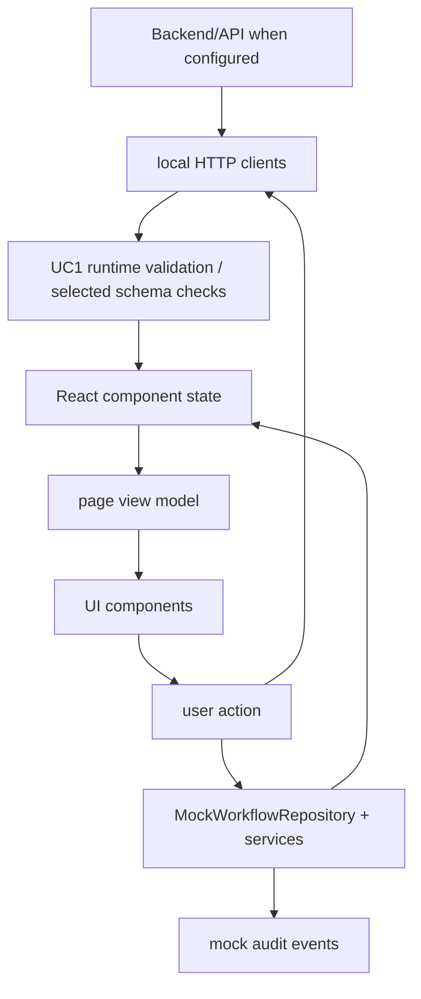

# Frontend Data State API Map

## Data Flow

## Endpoint Matrix

| Endpoint | Caller | Contract | Real/Mock | Error Handling | Test |
| --- | --- | --- | --- | --- | --- |
| `POST /v1/uc1/sessions/{sessionId}/replays` | `HttpUC1ReplayClient.createReplay` | gesture inference schemas + validation utils | Real when base URL set, mocked in E2E | problem details to `UC1ReplayClientError`; UI fails closed | Playwright Day22 |
| `POST /v1/uc1/replays/{replayId}/advance` | `HttpUC1ReplayClient.advanceReplay` | expected replay/index/revision checks | Real/mocked | 409/stale/mismatch handled; no substitute result | Playwright Day22 |
| `POST /v1/uc1/replays/{replayId}/feedback` | `HttpUC1ReplayClient.submitFeedback` | feedback context validation | Real/mocked | validates receipt provenance; idempotency key | Playwright Day22 |
| `POST /v1/uc2/assessments` | `UC2AssessmentClient.create` | UC2 assessment TS interface | Real if base URL responds, mock fallback otherwise | catches and falls back silently | Jest + Playwright Day23 |
| `POST /v1/review-cases` | `ReviewReportClient.createReviewCase` | review-report schema types | Real only; no mock fallback in client | throws raw HTTP text | Playwright Day24 with route mock |
| `GET /v1/review-cases/{caseId}` | `ReviewReportClient.getReviewCase` | review-report schema types | Real only | create fallback in page for missing REV case | Playwright Day24 |
| `POST /v1/review-cases/{caseId}/events` | `ReviewReportClient.addReviewEvent` | review event types | Real only | UI shows error string | Playwright Day24 |
| `POST /v1/reports/preview` | `ReviewReportClient.previewReport` | report package type | Real only | UI shows error string | Playwright Day24 |
| `POST /v1/reports/finalize` | `ReviewReportClient.finalizeReport` | report package type | Real only | UI shows error string | Playwright Day24 |
| `GET /v1/reports/{reportId}` | `ReviewReportClient.getReport` | report package type | Real only | throws HTTP error | not directly covered |

## Mock Data Sources

- `MockWorkflowRepository`: sessions, imports, mappings, preflights, calibrations, QC results, analysis jobs, reviews, reports, feedback, issues, audit log.
- Mock services: session, import, signal workflow, calibration, analysis.
- Static constants exist on dashboard, devices, protocols, feedback analytics, use-case intro pages.

## State Management Inventory

- Local component state: dominant.
- Context: auth only.
- URL state: UC1 `analysisId`/`scenarioId`; UC2 longitudinal `scenario`.
- Browser storage: mock role and workflow metadata in `sessionStorage`.
- Cached/server state: no shared cache layer.
- Derived state: eligibility, state badge variants, signal points, QC attention, metric evidence view.

## Schema Duplication

Frontend schemas are canonical for the web portal, but not imported from a shared backend package. This is acceptable for deterministic portfolio demo, but contract drift is a P1/P2 risk for real integration. UC1 mitigates this best with runtime validation.

## Domain Traceability

| Domain concept | Backend contract | Frontend type | UI | Test |
| --- | --- | --- | --- | --- |
| Session | mock workflow/session intake | `SessionContext` | sessions pages, dashboard | workflow E2E |
| Signal | UC1/Signal viewer contracts | `GestureInferenceWindow`, `Series` | UC1 workspace, SignalViewer | Day22, signal tests |
| QC Result | quality/QC schemas | `QCResult`, `QueueItem` | quality page, QCDashboard, QCCard | QC stress tests |
| Processing | analysis job schemas | `AnalysisJob` | analysis page, processing page | Day21/Day24 tests |
| Metric | UC2 and metric evidence | `UC2Metric`, `MetricEvidenceView` | UC2 panels, MetricEvidenceCard | UC2 Jest, metric tests |
| Eligibility | analysis/MFCV/metric status | `AnalysisEligibility`, `MFCVEligibility` | analysis page, MetricEvidenceCard | unit/stress partial |
| Evidence | source refs, hashes, reason codes | multiple schema modules | UC1 provenance, report preview | Day22/Day24 |
| Review State | review/report schemas | `ReviewCaseContract`, `ClinicalReview` | review pages, ReviewTimeline | Day24 |
| Audit Event | mock common schema | `AuditEntry` | audit page, review-queue audit history | partial |
| Provenance | hashes/manifests/model versions | multiple schema modules | UC1, analysis, signal viewer | Day22/signal tests |
