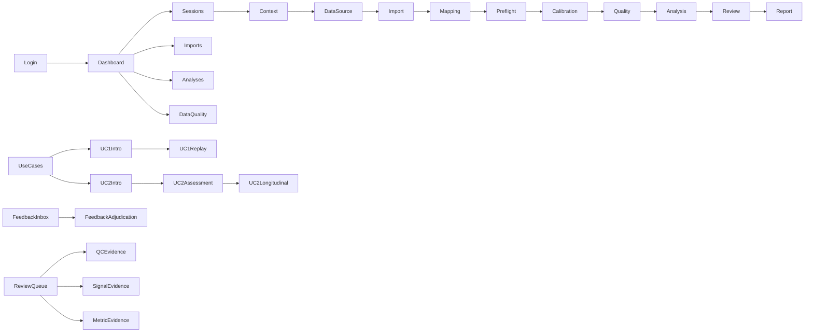

# Frontend Route And Page Inventory

Source of truth: Next production build and `apps/web-portal/src/app`.

## Actual Routes

| Route | Page | Layout/Auth | Data Source | Status |
| --- | --- | --- | --- | --- |
| `/` | root redirect to `/login` | RootLayout | none | KEEP |
| `/login` | role-selection login | public | mock auth | KEEP_WITH_MINOR_POLISH |
| `/dashboard` | overview dashboard | AppShell + route guard | static mock constants | KEEP_WITH_INTEGRATION_FIX |
| `/use-cases` | use-case catalog | AppShell | route config | KEEP |
| `/sessions` | session list | AppShell | MockWorkflowRepository | KEEP |
| `/sessions/new` | session creation wizard | AppShell | MockWorkflowRepository | KEEP |
| `/sessions/[sessionId]/context` | session context | AppShell | MockWorkflowRepository | KEEP |
| `/sessions/[sessionId]/data-source` | source selection | AppShell | MockWorkflowRepository | KEEP |
| `/sessions/[sessionId]/import` | upload/import workflow | AppShell | MockWorkflowRepository + browser file APIs | KEEP |
| `/sessions/[sessionId]/mapping` | channel mapping | AppShell | MockWorkflowRepository | KEEP |
| `/sessions/[sessionId]/preflight` | preflight checks | AppShell | MockWorkflowRepository | KEEP |
| `/sessions/[sessionId]/calibration` | calibration wizard | AppShell | MockWorkflowRepository | KEEP |
| `/sessions/[sessionId]/acquisition` | simulated acquisition | AppShell | local state | KEEP |
| `/sessions/[sessionId]/quality` | quality gate | AppShell | MockWorkflowRepository | KEEP |
| `/sessions/[sessionId]/analysis` | analysis gate/output | AppShell | MockAnalysisService + MockWorkflowRepository | KEEP_WITH_MINOR_POLISH |
| `/sessions/[sessionId]/review` | human/clinician review page | AppShell | MockWorkflowRepository | REFACTOR_LOCAL for claim boundary |
| `/sessions/[sessionId]/report` | report page | AppShell | MockWorkflowRepository | REFACTOR_LOCAL for claim boundary |
| `/analyses` | analysis list | AppShell | static mock constants | KEEP |
| `/analyses/[analysisId]/processing` | analysis processing | AppShell | HttpAnalysisClient hook | KEEP |
| `/imports` | import list | AppShell | MockWorkflowRepository | KEEP |
| `/imports/[importId]` | import detail | AppShell | MockWorkflowRepository | KEEP |
| `/data-quality/issues` | data quality issue queue | AppShell | MockWorkflowRepository | KEEP |
| `/feedback/inbox` | feedback inbox | AppShell | MockWorkflowRepository | KEEP_WITH_MINOR_POLISH |
| `/feedback/[feedbackId]` | feedback adjudication | AppShell | MockWorkflowRepository | KEEP |
| `/feedback/analytics` | feedback analytics | AppShell | static mock constants | KEEP |
| `/feedback/training-candidates` | training candidates | AppShell | static mock constants | KEEP_WITH_MINOR_POLISH |
| `/devices` | devices | AppShell | static mock constants | KEEP |
| `/devices/[deviceId]` | device detail | AppShell | static mock constants | KEEP |
| `/protocols` | protocols | AppShell | static mock constants | KEEP |
| `/protocols/[protocolId]` | protocol detail | AppShell | static mock constants | KEEP_WITH_MINOR_POLISH |
| `/audit` | audit log | AppShell | MockWorkflowRepository | KEEP |
| `/admin/users` | admin users | AppShell | static mock constants | KEEP |
| `/uc1/intro` | UC1 intro | AppShell | route config/static | KEEP_WITH_MINOR_POLISH |
| `/uc1/demo` | compatibility redirect | AppShell | redirect only | KEEP |
| `/uc1/session/[sessionId]` | UC1 deterministic replay | AppShell | HTTP client, Playwright mocks/API | KEEP |
| `/uc1/calibration/[sessionId]` | redirects/links to calibration | AppShell | route params | KEEP |
| `/uc1/review/[sessionId]` | UC1 technical review | AppShell | MockWorkflowRepository | KEEP_WITH_MINOR_POLISH |
| `/uc2/intro` | UC2 intro | AppShell | static | KEEP_WITH_MINOR_POLISH |
| `/uc2/demo` | compatibility redirect | AppShell | redirect only | KEEP |
| `/uc2/assessment/[sessionId]` | UC2 assessment | AppShell | UC2AssessmentClient mock/API fallback | KEEP |
| `/uc2/longitudinal/[subjectRef]` | UC2 longitudinal | AppShell | UC2AssessmentClient mock/API fallback + URL scenario | KEEP |
| `/uc3/intro` | UC3 intro | AppShell | static | KEEP |
| `/uc3/feasibility` | UC3 feasibility placeholder | AppShell | static | PARTIAL |
| `/uc4/intro` | UC4 intro | AppShell | static | KEEP |
| `/uc4/feasibility` | UC4 feasibility placeholder | AppShell | static | PARTIAL |
| `/qc` | Day56 QC route | AppShell | feature fixtures | PARTIAL |
| `/review-queue` | Day59 review queue | AppShell | fixture model | PARTIAL |
| `/review-queue/[caseId]` | review case | AppShell | fixture model/local state | PARTIAL |
| `/review-queue/[caseId]/qc` | QC evidence stub | AppShell | static | PARTIAL |
| `/review-queue/[caseId]/signal` | signal evidence stub | AppShell | static | PARTIAL |
| `/review-queue/[caseId]/metrics` | metric evidence stub | AppShell | static | PARTIAL |
| `/reviews/[caseId]` | Day24 review API workflow | AppShell | ReviewReportClient | KEEP_WITH_INTEGRATION_FIX |
| `/reports/[reportId]` | Day24 report API workflow | AppShell | ReviewReportClient | KEEP_WITH_INTEGRATION_FIX |

## Canonical Config Routes Not Fully Backed By Filesystem

`useCaseRoutes.ts` defines additional routes such as `/feedback/{id}/adjudicate`, `/admin/protocols`, `/admin/models`, `/uc3/replay/{sessionId}`, `/uc3/expert-review/{analysisId}`, `/uc4/sterile-command`, `/uc4/sign-sequence`, and `/uc4/expert-review/{analysisId}`. These do not have matching App Router files and should be treated as roadmap/config routes, not live pages.

## Navigation Graph

## Page Inventory Summary

- Production-like/demo-ready: login, dashboard, use-cases, sessions workflow, UC1 replay, UC2 assessment, Day24 review/report.
- Functional: devices, protocols, feedback analytics/training candidates, audit.
- Partial/stub: `/qc`, review-queue evidence subroutes, UC3/UC4 feasibility placeholders.
- Mock-only: most pages except HTTP clients that can call API when `NEXT_PUBLIC_API_BASE_URL` is set.
